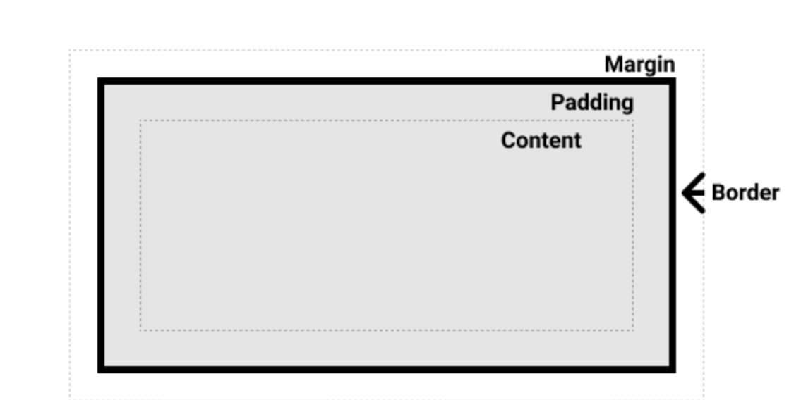
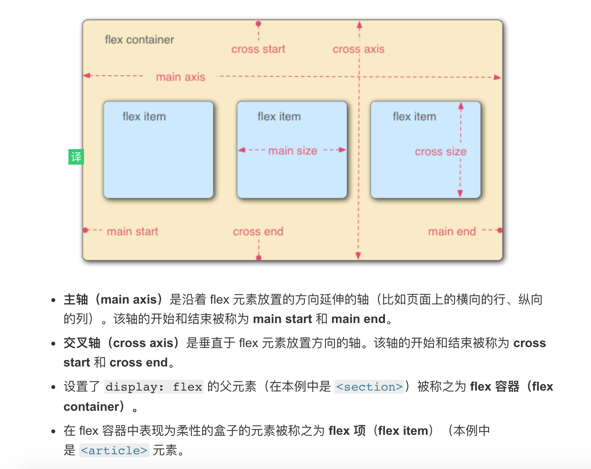

## 基础
1. 导入
   - 在head中添加 ```<link href="styles/style.css" rel="stylesheet">```
   - 在head中添加 ```<style></style>```
2. 选择器


名称 | 选择的内容 | 示例
:-: | :-: | :-: 
元素选择器 | html元素 | p
id 选择器 | 具有特定id的元素  | #my-id
类选择器  | 具有特定类的元素 | .my-class
属性选择器 | 具有特定属性的元素 | img[src]
伪类选择器  | 特定状态下的特定元素 | a.hover 鼠标悬停在a标签上时

使用：
   - 元素选择器 ```a.id```
   - 元素，元素 a, p   a和p
   - 元素 元素  ul li   li在ul内部
   - 元素 + 元素 h1 + p   h1和相邻的一个p元素
   - 规则： @rules
      - ```@import 'styles2.css'```
      - ```@media(min-width: 30em){body {color: "blue"}}```  媒体查询， 当浏览器宽度小于30em, 则显示蓝色
 
速记属性： font, background, padding, border, margin 等，可以在一行设置多个值
例如： padding: 10px 15px 15px 5px;  top right bottom left

## 构建css
### 1. 层叠与继承

1. 层叠 当应用两条同级别的规则到一个元素的时候，写在后面的就是实际使用的规则。
2. 优先级 一个元素选择器不是很具体 — 会选择页面上该类型的所有元素 — 所以它的分数就会低一些
   - 内联 > ID选择器 > 类选择器=属性选择器=伪类 > 元素、伪元素选择器
   - !important 加载属性值后面 表示此个属性优先级最大

3. 继承 一些设置在父元素上的css属性是可以被子元素继承的，有些则不能。
   控制继承（属性值）：
    - inherit 开启继承
    - initial 设置属性值和浏览器默认样式相同。如果浏览器默认样式中未设置且该属性是自然继承的，那么会设置为 inherit 。
    - unset 将属性重置为自然值，也就是如果属性是自然继承那么就是 inherit，否则和 initial一样
### 2. 盒子模型


1. 组成部分
   - content box：这个区域是用来显示内容，大小可以通过设置 width 和 height.
   - padding box: 包围在内容区域外部的空白区域； 大小通过 padding 相关属性设置
   - border box: 边框盒包裹内容和内边距。大小通过 border 相关属性设置。
   - margin box: 这是最外面的区域，是盒子和其他元素之间的空白区域。大小通过 margin 相关属性设置
4. 背景样式 background
   1. background-color: 背景颜色
   2.  background-image: 背景图片 {background-image: url(start.png)}
      -  background-repeat: repeat-x, repeat-y, repeat, no-repeat 平铺类型
      -  background-size: cover（保持高宽比）, contain（长宽比不同可能会出现间隙）, 长度宽度
      -  background-position: 定位
5. 边框border
   - 圆角 border-radius
6. overflow 溢出
   - hidden: 隐藏
   - scroll: 滚动条
   - auto: 滚动条在有比盒子所能装下更多的内容的时候才显示
### 样式化文字
#### 字体
1. 颜色 color
2. 字体种类 font-family, 可以提供一个字体栈，多个字体用逗号隔开
3. 字体样式 font-style
   - normal 普通字体
   - italic 斜体
4. 粗体 font-weight
   - normal 普通
   - bold 加粗
   - lighter bolder 较父元素更细 更粗
5. 转换 text-transform
   - none 防止转型
   - uppercase 大写
   - lowercase 小写
   - capitallize 首字母大写
   - full-width 全角
6. 装饰 text-decoration
   - none 取消已存在的文本装饰
   - underline 下划线
   - overline 上划线
   - line-through 删除线
7. 文字阴影 text-shadow
#### 文字布局
1. 对齐 text-align
2. 行高 line-height
3. 字母间距 单词间距  letter-spacing word-spacing
4. 列表样式 [list-style-type](https://developer.mozilla.org/zh-CN/docs/Web/CSS/list-style-type)
5. 样式化链接
   - Link 未访问 :link
   - Visited 已经访问 :visited
   - Hover 鼠标悬停 :hover
   - Focus 选中 :focus
   - Active 激活状态 (比如被点击的时候) :active
   - 添加顺序 LOVE FEARS HEAT  -> link visited focus hover active

### 布局
####  正常布局流 即盒子模型
#### 弹性盒子 flex
 1. 作用： 
   - 在父内容里面垂直居中一个块内容
   - 使容器的所有子项占用等量的可用宽度/高度，而不管多少宽度/高度可用 
   - 使多列布局中的所有列采用相同的高度，即使他们包含的内容量不同


2. 自动换行： flex-wrap: wrap
3. 缩写 flex-flow: row wrap;
4. 尺寸 flex:1 表示每个flex项沿主轴的可用空间大小。 全部一样则等分， flex: 200px; 表示最小是200px
5. align-items: 控制flex在交叉轴方向对其
   - stretch 交叉轴方向拉伸填充父容器
   - center 居中对齐
6. justify-content: 控制flex项在主轴的位置
   - flex-start， 主轴开始处
   - flex-end 结尾处
   - center 居中
   - space-around 均匀分布，两端都留有一点空间
   - space-between 均匀分布，两端不留空间
7. 排序 order 默认是0， 值越大越靠后

#### 网格布局 grid
#### 浮动布局 float
#### 定位 
   - 静态定位 将元素放入它在文档布局流中的正常位置 static默认行为
   - 相对定位 relative, top left bottom right等属性，相对于原本的位置
   - 绝对定位 absolute 指定元素应距离每个包含元素的边的距离，而不是指定元素应该移入的方向。
   - 定位上下文  包含元素为定义了position属性的父元素，如果都没显示的定义，则包含在初始块容器
   - 固定定位 fixed，固定定位固定元素则是相对于浏览器视口本身，可用于导航栏
   - 粘性定位 sticky， 开始是相对定位，当滚动到某个阈值，变为固定定位
#### 多列布局
1. column-count: n; n个列
2. column-width: 200px; 宽度
3. column-gap: 20px; 间隔
4. column-rule: 规则，包含间隔的大小形状颜色， column-rule: 4px dotted rgb(79, 185, 227);
5. break-inside: avoid; 不分开单词