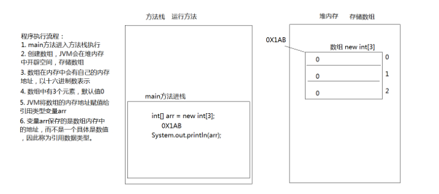
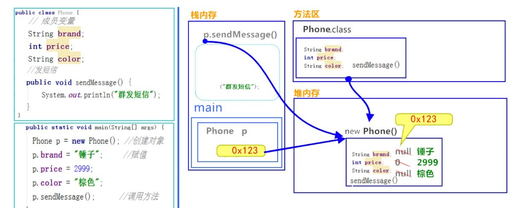
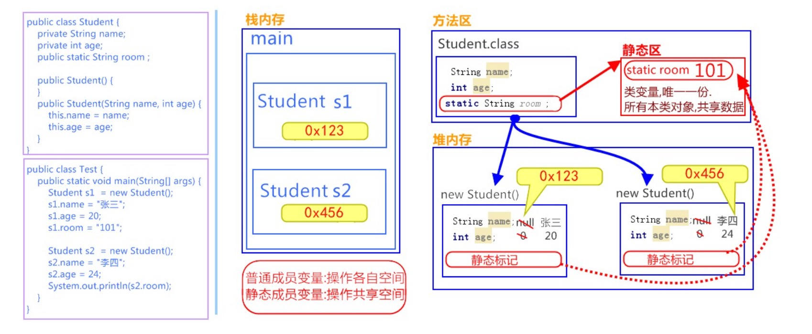
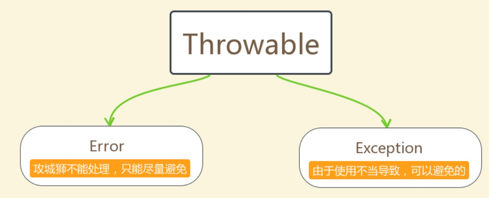
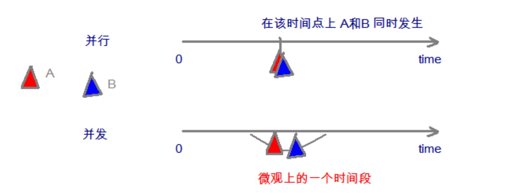
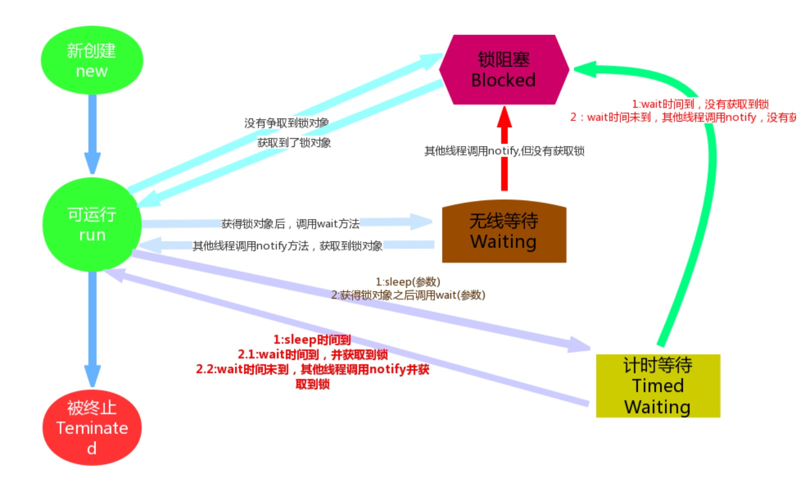

## java基础
### 命名规则
   - 类名: 大驼峰， 每个单词首字母大写
   - 方法名: 小驼峰， 首字母小写，后面每个单词首字母大写
   - 变量名: 全部小写
### 常量
在Java程序中固定不变的数据
### 变量
1. 基本数据类型

数据类型|关键字|内存占用|范围
:-: | :-: | :-: | :-:
字节型 | byte | 1个字节| -128~127
短整型 | short | 2个字节 | -2^15 ~ 2^15-1 (-32768 ~ 32767)
整型 | int | 4个字节| -2^31 ~ 2^31-1
长整型 | long | 8个字节|
单精度浮点数| float | 4个字节|
双精度浮点数 | double | 8个字节|
字符型| char | 2个字节|
布尔类型 | boolean| 1个字节|

2. 类型转换
   - 自动转换: 将取值范围小的类型自动提升为取值范围大的类型
   - 强制转换: 将取值范围大的类型强制转换成取值范围小的类型 格式: 数据类型 变量名 = （数据类型） 被转数据值
   - ASCII码表
### 数组
1. 定义
   - int[] arr = new int[3];
   - int[] arr = new int[]{1, 2, 3, 4};
   - int[] arr = {1, 2, 3, 4};
2. java内存划分
  
区域名称 | 作用
:-: | :-:
寄存器| cpu使用
本地方法栈| jvm在使用操作系统功能时候使用
方法区| 存储可以运行的class文件
堆内存| 存储对象或者数组，new来创建的，都存储在堆内存
方法栈|方法运行时使用的内存，比如main方法运行。



#### IDEA
1. project -> module -> package -> javaClass
2. psvm  == public static void main(String[] args){} 
3. 5.fori == for (int i = 0; i < 5; i++){}
4. array.fori  for(int i=0; i < array.length; i++){}
5. alt + enter 导入包，自动修正代码
6. Ctrl+Alt+L 格式化代码
7. ctrl+N 自动化生成getter、setter以及constructor 

#### 面向对象
1. 类与对象的内存占用


成员变量有默认值，局部变量没有默认值。
2. JavaBean 编写类的一种标准规范。
   ```java
    public class ClassName{ //成员变量
   //构造方法 //无参构造方法【必须】 //有参构造方法【建议】 //成员方法
   //getXxx()
   //setXxx()
   }
   ```
#### 常用API
1. Scanner 获取输入项
   ```java
   import java.util.Scanner;
   public class TestScanner(){
      public static void main(String[] args){
         Scanner sc = new Scanner(System.in);
         int x = sc.nextInt();

         new Scanner(System.in).nextInt(); // 匿名对象
      }
   }
   ```
2. Random 随机数
   ```java
   import java.util.Random;
   public class TestRandom{
      public static void main(String[] args){
         Random r = new Random(); // 创建一个随机数生成器
         int x = r.nextInt(100); //获取一个0-100的随机数，其中不包括100
      }
   }
   ```
3. ArrayList 大小可变的数组， 存储在内的数据为元素。
   - 构造方法 ArrayList<String> list = new ArrayLiat<>();
   - 添加  public boolean add(E e)
   - 删除  public E remove(int index)
   - 获取  public E get(int index)
   - 元素数量 public int size()
4. String string对象不可变，每次修改都会赋值新的地址
   - 比较 s1.equals(s2);   忽略大小写比较 s1.equalsIgnoreCase(s2);
   - s.length() 获取长度
   - s.concat(s2) 连接
   - s.charAt(1) 获取索引位置的值
   - s.indexOf("ol") 第一次出现的索引位置，找不到为-1
   - s.substring(int beginIndex, int endIndex) 返回子串, 左闭右开
   - s.toCharArray()  转为字符数组
   - s.getBytes()  返回字节数组
   - s.replace(CharSequence target, CharSequence replacement)
   - s.spilit(String regex) 分割字符串，返回字符串数组

5. static 用来修饰的成员变量和成员方法，被修饰的成员是属于类的，而不是单单是属 于某个对象的。也就是说，既然属于类，就可以不靠创建对象来调用了。
   1. 类变量 static int numberId; 所有对象共享同一个类变量的值，这个值保存在类的空间中，不在对象里
   2. 静态方法 格式： ```修饰词 static 返回值类型 方法名 （参数列表）{}```,调用直接从类调用。
   3. 静态代码块  定义在成员位置，使用static修饰的代码块{ }。随着类的加载而执行且执行一次，优先于main方法和构造方法的执行。
   
   ```java
   public class Game{
      public static int num;
      public static ArrayList<String>  list;
      static{
         number = 2;
         list = new ArrayList<String>();
         list.add("222");
      }
   }
   ```

   

#### 继承
1. 继承
   1. 格式 extends
   2. 成员方法: 
      - 不重名没有影响
      - 重名 方法重写，使用@override,使用super. 来调用父类的方法
   3. 构造方法
      - super() 调用父类
   4. super & this
      - super: 代表父类的存储空间标识， super() 表示父类的构造方法
      - this: 代表当前的对象的引用， this() 表示本类的构造方法
   5. 特点：只支持单继承， 不支持多继承，顶层的父类是Object类
2. 抽象类
   1. 没有方法主体的方法称为抽象方法，包含抽象方法的类是抽象类
   2. 格式 ```修饰词 abstract 返回值类型 方法名(参数列表)```
   3. 抽象类的子类必须重写父类所有的抽象方法，否则，该子类也要声明为抽象类

#### 接口
1. 引用类型(数组，类和接口)， 方法的集合。 不能创建对象，可以被实现implements,实现的子类必须实现接口中所有的抽象方法，否则它必须是一个抽象类
2. 格式 
   ```java
   public interface 接口名称{
      // 抽象方法
      // 默认方法
      // 静态方法 
      // 私有方法
   }
   ```
   - 抽象方法 public abstract void method(); 没有方法体
   - 默认方法 public default void method(){}; 供子类调用或者子类重写
   - 静态方法 public static void method(){}; 供接口直接调用
   - 私有方法 private void method(){}; 供接口中的默认方法调用
   - 私有静态方法 private static void method(){}; 供接口中的静态方法和默认方法调用

#### 多态
1. 同一行为，具有多个不同表现形式
2. 格式 父类类型 变量名 = new 子类对象; 变量名.方法名();
   使用多态方式调用方法时， 首先检查父类是否有，如果没有则编译错误。如果有执行子类重写的方法
3. 引用类型转换
   1. 向上转型： 多态本身是子类类型向父类类型向上转换的过程，这个过程是默认的。
   ```java
   Animal a = new Cat();
   ```
   2. 向下转型： 父类类型向子类类型向下转换的过程，这个过程是强制的。
   ```java
   Cat c = (Cat) a;
   ```
4. instanceof 类型校验， 
   ```java
   // 变量名 instanceof 数据类型
   if (a instanceof Cat){
      Cat c = (Cat)a;
   } else {
      Dog d = (Dog)a;
   }
   ```
#### final 权限 内部类 引用类型
1. final 不可改变
   1. 类: 被修饰的类，不能被继承
   2. 方法: 被修饰的方法，不能被重写
   3. 变量: 被修饰的变量，不能被重新赋值
2. 权限修饰符
   1. public(全部可见) protected(子类可见) default(空)(包内可见) private(本类可见)
   2. 常用方式:
      - 成员变量使用private
      - 构造方法使用public
      - 成员方法使用Public
3. 内部类 定义在类内部的类，则称为内部类
   1. 成员内部类。定义在类中方法外。
      ```java
      class 外部类{
         class 内部类{}
      }
      // 内部类可以直接访问外部类的成员，包括私有成员
      // 外部类想要访问内部类的成员，必须建立内部类的对象
      // 格式: 外部类名.内部类名 对象名 = new 外部类型().new 内部类型()
      ```
   2. 匿名内部类: 内部类的简化写法。本质是一个带具体实现的父类或者父接口的匿名的子类对象
   ```java
   new 父类名或者接口名() {
      // 方法重写
      @Override
      public void method(){}
   }
   ```
4. 引用类型用法总结
   1. class 作为成员变量
   2. interface 作为成员变量
   3. interface作为方法参数和返回值类型
#### Object类，常用的API
1. Object类
   1. java.lang.Object类是java语言的根类，如果一个类没有特别指定父类，则默认继承自Object类。
   2.  toString(), 返回该对象的字符串表示，重写
   3.  equals() 表示其他某个对象是否相等。 public booleam equals(Object obj),默认比较地址，可重写
   4. 上面可以直接通过IDEA Generate来自动生成
2. 日期时间类
   1. Date类
      - 构造方法 new Date() 当前时间。 new Date(long date); 分配Date对象并初始化此对象，以表示自从标准基准时间（称为“历元（epoch）”，即1970年1月1日00:00:00 GMT）以来的指定毫秒数。
   2. DateFormat类
      - 格式化时间日期。可以完成Date对象和String对象之间的来回转换
      - 格式化: Date对象转换为String对象 ft.format(data)。 解析:String对象转换为Date对象 ft.parse(str)
      - 构造方法SimpleDateFormat(String pattern)
3. Calendat类
   1. 日历类，替换Date部分方法。 public static Calendar getInstance(). 获取日历
   2. 常用方法
      - public int get(int field) 返回指定日历字段的值
      - public void set(int field, int value)
      - public abstract void add(int field, int amount) 增减时间量
      - public Date getTime() 返回Date对象
   
   日历字段:

   字段值|含义
   :-:|:-:
   YEAR|年
   MONTH|月 从0开始
   DAY_OF_MONTH|月中的第几天(几号)
   HOUR|时(12小时制)
   HOUR_OF_DAY|时(24小时制)
   MINUTE|分
   SECOND|秒
   DAY_OF_WEEK|周几

4. System类
   1. public static long currentTimeMillis(), 返回以毫秒为单位的当前时间。
   2. public static void arraycopy(Object src, int srcPos, Object dest, int destPos, int length) 将数组中指定的数据拷贝到另一个数组。

5. StringBuilder类
   1. 由于String类的对象内容不可改变，每当字符串进行拼接时候，总会在内存中创建新的对象。StringBuilder称为可变字符序列，类似于String的字符串缓冲区，可以改变序列的长度和内容，即可以解决String操作带来的损耗问题
   2. 构造方法: 
      - public StringBuilder() 构造一个空的StringBuilder容器
      - public StringBuilder(String str) 构造一个StringBuilder容器，并将字符串添加进去。
   3. 常用方法
      - public StringBuilder append()  添加任意类型数据的字符串形式，并返回当前对象自身
      - public String toString() 将当前的StringBuilder对象转换为String对象
6. 包装类
   1. Java提供了两个类型系统，基本类型与引用类型，使用基本类型在于效率，然而很多情况，会创建对象使用，因为对象可以做更多的功能，如果想要我们的基本类型像对象一样操作，就可以使用基本类型对应的包装类，如下：
   
   | 基本类型    | 对应的包装类（位于java.lang包中） |
   | ------- | --------------------- |
   | byte    | Byte                  |
   | short   | Short                 |
   | int     | **Integer**           |
   | long    | Long                  |
   | float   | Float                 |
   | double  | Double                |
   | char    | **Character**         |
   | boolean | Boolean               |

   2. 装箱和拆箱
      1. 装箱 从基本类型转换为对应的包装类对象
      2. 拆箱 从包装类对象转换为对应的基本类型
      ```java
      Integer i = new Integer(4); //使用构造函数
      Integer ii = Integer.valueOf(4); // 使用包装类的方法
      Integer iii = 100; // 自动装箱
      
      int num = i.intValue(); // 拆箱
      int num2 = i; // 自动拆箱
      ```
   3. 自动装箱和自动拆箱
      ```java
      Integer i = 4; // 自动装箱
      i = i + 5; // 等号右边，将i对象转换为基本数值(自动拆箱)， i.intValue + 5; 加法完成之后，再次装箱，把基本数值转换为对象
      ```
   4. 基本类型和字符串的转换
      1. 基本类型转String,  基本类型 + ""
      2. String转换为基本类型  parseXxx
         - public static byte parseByte(String s)
         - public static short parseShort(String s)
         - public static int parseInt(String s)
         - public static long parseLong(String s)
         - public static float parseFloat(String s)
         - public static double parseDouble(String s)
         - public static boolean parseBoolean(String s)
      3. 如果字符串参数内容无法正确转换为对应的基本类型，会抛出 ```java.lang.NumberFormatException```异常

#### 集合Collection、泛型
1. 集合按照存储结构分为：单列集合 java.util.Collection和双列集合java.util.Map
2. Collection: 单列集合类的根接口，用于存储一系列符合某种规则的元素。有两个重要的子接口：
   - java.util.List List特点是有序、元素可重复。主要实现类有java.util.ArrayList、java.util.LinkedList。
   - java.util.Set  Set的特点是元素无需，且不可重复。主要实现类有java.util.HashSet,java.util.TreeSet。
3. Collection常用功能:
   - public boolean add(E e)  给定的对象添加到当前集合中
   - public void clear()  清空集合中的所有元素
   - public boolean remove(E e) 在当前的集合中删除给定的对象
   - public boolean contains(E e) 判断当前的集合中是否包含给定的对象
   - public boolean isEmpty() 判断当前的集合是否为空
   - public int size()  返回集合中元素的个数
   - public Object[] toArray() 把集合中的元素存储到数组中

#### Iterator迭代器
1. Iterator接口 Iterator主要用于迭代访问(遍历)Collection中的元素，因此Iterator对象也被成为迭代器。
2. public Iterator iterator() 获取集合对应的迭代器，用来遍历集合中的元素。
3. public E next() 返回迭代的下一个元素
4. public boolean hasNext() 如果仍有元素可以迭代，则返回true
5. foreach 
   ```java
   for(元素数据类型 变量 : Collection集合或者数组){
      //
   }
   ```

#### 泛型
1. 泛型:可以在类或方法中预支地使用未知的类型。 
   ```java
   Collection<String> list = new ArrayList<String>();
   // 这里的 <String> 成为泛型
   ```
2. 一般在创建对象时，将未知的类型确定具体的类型。当没有指定泛型时，默认类型为Object类型。
3. 定义和使用
   1. 含有泛型的类，定义格式 ```修饰符 class 类名<代表泛型的变量> {}```
   ```java
   Class ArrayList<E>{
      public boolean add(E e){}
      public E get(int index){}
   }
   // 在创建对象的时候确定泛型
   ArrayList<String> list = new ArrayList<>();
   // 此时的ArrayList可以理解为
   class ArrayList<String> {
      public boolean add(String e){}
      public String get(int index){}
   }
   ```
   2. 含有泛型的方法 定义格式 ```修饰符 <代表泛型的变量> 返回值类型 方法名(参数){}
   ```java
   public class MyGenericMethod{
      public <MVP> void show(MVP mvp){
         System.out.println(mvp.getClass);
      }
      public <MVP> MVP show2(MVP mvp){
         return mvp;
      }
   }
   public class GenericMehodDemo{
      public static void main(String[] args){
         MyGenericMethod mm = new MyGenericMethod();
         mm.show("aaa");
         mm.show(123);
         mm.show(123.142);
      }
   }
   ```
   3. 含有泛型的接口 定义格式 ```修饰词 interface接口名<代表泛型的变量>{}```
   ```java
   public interface MyGenericInterface<E>{
      public abstract void add(E e);
      public abstract E getE();
   }
   // 1. 定义时候确定泛型的类型
   public class MyImp1 implements MyGenericInterface<String> {
      @Override
      public void add(String e){
         //
      }
      @Override
      public String getE(){
         return null;
      }
   }
   // 2. 始终不确定泛型的类型，直到创建对象时候，确定泛型的类型
   public class MyImp2<E> implements MyGenericInterface<e>{
      @Override
      public void add(E e){}
      @Override
      public E getE(){
         return null;
      }
   }
   // 使用
   public class GenericInterface{
      public static void main(String[] args){
         MyImp2<String> my = new MyImp2<String>();
         my.add("aaa");
      }
   }
   ```
   4. 泛型通配符：不知道使用什么类型来接收的时候,此时可以使用?,?表示未知通配符。
   ```java
   public static void main(String[] args) {
    Collection<Intger> list1 = new ArrayList<Integer>();
    getElement(list1);
    Collection<String> list2 = new ArrayList<String>();
    getElement(list2);
   }
   public static void getElement(Collection<?> coll){}
   //？代表可以接收任意类型
   ```
   - 通配符高级使用----受限泛型
     - **泛型的上限**：
       - **格式**： `类型名称 <? extends 类 > 对象名称`
       - **意义**： `只能接收该类型及其子类`
     - **泛型的下限**：
       - **格式**： `类型名称 <? super 类 > 对象名称`
       - **意义**： `只能接收该类型及其父类型`

#### 异常
1. 异常 :指的是程序在执行过程中，出现的非正常的情况，最终会导致JVM的非正常停止。
2. 异常的根类是 java.lang.Throwable ，其下有两个子类: java.lang.Error 与 java.lang.Exception ，平常所说的异常指 java.lang.Exception 。
   

   **异常体系：**
   - Error： 严重错误Error,无法通过处理的错误，只能实现避免。
   - Exception： 异常，程序员可通过代码的方式进行纠正，使程序正常运行，这是必须处理的
   **Throwable常用方法**
   - public void printStackTrace() 打印异常的详细信息
   - public String getMessage() 获取发生异常的原因
   - public String toString() 获取异常的类型和异常描述信息
3. 异常分类(Exception)
   - 编译期异常: checked异常。
   - 运行期异常: runtime异常。
4. 异常的处理
   1. throw，抛出异常  格式 throw new 异常类名(参数)
   2. Objects非空  
   ```java
   public static <T> T requireNonNull(T obj){
      if (obj == null){
         throw new NullPointerException();
      }
      return obj;
   }
   ```
   3. 声明异常throws ```修饰词 返回值类型 方法名(参数) throws 异常类名1，异常类名2...{}```
   4. try...catch
   5. try...catch...finally
   6. 注意：
      1. finally中不要return，否则只会返回finally中的结果
      2. 如果父类抛出了多个异常，子类重写父类方法时候，抛出和父类相同的异常或者父类异常的子类或者不抛出异常。
      3. 父类方法没有抛出异常，子类重写父类方法是也不可抛出异常，此时的子类产生异常只能捕获不能声明抛出
5. 自定义异常
   1. 自定义编译期异常，继承java.lang.Exception
   2. 自定义运行期异常，继承java.lang.RuntimeException
   3. 重写两个构造方法，无参和有参

#### 多线程
1. 并发与并行
   - 并发: 两个或者多个事件在同一时段发生。cpu单核处理器
   - 并行: 两个或者多个事件在同一时刻发生。cpu多核处理器
   

2. 线程与进程
   - 进程:是指一个内存中运行的应用程序，每个进程都有一个独立的内存空间，一个应用程序可以同时运行多 个进程;进程也是程序的一次执行过程，是系统运行程序的基本单位;系统运行一个程序即是一个进程从创 建、运行到消亡的过程。
   - 线程:线程是进程中的一个执行单元，负责当前进程中程序的执行，一个进程中至少有一个线程。一个进程 中是可以有多个线程的，这个应用程序也可以称之为多线程程序。
3. 线程调度:
   1. 分时调用，所有线程轮流使用cpu使用权，平均分配每个线程占用cpu时间
   2. 抢占式调度，优先让优先级高的线程使用 CPU，如果线程的优先级相同，那么会随机选择一个(线程随机性)，Java使用的为 抢占式调度。
4. 创建线程类。java.lang.Thread
   1. 定义Thread类的子类，并重写该类的run()方法，该run()方法的方法体就代表了线程需要完成的任务,因此把 run()方法称为线程执行体。
   2. 创建Thread子类的实例，即创建了线程对象   
   3. 调用线程对象的start()方法来启动该线程
5. 多线程原理： 每一个执行线程都有自己所属的栈内存空间
6. Thread类，java.util.Thread
   **构造方法:**
   - public Thread() 分配一个新的线程对象
   - public Thread(String name) 分配一个带有指定名字的线程对象
   - public Thread(Runnable target) 分配一个带有指定目标新的线程对象
   - public Thread(Runnable target, String name)

   **常用方法:**
   - public String getName() 获取当前线程名称
   - public void start() 此线程开始执行，jvm调用此线程的run方法
   - public void run() 要执行的代码段
   - public static void sleep(long millis)
   - public static Thread currentThead 当前线程的引用
7. 创建方法： 一种是继承Thread类，第二种是实现Runnable方法，如下
   - 定义Runnable接口实现类，重写run方法
   - 创建Runnable实现类的示例，并以此实例作为Thread的target，此Thread才是真正的线程对象
   - 调用线程的start方法启动线程

   **实现Runnable接口比继承Thread的优势**:
   - 适合多个相同的程序代码的线程去共享同一个资源
   - 可以避免java单继承的局限性
   - 增加程序的健壮性，解耦操作，代码可以被多个线程共享，代码和线程独立
   - 线程池只能放入实现Runnable或者Callable的类线程，不能直接放入继承Thread的类。

#### 线程安全
1. 多个线程同时对全局变量或者静态变量进行写操作，需要线程同步。
2. 线程同步 synchronized,三种方法
   - 同步代码块
   - 同步方法
   - 锁
3. 同步代码块， synchronized(同步锁){} 表示只对这个区块的资源实行互斥访问。
4. 同步方法 public synvhronized void method(){}
5. Lock锁
6. 线程状态
   
   线程状态|导致状态发生条件
   :-:|:-:
   NEW|线程被创建，未启动，没有调用start方法
   Runnable|线程可以在java虚拟机中运行的状态，可能正在运行自己代码，也可能没有这取决于操作系统处理器。
   Blocked(阻塞)|当一个线程试图去获取一个对象锁，而该对象锁被其他线程持有，则该线程进入blocked状态，当该线程获取的锁时，变为Runnable
   Waiting(无限等待)|一个线程在等待另一个线程执行一个(唤醒)动作时，该线程进入Waiting状态。进入这个状态后是不能自动唤醒的，必须等待另一个线程调用notify或者notifyAll方法才能够唤醒。
   Timed Waiting(计时等待)| 同Waiting状态，超时可自动唤醒。
   Teminated(终止)|run正常退出，或者因为没有捕获的异常终止而退出

   

#### 线程池
其实就是一个容纳多个线程的容器，其中的线程可以反复使用，省去了频繁创建线程对象的操作，无需反复创建线程而消耗过多资源。
```java
ExecutorService service = Executors.newFixedThreadPool(2);
MyRunnable r = new MyRunnable();
service.submit(r);
service.submit(r);
service.submit(r);
service.shutdown();
```
#### lambda
1. (参数类型 参数名称) -> {代码}
2. 省略规则
   - 小括号内的参数类型可以省略
   - 如果小括号内有且仅有一个参数，则小括号可以省略
   - 如果大括号内有且仅有一个语句，则无论是否有返回值，都可以省略大括号，return关键字以及语句分号
3. 使用lambda的前提
   - 使用lambda必须具有接口，且接口内有且仅有一个抽象方法（函数式接口）
   - 使用Lambda必须具有上下文推断。‘

#### File
1. java.io.File 文件和目录路径的抽象
2. 构造方法：
   1. public File(String pathname)
   2. public File(String pathname, String child)
   3. public File(File parent, String child)
3. 常用方法
   1. get
      - public String getAbsolutePath(): 返回绝对路径名字符串
      - public String getPath() 将File转换为路径名字符串
      - public String getName() 返回此File表示的文件或者目录的名字
      - public long length() 返回文件的长度
   2. 判断
      - public boolean exists() 是否存在
      - public boolean isDirectory() 是否为目录
      - public boolean isFile() 是否为文件
   3. 创建删除
      - public boolean createNewFile() 当且仅当文件不存在时候，创建新的文件
      - public boolean delete() 删除由此File表示的文件或者目录
      - public boolean mkdir() 创建由此File表示的目录
      - public boolean mkdirs() 创建由此File表示的目录，包括任何必需但不存在的父目录。
   4. 遍历
      - public String[] list() 所有子文件或者目录
      - public File[] listFile() 所有子文件或者目录

#### IO
1. 数据的传输是一种数据的流动，称为数据流， JAVA中的IO操作指的是使用java.io的内容进行输入输出操作。
2. 分类：
   1. 数据的流向：
      - 输入流： 把数据从其他设备读取到内存中的流
      - 输出流： 把数据从内存中写出到其他设备的流
   2. 数据格式:
      - 字节流： 以字节为单位，读写数据的流
      - 字符流： 以字符为单位，读写数据的流

   |输入流|输出流
   :-:|:-:|:-:
   字节流|InputStream|OutputStream
   字符流|Reader|Writer

3. 字节流
   1. OutputStream:
      - public void close()
      - public void flush() 强制刷新输出流，并强制写出缓冲区的输入字节
      - public void write(byte[] b) 将 b.length字节从指定的字节数组写入此输出流。
      - public void write(byte[] b, int off, int len) :从指定的字节数组写入 len字节，从偏移量 off开始输出到此输出流。
      - public abstract void write(int b) :将指定的字节输出流。
   2. FileOutputStream:
      - public FileOutputStream(File file)
      - public FileOutputStream(File file，boolean append)
      - public FileOutputStream(String filename)
      - public FileOutputStream(String filename, boolean append)
      - write(int b) 写出一个字节
      - write(byte[] b)
      - write(byte[] b, int off, int len)写出指定长度字节数组

   3. InputStream:
      - public void close()
      - public abstract int read() 从输入流读取数据的下一个字节
      - public int read(byte[] b)
   4. File  FileInputStream:
      - FileInputStream(File file)
      - FileInputStream(String filename)
4. 字符流
   - 使用字节流读取文件时，可能会遇到问题，比如中文字符会显示不完整。因为一个中文字符占了多个字节空间。（UTF-8编码一个中文占三个字节，Unicode一个中文两个字节，所以每次读取一个字节无法显示中文），所以提供了字符流，以字符为单位进行读写数据。
   1. Reader  读取字符信息到内存
      - public void close()
      - public int read()  从输入流读取一个字符
      - public int read(char[] cbuf)
   2. FileReader
      - FileReader(File file)
      - FileReader(String filename)
      - read() 读取一个字符，文件末尾是-1
      - public int read(char[] cbuf)
   3. Writer 将指定的字符信息写出到目的地
      - void write(int c)写入单个字符
      - void write(char[] cbuf)
      - abstract void write(char[] cbuf, int offset, int len)
      - void write(String str)
      - void write(String str, int off, int len)
      - void flush()
      - void close()
   4. FileWrite
      - FileWrite(File file)
      - FileWrite(File file， boolean true)
      - FileWrite(String filename)
      - FileWrite(String filenamem, boolean true)
      - write(int b) 每次写出一个字符数据
      - write(String str)
5. try
   ```java
   FileReader fr = new FileReader("in.txt");
   FileWriter fw = new FileWriter("out.txt");
   try(fr; fw){  // 完成后会自动close()
      //
   } catch(IOException e){
      //
   }
   ```
#### 属性集
1. java.util.Properties 继承自Hashtable
2. public Properties() 创建空的属性列表
3. 存储：
   - public Object setProperty(String key, String value)
   - public String getProperty(String key)
   - public Set<String> stringPropertyNames() 获取所有的键名集合
4. public void load(InputStream inStream) 从字节输入流中读取键值对

#### 缓冲流
   - 缓冲流是对4个基本的Filexxxx流的增强 分为字节缓冲流 **BufferedInputStream**, **BufferedOutputStream**, 字符缓冲流**BufferedReader**, **BufferedWriter**
1. 字节缓冲流
   - public BufferedInputStream(InpurtStream in)
   - public BufferedOutputStream(OutputStream out)
   - 读写方法与基本流相同
2. 字符缓冲流
   - public BufferedReader(Reader in)
   - public BufferedWriter(Writer out)
   - 特有方法:
     - public String readLine() 读一行
     - public void newLine() 写一行行分隔符
#### 序列化
1. 用一个字节序列可以表示一个对象，该字节序列包含了对象的数据，对象的类型和对象中存储的属性，这个过程为序列化。反序列化时从文件 中读取出来，重新加载为对象
2. ObjectOutputStream, 将java对象从原始数据类型写出到文件，实现对象的持久化
   - public ObjectOutputStream(OutputStream out)
   - 要求： 1.该类实现了java.io.Serializable 2.所有属性必须时可序列化的
   - public final void writeObject(Object obj) 写出
3. ObjectInputStream
   - public ObjectInputStream(InputStream in)
   - public final Object readObject()

#### 打印流
1. PrintStream
2. public PrintStream(String fileName)
   ```java
      PrintStream ps = new PrintStream("ps.txt");
      System.setOut(ps);
      System.out.println(97);
   ```

#### 网络编程
1. Socket 客户端的套接字， ServerSocket服务器的套接字
2. Socket: 
   - public Socket(String host, int port) 创建套接字对象并连接
   - public InputStream getInputStream() 返回套接字的输入流
   - public OutputStream getOutputStream() 返回套接字的输出流
   - public void close() 关闭套接字
   - public void shutdownOutput() 禁用套接字的输出流

3. ServerSocket:
   - public ServerSocket(int port)
   - public Socket accept() 侦听并接受连接

#### 函数式接口
1. 有且只有一个抽象方法的接口叫做抽象接口
2. @FunctionalInterface 
3. 常见的函数式接口:
   - java.util.function.Supplier<T>  T get()
   - java.util.function.Consumer<T>  void accept(T t)  默认方法 andThen
   - java.util.function.Predicate<T> boolean test(T t) 默认方法 and or negate(非)
   - java.util.function.Function<T, R>  R apply(T t)