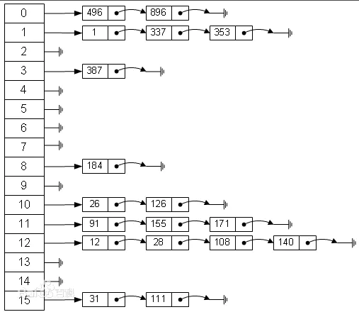
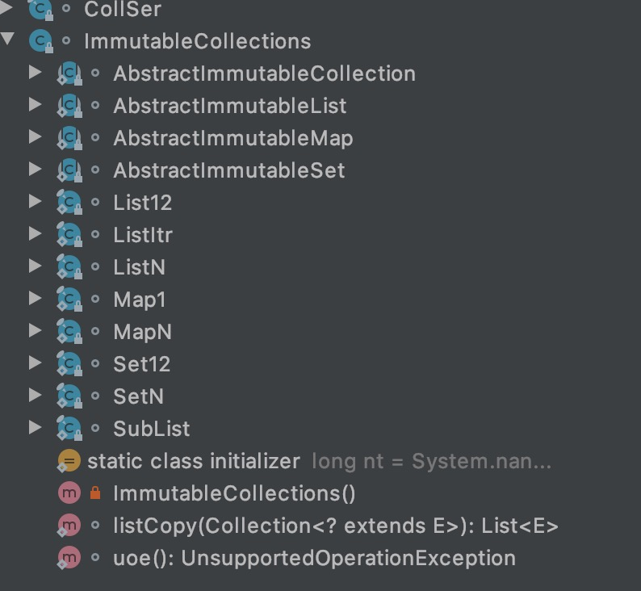

# 新坑 容器源码分析
Collection容器系列代码在java.base/java/util 下面

使用idea查看源码时，project structure中的project/project sdk选择自己安装的jdk,然后Plantform settings的sdks选择自己的jdk.这样查看源码时有注释，代码也是最新的，不会有奇怪的变量名。

# 开篇
java容器分为Collection和Map,Collection又分为List,Queue,Set。

## 基础
### 数组和链表
**数组**数组是内存中一段连续的存储单元，每个数据依次放在每个单元中。

特点：
 1. 内存的申请是在创建时完成的，所以数组的长度、类型是确定的。
 2. 连续的存储单元，通过索引查询非常方便,复杂度O(1).
 3. 查找特定的值需要遍历，复杂度为O(N).
 4. 插入一个值，需要从插入位置起，所有元素后移一位，且数组满了就无法插入。
 5. 数组可能无法完全使用，产生碎片

**链表**
离散型存储结构，每个元素通过指针指向下一个元素。可以分为单链表，双向链表和循环链表。

特点:
 1. 声明链表时无需知道其长度和类型，可以动态调整
 2. 每个元素不仅包含要存储的值，还有存储指向其他值得指针。
 3. 索引非常复杂，需要遍历获取
 4. 查询和数组一样，需要遍历
 5. 新增和删除很方便，O(1) 复杂度
 6. 没有碎片

总结：
 1. 需要大量新增删除操作使用链表，数据量小且内容固定使用数组。

### 哈希表
查询数据时，数组和链表都需要遍历，O(N)的复杂度。因为不能根据值找到他所在的位置。如果可以根据一个值得到一个位置、坐标，那么查找的复杂度就大大降低。这就是哈希函数。
建立值与数字之间的映射关系，根据一个字符串可以计算出一个数字，且每次根据这个字符串都能得到这个数字。但是当数据很多时，总会遇到两个字符串得到的数字相同，即哈希碰撞。这就需要使用二维数组或者数组加链表来实现了。常用的还是数组加链表，当发生哈希碰撞，就加到对应的数组项的链表后面，查找时使用O(1)找到数组项，再遍历链表查询到具体的值。复杂度会远远低于O(n).



## Iterable
Iterable接口实现了forEach()方法，包含了一个内部变量Iterator(接口)迭代器，迭代器中定义了方法next和hasNext等方法，所以如果集合实现了可迭代，需要提供一个自己实现的迭代器。
Collection接口继承了Iterable，所以任何需要实现Collection的接口都需要自己实现一个迭代器,即Iterator类型的方法来获取迭代器。从而可以是其使用forEach遍历方法
```java
for (String a : strings){
    System.out.println(a);
}
```
但是具体的迭代器的定义方式，是在具体的容器类中定义的，如ArrayList, LinkedList


## Collection
Collection是list,queue,set的超集，是一个接口，直接继承自Iterable,所有的Collection集合都支持for-each循环。
Collection定义了一些集合的功能，如：size()统计大小，isEmpty()判断是否为空，contains()包含，toArray()转为数组，add()新增，remove删除等等

**AbstractCollection**是继承了Collection接口的抽象类,实现了部分接口，减少实现类需要实现的方法。
在AbstractCollection中，iterator迭代器和size还是抽象方法，其中：
```java
public boolean add(E e) {
    throw new UnsupportedOperationException();
}
```
如果是不需要新增元素的集合可以不用重写这个函数。只需要提供迭代器和size方法即可使用。

记录其中的部分实现：
```java
public boolean contains(Object o) {
    // 获取迭代器
    Iterator<E> it = this.iterator();
    if (o == null) {
        while(it.hasNext()) {
            // 如果是null,需要比较每个值是否为null
            if (it.next() == null) {
                return true;
            }
        }
    } else {
        while(it.hasNext()) {
            // 如果不是null,则需要比较o与每个值
            if (o.equals(it.next())) {
                return true;
            }
        }
    }

    return false;
}
public Object[] toArray() {
    // 首先创建了容器size大小的数组
    Object[] r = new Object[this.size()];
    Iterator<E> it = this.iterator();

    for(int i = 0; i < r.length; ++i) {
        // 把容器中的所有元素放到数组中
        // 如果迭代器在过程中没有值了，直接返回已经复制过得数组大小
        if (!it.hasNext()) {
            return Arrays.copyOf(r, i);
        }

        r[i] = it.next();
    }
    // 如果迭代器还有值需要再次复制到数组中
    return it.hasNext() ? finishToArray(r, it) : r;
}
private static <T> T[] finishToArray(T[] r, Iterator<?> it) {
    int i;
    // 这里和第一次遍历相同，起点是r.length，遍历后面的值
    for(i = r.length; it.hasNext(); r[i++] = it.next()) {
        // 这里第一次运行时，获取到容量cap
        int cap = r.length;

        // 第一次到这里肯定是容量满了，需要扩容。扩容之后不再相等，使用r[i++]=it.next()继续赋值
        if (i == cap) {
            // 获取新的容量
            int newCap = cap + (cap >> 1) + 1;
            if (newCap - 2147483639 > 0) {
                newCap = hugeCapacity(cap + 1);
            }
            // 这里是扩容的操作，调用了System.arraycopy，调用了本地库arraycopy方法，对r进行扩容
            r = Arrays.copyOf(r, newCap);
        }
    }

    return i == r.length ? r : Arrays.copyOf(r, i);
}
```

### List
List接口继承自Collection接口。要理解这个接口要知道List的特点，1. 有序，2. 可重复的，3. 可以索引的， 4. 可以插入删除等动态调整的。
根据他的特点，List接口比Collection接口新增了一些方法：
1. `boolean addAll(int index, Collection<? extends E> c);`在指定的位置插入另一个集合
2. 默认的排序
```java
default void sort(Comparator<? super E> c) {
    // 转为数组，使用数组的排序，再复制回迭代器， 这里的算法就是下面写的算法，归并算法。
    Object[] a = this.toArray();
    Arrays.sort(a, (Comparator) c);
    ListIterator<E> i = this.listIterator();
    for (Object e : a) {
        i.next();
        i.set((E) e);
    }
}
```
3. `E get(int index);`
4. `E set(int index, E element);`
5. `int indexOf(Object o);`查找对象的索引位置
6. `ListIterator<E> listIterator();`提供了列表迭代器，继承自迭代器，新增了hasPrevious， pervious,前一个，可以实现向前遍历
7. `ListIterator<E> listIterator(int index);`从某个位置开始返回一个迭代器。
8. `List<E> subList(int fromIndex, int toIndex);` 返回一个范围内的子列表
9. 提供了静态方法of,用于创建不可变集合中的列表，也就是不可变列表

**ImmutableCollections** 不可变集合，包含了不可变set,不可变map,不可变list。
`Container class for immutable collections. Not part of the public API.Mainly for namespace management and shared infrastructure.` 不可变集合不是公共的API，主要用于名称空间管理和共享基础结构。



这个使用的比较少还是，本质就是实现了部分方法的collection接口的类。

**AbstractList**
和AbstractCollection差不多，实现了一个骨架，如果需要实现了一个不可变的列表，只要实现get和size方法即可。要实现一个可变的list，要实现set,add，remove方法

新增的方法：
1. `public Iterator<E> iterator() {return new Itr();}`实现了迭代器，Itr在内部实现了，这里有一个`checkForComodification`方法，用来实现fail-fast机制

    如果有两个线程A,B, A负责遍历list, B负责修改list,则A在遍历的过程中会比较expectedModCount = modCount=N，如果不相等就报错。如果B增加或删除一个元素，modCount会变化，A就会报错。

2. `public ListIterator<E> listIterator(final int index) {rangeCheckForAdd(index);return new ListItr(index);}` 另一个迭代器，这个迭代器和上面的差不多，新增了向前遍历，继承自ListIterator

# 部分源码算法分析

## ArrayList.batchRemove
先贴出源码
```java
// removeAll会调用这个方法进行删除，this是源列表，c是要删除的， complement=False
// 目的是删除this中包含在c中的元素。
boolean batchRemove(Collection<?> c, boolean complement, int from, int end) {
        Objects.requireNonNull(c);
        Object[] es = this.elementData;

        for(int r = from; r != end; ++r) {
            if (c.contains(es[r]) != complement) {
                int w = r++; // 遇到在c中的代码时，保存位置为当前位置，这里是int w = r； r++的合并

                try {
                    for(; r < end; ++r) {
                        // 这个循环很有意思， 一直循环，当遇到一个没在c中的元素时，把他放到w中，然后w自增。
                        // 如果一直在c中，就一直向后找，等于把没在c中的前移。
                        Object e;
                        if (c.contains(e = es[r]) == complement) {
                            es[w++] = e;
                        }
                    }
                } catch (Throwable var12) {
                    System.arraycopy(es, r, es, w, end - r);
                    w += end - r;
                    throw var12;
                } finally {
                    // 保存修改数量
                    this.modCount += end - w;
                    // 这里会把w 到 end位置的元素置为Null,方便gc
                    this.shiftTailOverGap(es, w, end);
                }
                // 这里就已经完成了，会遍历全部的
                return true;
            }
        }
        // 没有删除，表示没有要删除的。
        return false;
    }
```
有趣的是，retainAll方法调用和removeAll差不多，只有complement=True,这个结果就刚好相反，保留的都是在两个集合中的交集。而且保存在源列表中。
## Arrays.sort()
这里根据参数会从两种排序算法中二选一
1. merage归并算法

```java
private static void mergeSort(Object[] src, Object[] dest, int low, int high, int off, Comparator c) {
    int length = high - low;
    int destLow;
    int destHigh;
    if (length < 7) {
        // 长度小的话，直接用插入算法
        for(destLow = low; destLow < high; ++destLow) {
            for(destHigh = destLow; destHigh > low && c.compare(dest[destHigh - 1], dest[destHigh]) > 0; --destHigh) {
                swap(dest, destHigh, destHigh - 1);
            }
        }

    } else {
        destLow = low;
        destHigh = high;
        low += off;
        high += off;
        int mid = low + high >>> 1;
        mergeSort(dest, src, low, mid, -off, c);
        mergeSort(dest, src, mid, high, -off, c);
        if (c.compare(src[mid - 1], src[mid]) <= 0) {
            System.arraycopy(src, low, dest, destLow, length);
        } else {
            int i = destLow;
            int p = low;

            for(int q = mid; i < destHigh; ++i) {
                if (q < high && (p >= mid || c.compare(src[p], src[q]) > 0)) {
                    dest[i] = src[q++];
                } else {
                    dest[i] = src[p++];
                }
            }

        }
    }
}
```
2. TimSort
TimSort是归并排序做了大量优化的版本。 java.base/java/util/TimSort.class
