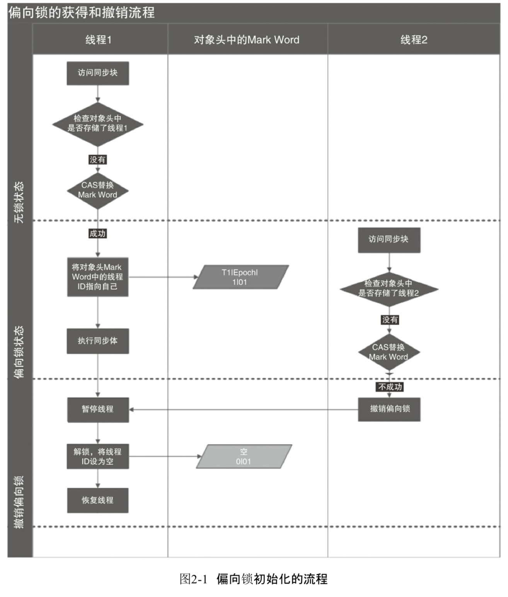
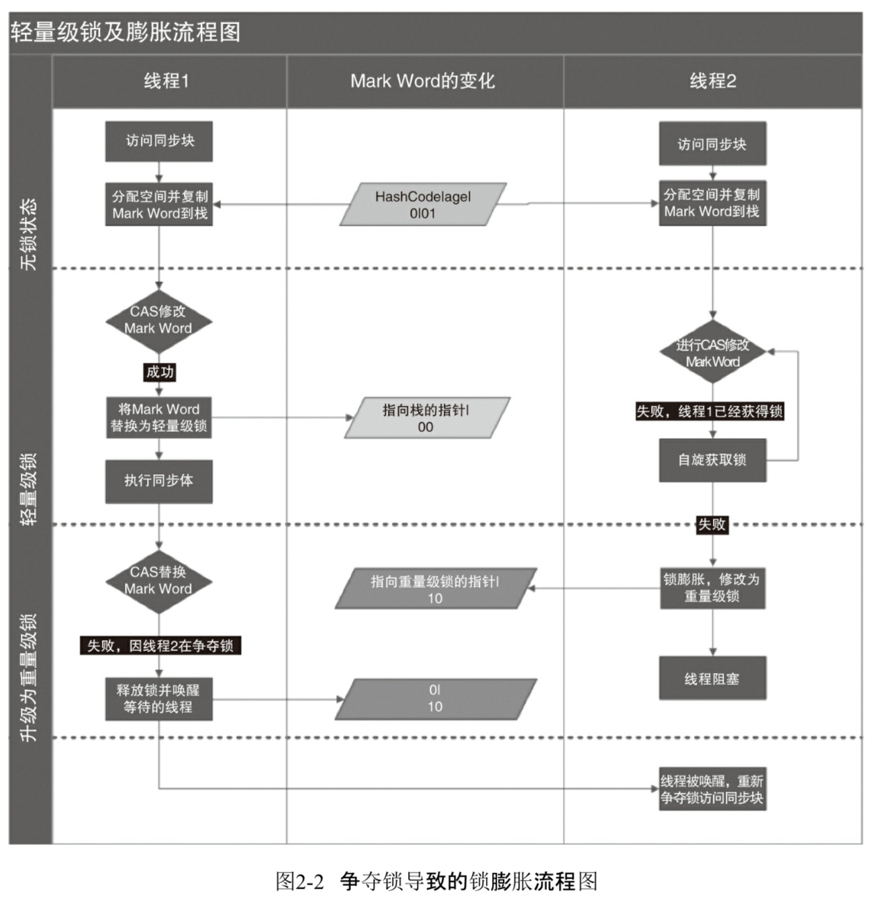
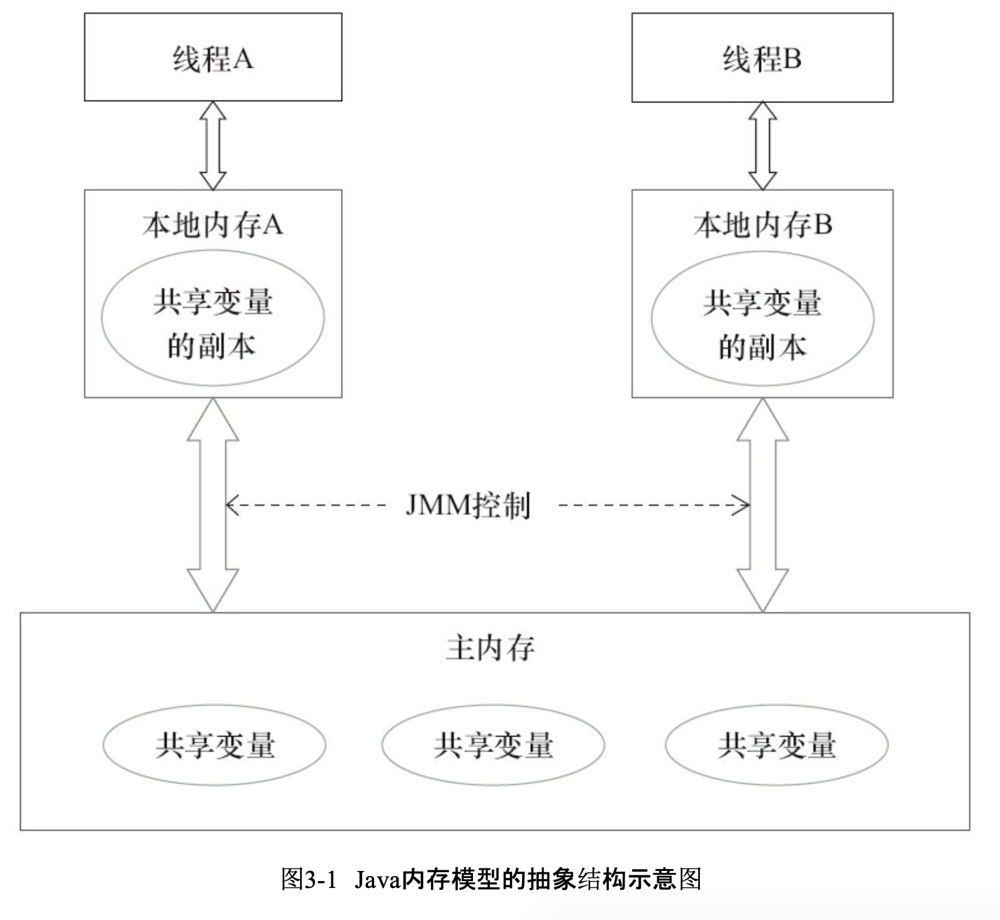

《Java并发编程的艺术》
续jvm并发章节，这里进行深入学习
## 第1章 并发编程的挑战
1. 上下文切换

    单核cpu可以通过给每个线程分配时间片来支持多线程。每个线程会执行完一个时间片后切换到另一个线程，并且保存这个线程的状态，以便切换回来时可以调用。**从保存到加载的过程叫做上下文切换**。
    当循环次数较小时，多线程比串行执行时间更长，因为切换上下文消耗时间。减少上下文切换：无锁并发（将数据id按照hash取模，不同线程处理不同段数据）、cas算法、使用最少线程、协程

2. 死锁

    两个线程分别获取了一个锁，等待对方的锁释放，此时服务终止持续等待。
    避免死锁的方式：
     - 避免一个线程同时获取多个锁
     - 避免一个线程在锁内同时占用多个资源
     - 尝试使用定时锁，使用lock.tryLock(timeout)代替内部锁机制
     - 对于数据库锁，加锁和解锁必须在一个数据库连接里。

小结： 多使用jdk并发包内提供的并发容器和工具类解决并发问题。

## 第2章 Java并发机制的底层实现原理
### volatile
volatile是轻量级的synchronized，在多处理器开发中保证了共享变量的可见性。可见性指的是当一个线程修改一个共享变量时，另外一个线程能够读到这个修改的值。

**volatile原理**
首先需要了解的是多核cpu为了提高处理速度，不会直接与内存进行通信，而是先将系统内存中的数据读取到内部缓存（L1,L2或者其他）后在进行操作，但是操作完成后不知道何时写回内存中。
如果对声明了volatile的变量进行写操作，jvm会向处理器发送一条lock前缀的指令，这个指令会在多核处理器下引发两件事：
 - Lock前缀指令会引起处理器缓存回写到内存
 - 一个处理器的缓存回写到内存会导致其他处理器的缓存无效

这里讲一下为什么会无效,每个处理器会通过嗅探在总线上传播的数据来检查自己缓存的值是否过期了，如果发现缓存行对应的内存地址已经被修改了，就会将当前处理器的缓存行设置为无效状态，再次修改这个值得时候会重新从系统内存上把数据读到处理器缓存里。

### synchronized
synchronize也称为重量级锁。在java中每个对象都可以作为锁。
  - 普通同步方法，锁时当前实例对象
  - 对于静态同步方法，锁时当前类的Class对象
  - 对于同步方法块，锁时synchronized括号里的对象

jvm规范中规定jvm基于进入和退出Monitor对象来实现方法同步（synchronized修饰方法）和代码块同步(synchronized修饰代码块)。编译后会插入monitorenter到同步代码块开始位置，monitorexit到代码结束位置。
synchronized的锁存储在对象头中，即synchronized(obj1){};这个obj1的对象头里
**锁的升级** 
为了减少获得锁和释放锁带来的性能消耗，引入了偏向锁、轻量级锁。所以锁一共有4中状态，无锁状态、偏向锁状态、轻量级锁状态和重量级锁状态。而且锁只能升级不能降级，也就是可以从偏向锁升级为轻量级锁，不能降级操作。
1. 偏向锁

    偏向锁时一种等到竞争出现才会释放锁的机制。当一个线程访问同步块并获取锁时，会在对象头和栈帧的锁记录中存储锁偏向的线程ID，当以后该线程再次进入和退出同步块时，只需要测试对象头的MarkWord里是否存储了当前线程Id的偏向锁。如果成功了，表示线程已经获得了锁。如果失败了，则需要测试对象头的偏向锁标志是否为1（当前是否使用了偏向锁），如果没有设置，就使用CAS竞争锁；如果设置了，则尝试使用CAS将对象头的偏向锁指向当前线程。

2. 轻量级锁
    - 加锁 执行同步代码块之前，jvm在当前线程的栈帧中创建用于存储锁记录的空间，并将对象头中的Mark Word复制到锁记录中。尝试使用CAS把对象头中的Mark Word替换为指向锁记录的指针。如果成功，当前线程获得锁。如果失败，表示其他线程竞争锁，当前线程尝试使用自旋获取锁。
    - 解锁 使用CAS将栈帧中复制来的Mark Word替换回到对象头中。如果成功表示解锁成功。如果失败，表示当前锁存在竞争，锁会膨胀为重量级锁。

自旋：在一个多核机器中，多个线程并行执行。如果后面请求锁的线程没有拿到锁，不挂起线程，继续占用处理器的执行时间，让当前线程执行一个忙循环（自旋操作），不断的盯着持有锁的线程是否已经释放锁。

小结：上述这几种锁其实都是synchronize的优化，jdk会自己选择使用。也可以使用参数来启用和禁用。

### 原子操作的实现原理
原子操作为不可被中断的一个或者一系列操作。

CAS：CAS属于乐观锁，比较和交换，cas操作输入两个数值，一个旧值一个新值。在操作期间先比较旧值有无变化，如果没有变化就交换新值，发生变化就不交换，有点像版本号。

处理器实现原理：
  - 总线锁 使用处理器提供一个lock前缀的指令，当一个处理器在总线上输出此信号时，其他处理器的请求就会被阻塞，该处理器可以独占共享内存。
  - 缓存锁，缓存一致性 当一个处理器对缓存中的数据进行了操作之后，就通知其他处理器放弃存储在他们内部的缓存，从主内存中从新读取。

**MESI协议（缓存一致性协议）**
以缓存行（缓存的基本数据单位）的几个状态来命名的（Modified,Exclusive, Share Invalid)。每个缓存行处于四种状态之一。
   - M 被修改的。处于这一状态的数据，只在本处理器中有缓存数据，而其他处理中没有。也表示相对于内存，数据已经修改，但是没有更新写回内存。
   - E 独占的。处于这一状态的数据，只在当前处理器有缓存，且数据没有被修改。
   - S 共享的。多个处理器都有缓存，且与内存一致。
   - I 无效的。当前处理器的缓存已经失效。

java实现原子操作原理:
  - 使用循环CAS实现原子操作, 可以使用JDK并发包里的AtomicBoolean、AtomicInteger、AtomicLong
  - CAS存在的三个问题：
    - ABA问题 如果一个值原来是A，变成了B，又变成了A。使用CAS检查可能会发现没有变化，可以使用版本号：1A-2B-3A。
    - 循环时间长开销大 如果自旋CAS长时间不成功，cpu开销非常大。
    - 只能保证一个共享变量的原子操作 可以把多个共享变量合并为一个变量来保证原子性。
  - 使用锁机制实现原子操作

## 第3章 Java内存模型
### 3.1 java内存模型基础
JMM java内存模型，是一个抽象的概念，定义了线程和主内存之间的抽象关系：线程之间的共享变量存储在主内存中，每个线程都有一个私有的本地内存（深入理解jvm中称为工作内存），本地内存中存储了该线程以读写共享变量的副本。本地内存是抽象概念，涵盖了缓存、写缓冲区、寄存器以及其他硬件和编译器优化。

如果线程A与线程B通信的话，需要以下步骤：
  - 线程A把本地内存A中更新过的共享变量刷新到主内存中
  - 线程B到主内存中读取线程A之前更新到过的共享变量

从源代码到指令顺序的重排序， 为了提高性能，编译器和处理器会对指令做出重排序：
  - 编译器优化的重排序。编译器在不改变单线程程序语义的前提下，可以重新安排语句的执行顺序
  - 指令级并行的重排序。现代处理器采用了指令级并行技术来将多条指令重叠执行。
  - 内存系统的重排序。由于处理器使用缓存和读写缓冲器，加载和存储操作在看上去是乱序执行的。

现代处理器会使用写缓冲器来临时保存向内存写入的数据，这样可以提高效率。会产生的影响赋值和声明语句的顺序。

### 3.2 重排序
**数据依赖性**
    如果两个操作访问同一个变量，且其中有一个写操作，则两个操作之间具有数据依赖性。
    同一线程中存在数据依赖性时，编译器和处理器不会改变这两个操作的执行顺序。不同处理器之间和不同线程之间的数据依赖性不被考虑。

**as-if-serial**
    无论怎么排序，（单线程）执行的结果不能改变。

### 3.3 顺序一致性
顺序一致性： 程序的执行结果与该程序在顺序一致性内存模型中的执行结果相同。
顺序一致性内存模型：1.一个线程中的所有操作必须按照程序的顺序来执行，2.不论程序是否同步，所有线程都只能看到一个单一的执行顺序。
### 3.4 volatile的内存语义
volatile变量具有以下特征：
   - 可见性。对一个volatile变量的读，总能看到任意线程对volatile变量最后的写入
   - 原子性。对任意单个volatile变量的读、写具有原子性，但是类似于volatile++这种复合操作不具有原子性

### 3.7 happens-before
