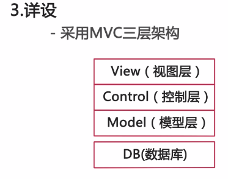
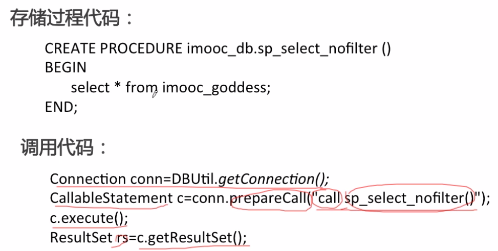
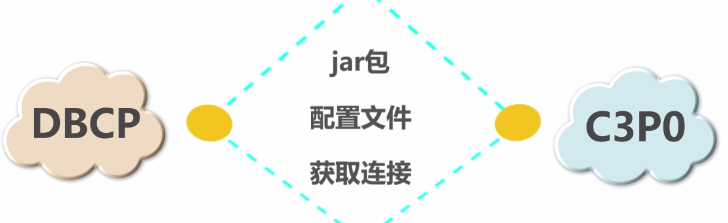
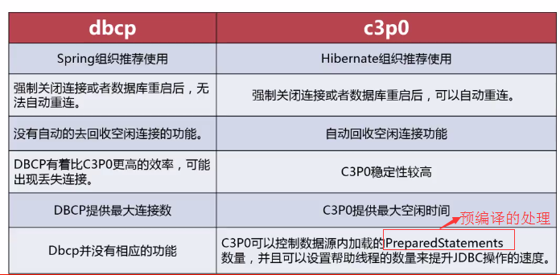

## JDBC
**JDBC(Java Database Connectivity)**是java语言访问数据库的一种规范，是一套API。即java数据库编程接口，是一组标准的java语言中的接口和类。本质是官方定义的规则，各个数据库厂商去实现接口，提供数据库驱动jar包。我们使用接口编程，真正执行的代码是驱动jar包中的实现类。
1. JDBC中包含的API任务通常与数据库使用：
    - 连接到数据库
    - 创建sql和mysql语句
    - 在数据库中执行sql和MySQL查询
    - 查看和修改记录
### 使用
1. 下载驱动包，导入到项目
2. 注册驱动（可以省略）
3. 获取连接对象Connection
4. 定义sql
5. 获取执行sql语句的对象 statement
6. 执行sql，接受返回结果
7. 处理结果
8. 释放资源
```java
//1. 导入驱动jar包
//2.注册驱动
Class.forName("com.mysql.jdbc.Driver");
//3.获取数据库连接对象
Connection conn = DriverManager.getConnection("jdbc:mysql://localhost:3306/db3", "root", "root");
//4.定义sql语句
String sql = "update account set balance = 500 where id = 1";
//5.获取执行sql的对象 Statement
Statement stmt = conn.createStatement();
//6.执行sql
int count = stmt.executeUpdate(sql);
//7.处理结果
System.out.println(count);
//8.释放资源
stmt.close();
conn.close();
```
### 搭建模型层
采用mvc三层架构

采用MVC三层架构：建议由下往上开发（DB->view,需求读懂以后，设计数据库，然后根据数据库映射模型，再写控制层，再写视图层）

- View视图层——展示数据，反馈用户行为
- Control控制层——控制数据流通过程，协调视图层和数据层
- Model模型层——与数据库建立映射，与数据进行交互 (db+dao)
- (DB数据库）

### JDBC中调用存储过程
1. 存储过程：一组为了完成特定功能的SQL 语句集，存储在数据库中，经过第一次编译后再次调用不需要再次编译，用户通过指定存储过程的名字并给出参数（如果该存储过程带有参数）来执行它。
2. 存储过程通常有以下优点：
- 存储过程增强了SQL语言的功能和灵活性。存储过程可以用流控制语句编写，有很强的灵活性，可以完成复杂的判断和较复杂的运算。
- 存储过程允许标准组件是编程。存储过程被创建后，可以在程序中被多次调用，而不必重新编写该存储过程的SQL语句。而且数据库专业人员可以随时对存储过程进行修改，对应用程序源代码毫无影响。
- 存储过程能实现较快的执行速度。如果某一操作包含大量的Transaction-SQL代码或分别被多次执行，那么存储过程要比批处理的执行速度快很多。因为存储过程是预编译的。在首次运行一个存储过程时查询，优化器对其进行分析优化，并且给出最终被存储在系统表中的执行计划。而批处理的Transaction-SQL语句在每次运行时都要进行编译和优化，速度相对要慢一些。
- 存储过程能过减少网络流量。针对同一个数据库对象的操作（如查询、修改），如果这一操作所涉及的Transaction-SQL语句被组织程存储过程，那么当在客户计算机上调用该存储过程时，网络中传送的只是该调用语句，从而大大增加了网络流量并降低了网络负载。
- 存储过程可被作为一种安全机制来充分利用。系统管理员通过执行某一存储过程的权限进行限制，能够实现对相应的数据的访问权限的限制，避免了非授权用户对数据的访问，保证了数据的安全。

3. 调用存储过程：
   

### 事务
事务（transaction）是作为单个逻辑工作单元执行的一系列操作。这些操作作为一个整体一起向系统提交，要么都执行、要么都不执行。
1. 特点：
    - 原子性： 完整的操作不可再分
    - 一致性： 事务完成时，数据处于一致状态
    - 隔离性： 对数据进行修改的所有并发事务是彼此隔离的
    - 永久性： 事务完成后，数据库的修改是永久保持的
2. jdbc实现事务管理
    - 通过commit()、 rollback()进行管理
    - 关闭自动提交 setAutoCommit(false)
    - 加锁：setTransactionIsolation(TRANSACTION_READ_UNCOMMITTED);
      - static int TRANSACTION_NONE = 0;
      - static int TRANSACTION_READ_UNCOMMITTED = 1;
      - static int TRANSACTION_READ_COMMITTED = 2;
      - static int TRANSACTION_REPEATABLE_READ = 4;
      - static int TRANSACTION_SERIALIZABLE = 8;

    ```java
    try {  
        conn = DriverManager.getConnection("jdbc:microsoft:sqlserver://localhost:1433;User=JavaDB;Password=javadb;DatabaseName=northwind");  
        //点禁止自动提交，设置回退  
        conn.setAutoCommit(false);   
        stmt = conn.createStatement();  
        //数据库更新操作1  
        stmt.executeUpdate(“update firsttable Set Name='testTransaction' Where ID = 1”);   
        //数据库更新操作2  
        stmt.executeUpdate(“insert into firsttable ID = 12，Name = 'testTransaction2'”);   
        //事务提交  
        conn.commit();  
    }catch(Exception ex) {   
        ex.printStackTrace();  
        try {  
            //操作不成功则回退  
            conn.rollback();  
        }catch(Exception e){  
            e.printStackTrace();  
        }  
    }
    ```

### 线程池
- 数据库连接是一种重要资源；

- 频繁的连接数据库会增加数据库的压力；

- 为解决以上问题出现连接池技术。
常用的数据库连接池有： dbcp,c3p0
DBCP和C3P0的相同点：

不同点：
