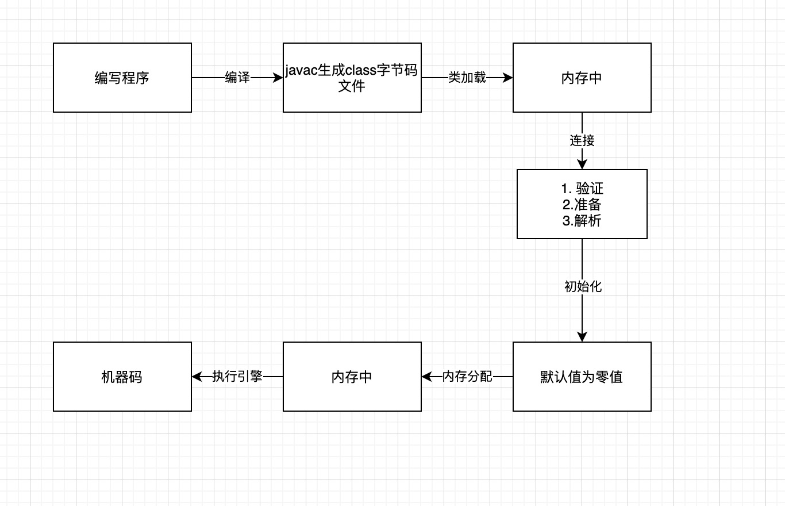

# 深入理解Java虚拟机：JVM高级特性与最佳实践（第3版）- 周志明
窃书者不为偷也 先读盗版看看，下次一定买

## 第一部分 走近java
### 第1章 走近java
JDK（java development kit）: java语言，jvm, java类库
JRE 是支持java程序运行的标准环境， jdk包含jre

讲了几大公司神仙打架，java越来越火
如何自己编译jdk, 下载源码，使用gcc编译
## 第二部分 自动内存管理
### 第2章 Java内存区域与内存溢出异常 

1. 程序计数器

    是一块较小的内存空间，是当前线程所执行的字节码的行号指示器。在运行过程中，字节码解释器通过改变这个计数器的值来选取下一条需要执行的字节码指令，使用程序计数器来实现分支、循环、跳转、异常处理和线程恢复等功能。

2. java虚拟机栈

    线程私有的，生命周期和线程相同。用来描述Java方法执行的线程内存模型：每个方法被执行的时候，jvm会创建一个栈帧来存储局部变量表、操作数栈、动态链接和方法出口等信息。每个方法被调用直至执行完毕就是一个栈帧在虚拟机中从入栈到出栈的全过程。

3. 本地方法栈

    与虚拟机栈类似，区别是虚拟机栈用来执行java方法（字节码）方法，本地方法栈为执行本地方法（native,指的是非java方法，可以理解为调用c、c++方法)。

4. java堆
   
   java堆是jvm管理的内存中最大的一块。java堆是所有线程共享的一块内存区域，在虚拟机启动时创建。用来存放对象实例，几乎所有的对象实例都是在这里分配内存。

   java堆是垃圾回收管理的内存区域，有时会叫做GC堆。

5. 方法区

    与堆一样，是各个线程共享的内存区域，用于存储已被虚拟机加载的类型信息、常量、静态变量、即时编译器编译后的代码缓存等数据。

6. 运行时常量池

    方法区的一部分。Class文件中除了有类的版本、字段、方法、接口等描述信息，还有一项信息是常量池表，用于存放编译期生成的各种字面量和符号引用，这部分内存放在运行时常量池中。（字面量，这个变量的量就是变量，比如 int x = 3, 3就是字面量， 如果是 int x; x不知道是多少，就不是字面量。js中 let person = {"name": "tom"},这样是一个字面量，概括来说就是不用调用构造函数创建的变量，通过声明就可以描述定义自己的就叫字面量）

7. 直接内存

    直接内存不是虚拟机运行时数据区的一部分。在NIO(New Input/Output)类中引入了基于通道channel和缓冲区的I/O方式，可以使用Native函数库直接分配堆外内存，然后通过java堆内的java堆和native堆中来回复制数据。

#### 2.3 HotSpot虚拟机对象
1. 对象的创建，遇到new指令
    1. 在常量池中定位到类的符号引用，检查是否已经加载、解析和初始化过。如果没有就先进行相应的类加载过程。
    2. 类加载之后为新对象分配内存。对象所需要的内存大小在类加载完成后便已经确定，分配过程就是把一块确定大小的内存从java堆中划分出来。这里有两种情况，1. java堆内存时规整的，一边是使用的，一边是空闲的，指针在中间，分配时直接移动指针即可，这种叫指针碰撞。2. java堆内存不规整，使用的和空闲的相互交错存在，这时候需要用一个列表来记录和维护，每次从空闲的内存中分一块够用的给新对象，这种方式是空闲列表。

        关于java堆是否规整却取决于垃圾回收期是否带有空间压缩整理的能力。

        即使使用指针碰撞这种简单的移动指针的分配方式，在多线程的情况下也存在安全问题，可能给对象A分配了内存，指针还没移动，又给B分配了这里。解决线程安全两种方案：1. 对分配内存空间的动作进行同步处理，即使用CAS（乐观锁）加上失败重试实现更新操作的原子性。2. 使用缓存，每个线程在java堆中预先分配一块内存，本地线程分配缓冲，需要内存时先自己分配，不够了再申请分配新的给线程。
    3. 初始化内存空间为零值，如果使用了TLAB，则进行TLAB分配。tlab就是上面讲的本地线程分配缓冲，Thread Local Allocation Buffer。
    4. 开始对对象进行设置。在对象头中设置：对象是哪个类的实例、如何找到类的元数据信息、对象的哈希吗、对象的GC分代年龄等。
    
    OK,完成了1234，jvm中一个对象就产生了。但是在java程序中对象才刚开始创建，所有的字段都还是零值，资源和状态都还没构造好。之后需要执行init方法了。

2. 对象的内存布局
   对象头、实例数据、对齐填充
   1. 对象头

        对象头包含两类信息：用于存储对象自身的运行时数据，如哈希码、GC分代年龄、锁状态标志、线程持有的锁、偏向线程ID、偏向时间戳等。但是这些信息与对象自身定义的数据无关。对象头里包含了类型指针，指向它的类型元数据，通过这个指针确定该对象是哪个类的实例。
    
    2. 实例数据

        类中的各个类型的字段内容。

    3. 对齐填充

        这个不是一定存在的，也没有特别含义，占位符的作用。因为HotSpotJVM的自动内存管理系统要求对象起始地址是8字节的整数倍，也就是任何对象的大小都是8字节的整数倍。对象头已经设计好满足条件了，如果实例数据没对齐，就通过对齐填充来补全。

3. 对象的访问定位

    java虚拟机规范中规定了reference类型是指向对象的引用，也就是为了使用对象。 这里reference存储两种方式: 1. 通过保存在句柄中，放入句柄池中，reference保存句柄池地址 2. 直接保存地址到reference

名词解释：
1. 符号引用

    包含在字节码文件的常量池中的符号，主要包括这个类中出现过的各类包、类、接口、字段、方法等元素的全限定名。
    Class文件里的“符号引用”的实态：带有类型（tag） / 结构（符号间引用层次）的字符串。

    [JVM里的符号引用如何存储？ - RednaxelaFX的回答 - 知乎](https://www.zhihu.com/question/30300585/answer/51335493)

2020/09/24
本想一周内肝完这本书，发现不大行，好多东西看不懂，准备刷一遍视频再来读这本书。这里的不太难，但是不好联系在一起。
立个flag:
1. 马上要国庆了，不到一周时间了，这几天晚上刷一套jvm视频入入门。国庆时候抽时间刷完这本书。
2. 这几天上班时间搞一下java容器源码，国庆回来之后看一下spring系列视频并且入门写一个项目，之后可以一边刷spring核心概念原理源码，一边找java开发工作。

2020/09/29
视频看了，大概了解了其中的核心知识点，还是需要看看书细化一下。
2020/10/09
国庆9天乐
继续填坑，增强自律性

### 第3章 垃圾收集器与内存分配策略
需要回收的是堆和方法区
#### 3.2 对象已死？
确认对象那些已经死去，那些还存活着
1. 引用计数算法
   Python 用这个方法，在对象中添加一个引用计数器，每当有一个地方引用它时，计数器值加一，当引用失效就减一。计数器为零时就是死去。
   这个方法一般，需要额外的空间去存储，当存在相互引用时，两个计数器都不是零，也就无法回收。

2. 可达性分析算法
   java、C#的内存管理子系统。通过一系列称为“GC Roots"的根对象作为起始节点集，从这些节点开始，根据引用关系向下搜索，搜索过程所走过的路称为引用链，如果某个对象到"GC Roots"间没有任何引用链相连，或者用图论的话来说就是GC Roots到这个对象不可达时，证明这个对象不可能再使用了。

    

生存还是死亡？

   当可达性分析算法中判定为不可达对象，进行一次标记。随后进行一次筛选，筛选条件是是否有必要执行finalize()方法。（没有覆盖这个方法或者已经条用过了，finalize()每个对象只会调用一次）如果有必要执行finalize(),该对象放在一个名为F-Queue的队列中。随后会开启一个线程去调用他的finalize方法。之后会对F-Queue中的对象进行第二次小规模的标记，如果第二次依旧是不可达，则进行回收。如果在finalize()方法中建立了关联，则会存活下来。

回收方法区
    jvm规范中说可以不进行回收这部分，因为回收困难，回收的内存也不多。
    主要回收废弃的常量和不再使用的类型。
#### 3.3 垃圾收集算法
大致分两种：引用计数式垃圾收集（直接垃圾收集）和追踪式垃圾收集（间接垃圾收集）。java中使用的追踪式垃圾收集.

分代收集理论
理论依据是：
   - 弱分代假说：绝大多数对象都是朝生夕灭。
   - 强分代假说：熬过越多次垃圾收集过程的对象就越难消亡

设计原则： 收集器将java堆划分出不同的区域，将回收对象依据其年龄（对象熬过垃圾收集过程的次数）分配到不同的区域中存储。每次垃圾收集都更关注年龄小的区域，可以用较小的代价回收较大的空间。对于难以消亡的对象，集中存放在一起，以较低的频率去回收它。

1. 标记-清除算法

    最基础的垃圾收集算法，后面的算法都是在这个基础上完善的。分为两部分：标记，清除。标记出需要回收的对象，完成标记后统一回收。

    缺点是 有大量碎片、执行效率不稳定。

    

2. 标记-复制算法

    半区复制，把内存分为大小相等的两块，每次只用一块，一块内存用完了，就进行垃圾收集，把可用的复制到另一块，别的进行清理。
    优点：简单高效，没有碎片。
    缺点：浪费一半空间
    

    可以进行优化，不用分成大小相等的两块。可以将新生代分成一块较大的Eden空间（伊甸空间）和两个较小的Survivor空间（幸存空间）。每次分配内存只使用Eden和其中一个Survivor。垃圾收集时，将Eden和Survivor中仍然存货的对象一次性复制到另一块Survivor,清理掉Eden和已用过的那块Survivor空间。Eden和Survivor大小是8：1。内存利用率为90%。（有一块幸存区是空的，等待复制，轮回使用两个幸存区）。如果垃圾收集后存活的对象超过了10%，就需要其他内存区域（老年代）进行分配。

3. 标记-整理算法

    标记-复制算法在存活率较高时复制操作多，效率低。
    因为标记-复制需要额外的空间进行分配担保，不适用与老年代。老年代使用标记-整理算法。标记过程相同，后续不是直接进行清除，而是所有的存活对象向内存空间一端移动，直接清理掉边界外的内存。

    

## 第三部分 虚拟机执行子系统
### 第六章 类文件结构
class文件时一组以8个字节为基础单位的二级制流，各个数据项目严格按照顺序紧凑地排列在文件之中，中间没有添加任何分隔符。
class文件结构使用两种数据类型：无符号数和表。
 - 无符号数：以u1, u2, u4, u8来分别代表1个字节、两个字节、四个字节和八个字节的无符号数，用来描述数字，索引类型，数量值和按照UTF-8编码的字符串值。
 - 由多个无符号数或者其他表作为数据项构成的复合数据类型。

文件结构:

  1. 魔数  Class文件的头4个字节，用来确定这个文件是否能被虚拟机接受。为固定的0xCAFEBABE,咖啡宝贝。
  2. 版本号  紧接着魔数的4个字节， 第五六个字节是此版本号，第七八个字节为主版本号。
  3. 常量池 主次版本号之后是常量池入口。
  4. 常量池计数值 位于常量池开头，也就是版本后后面，偏移地址为 0x00000008, 是从1开始的计数值。例如 0x0016为十进制的22，代表常量池中有21项常量。
  5. 访问标志  常量池结束之后，2个字节代表访问标志。用于识别一些类或者接口层次的访问信息。
  6. 类索引、父类索引，这两个索引都是一个u2类型的数据，接口索引集合是一组u2类型的数据集合。两个索引之后是接口计数器，表示接口索引集合的容量。后面会跟着接口信息数据区。
  7. 字段表集合 包含字段计数器和字段表。描述接口或类中声明的变量。字段包括类级变量以及实例变量，但不包括在方法内部声明的局部变量。
  8. 方法表集合 方法计数器和方法表。 类中的方法
  9. 属性表集合 属性计数器和属性表。在Class文件，字段表，方法表中都可以携带自己的属性集合。

### 第7章 虚拟机类加载机制
代码编译的结果是从本地机器码转变为字节码

1. 加载， 加载阶段完成三件事
   - 通过一个全类名来获取定义此类的二进制字节流
   - 将字节流锁代表的静态存储结构转化为方法区的运行时数据结构
   - 在内存中生成一个代表这个类的java.lang.Class对象，作为方法区这个类数据访问入口

2. 验证 确保Class文件的字节流中包含的信息符合全部约束要求，保证信息运行后不会危害虚拟机自身的安全。
3. 准备 正式为类中定义的变量（静态变量）分配内存并设置类的变量初始值。分配在方法区中。
4. 解析 java虚拟机将常量池内的符号引用替换为直接引用的过程。
5. 初始化 根据代码去初始化类变量和其他资源

jvm内置了三个重要的ClassLoader
  - BootstrapClassLoader(启动类加载器) 最顶层的加载器，由C++实现，负责加载`%JRE_HOME%/lib`目录下的jar包和类或者被-Xbootclasspath参数指定的路径中的所有类。
  - ExtensionClassLoader(扩展类加载器) 主要负责加载目录`%JRE_HOME/lib/ext`目录中的jar包和类，或者被java.ext.dirs系统变量指定的路径下的jar包。
  - AppClassLoader(应用程序类加载器) 面向用户的夹杂器，负责加载当前用classpath下的所有jar包和类。

**双亲委派机制**

