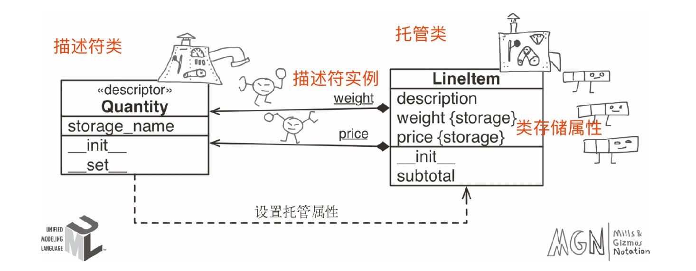

## 19 动态属性和特性
### 重要属性和函数
1. 常见属性
   - ```__class__``` 在对象所属类的引用，在对象的类中寻找，```obj.__class__```  == type(obj)
   -  ```__dict__``` 存储对象和类的可写属性
   -  ```__slots__``` 限制实例的属性
2. 处理属性的内置函数
   - dir 列出对象属性
   - getattr(object, name[, default]),从object对象获取属性，可能来自对象，或者对象所属的类或者超类，找不到抛出AttributeError
   - hasattr
   - setattr
   - vars 返回```__dict__```
   - ```__getattribute__``` obj.attr,或者getattr(obj, 'attr') 都会触发，查找失败抛出AttributeError之后会调用```__getattr__```
   - ```__getattr__``` 仅当指定属性查找失败之后调用
## 20 属性描述符
*** 描述符是实现了特定协议的类，协议包括__get__、__set__、__delete__方法 ***

1. ```__set__(self, instance, value)``` 这里要区分self和instance，self表示描述符实例，属于托管类的类属性，instance是托管实例。管理实例属性的描述符应该把值存储在托管实例中。
2. 覆盖型和非覆盖型描述符，定义了```__set__```是覆盖型描述符，会覆盖对实例属性的赋值操作。
## 21 类元编程
1. import时候会执行所有的类定义体，然后调用依附在类上的装饰器函数