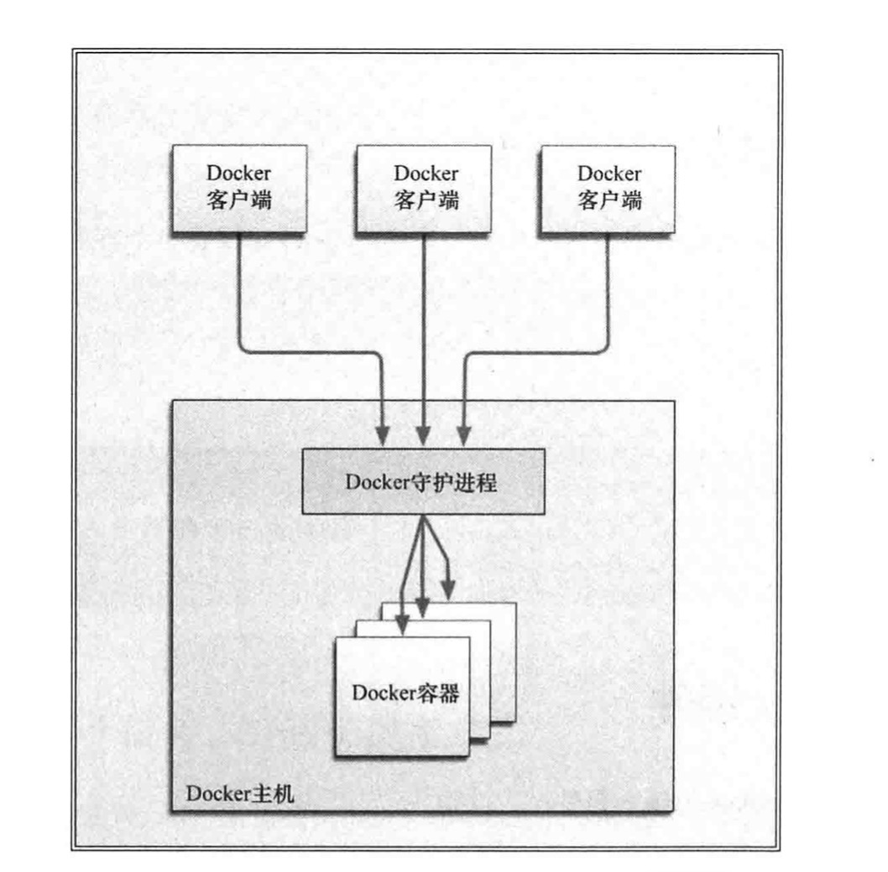

### DOCKER

#### 概念
1. 组件:
    1. Docker客户端和服务器
   
     

    2. Docker镜像  镜像是Docker生命周期中的构建部分。
    3. Registry 保存用户构建的镜像。
    4. 容器 Docker可以构建和部署容器，容器为启动和执行阶段，里面应该包含镜像。
2. 常用命令参数
   - run 运行
   - -i 允许对容器内的标准输入进行交互，保证容器内的STDIN开启
   - -t 在新容器内指定一个伪终端或终端
   - ```--name ``` 容器命名
   - logs 查看日志
   - stop 停止
   - start  启动
   - attach 附着到容器上（连接）
   - -d 守护式容器， 可以后台运行
   - 查看日志， docker logs  容器名（或者ID） , 1. -f 可以追踪日志， 2. --tail n 可以查看最后n条数据 3. -t加时间戳
   - 查看容器内的进程 docker top container_name
   - 在容器内不运行进程 exec
   - docker rm 容器  删除容器
   - ps 查看运行的进程  docker ps -a 查看全部容器
   - 自动重启容器  --restart=always 无论容器的退出代码是什么都会自动重启容器
   - 检查容器 docker inspect container_name
   - 调用容器的终端 docker -i -t container_id /bin/bash


    ```bash
    docker run -i -t ubuntu:15.10 /bin/bash
    ```
#### Dockerfile
1. 介绍
   > dockerfile就是根据自己的需要自定义一个镜像，就像你写shell脚本一样，把一连串的过程或步骤全部写进dockerfile文件中，一步一步的执行dockerfile文件中你写的内容。

   > 每条指令都会创建一个新的镜像层并对镜像进行提交。
   > 多次构建会对步骤进行缓存，每次只从修改处进行提交新的镜像。可以只用build --no-chache来禁用

    指令|描述|示例
    :-:|:-:|:-:
    FROM|构建的新镜像基于哪个镜像| FROM centos:6
    MAINTAINER|维护者的姓名邮箱 | MAINTAINER xxx<22@qq.com>
    RUN|构建镜像时候运行的Shell命令| RUN yun install httpd
    CMD| 运行容器时执行的Shell命令| CMD /usr/sbin/sshd -D
    EXPOSE|声明容器运行的服务端口| EXPOSE 80 443
    ENV | 设置容器内环境变量| ENV MYSQL_ROOT_PASSWORD 123456
    ADD| 拷贝文件或目录到镜像，如果是url或者压缩包会自动下载解压| ADD https://xxx.com/html.tar.gz /var/www/html
    COPY | 拷贝文件或者目录到镜像| COPY ./start.sh /start.sh
    ENTRYPOINT| 运行容器时执行的Shell命令| ENTRYPOINT /bin.bash -c '/start.sh'
    VOLUME| 指定容器挂载点到宿主机自动生成的目录或者其他容器| VOLUME ["/var/lib/mysql"]
    USER | 为RUN,CMD和ENTRYPOINT执行命令指定运行用户| USER admin
    WORKDIR| 为RUN,CMD,ENTRYPOINT,COPY,ADD设置工作目录| WORKDIR /data
    ARG| 在构建镜像时候指定的一些参数| ARG user

    

2. build命令
   ```
   docker build [OPTIONS] PATH | URL | -
   OPTION :
   -t, --tag list # 构建后的镜像名称
   -f, --file string # 指定Dockerfile文件位置
   示例：
   1. docker build .
   2. docker build -t nginx:v10 .
   3. docker build -t nginx:v10 -f /path/Dockerfile /path
   ```

#### 镜像
1. 列出镜像 docker images
2. 拉取镜像 docker pull / run 
3. 查找镜像 docker search   从DockerHub上查找公共的可用镜像
4. 构建镜像，两种方式 
    - 使用 docker commit 命令 docker commit container_id new_image_name(不推荐)
    - 使用 docker build 命令和Dockerfile文件(推荐)
5. 删除 docker rmi
