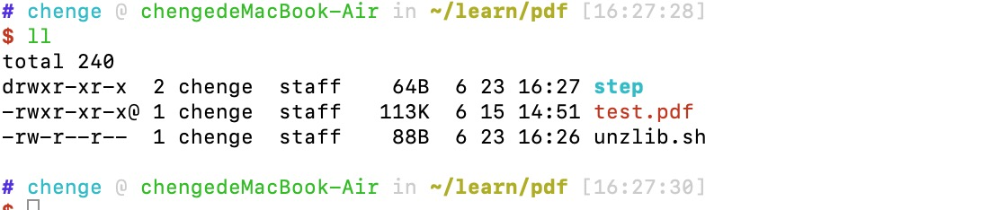
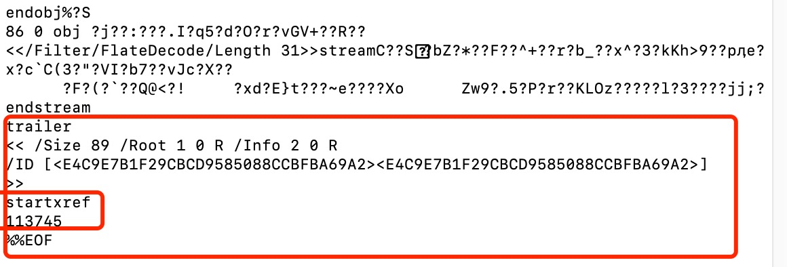
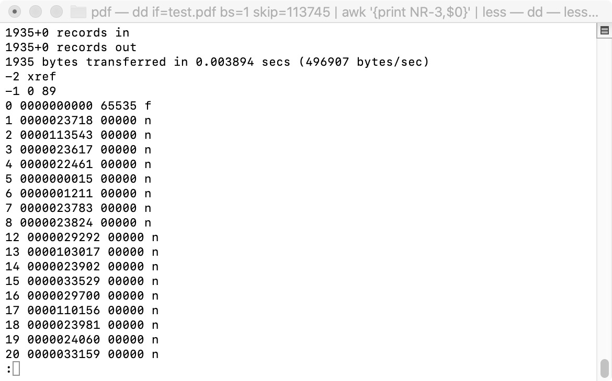
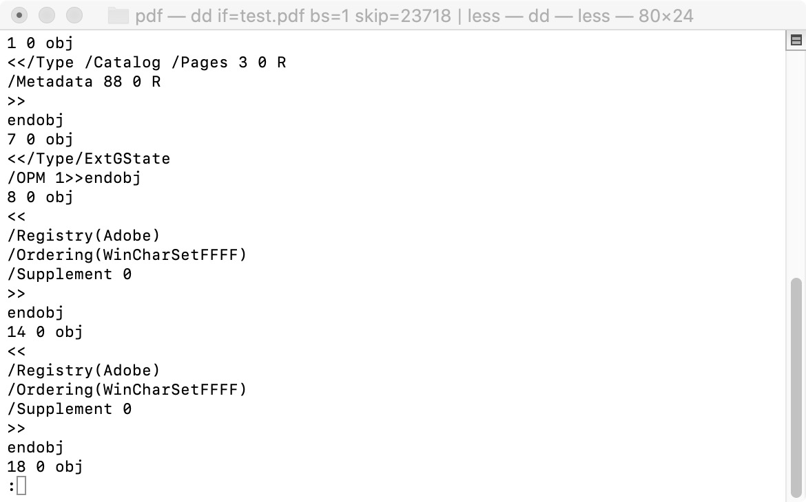
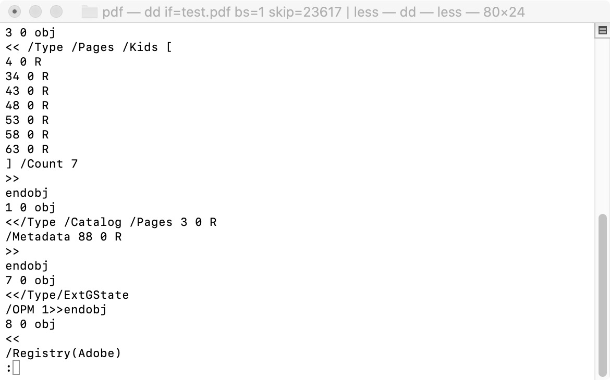
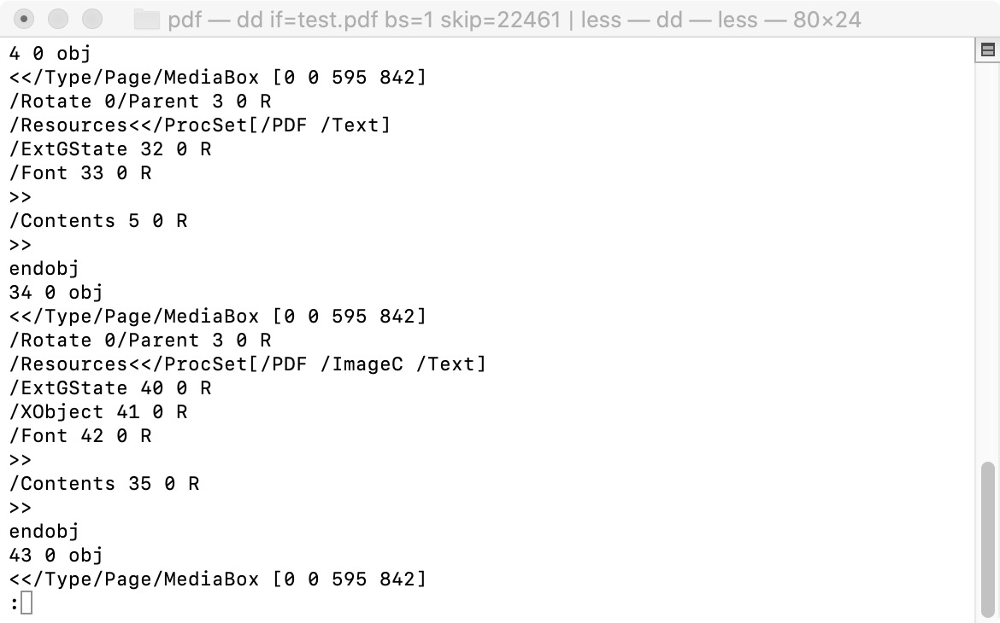
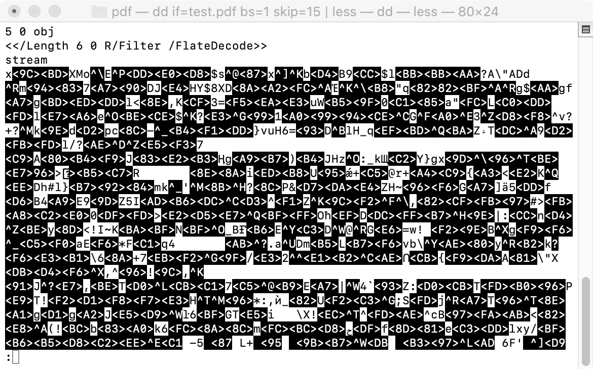
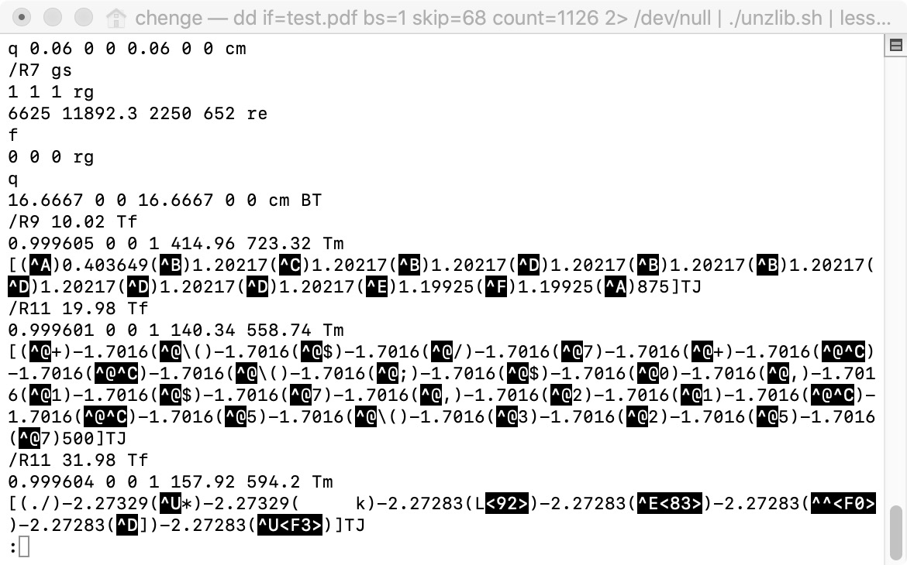

## 结构
大概分为四个部分：
1. pdf头部的信息，说明了支持的pdf版本
2. 内容信息
3. xref表
4. 尾部tailer记录xref的偏移量

## 手动解析pdf

[连接](https://www.youtube.com/watch?v=k34wRxaxA_c)

1. 目录结构
   


2. 查看tailer信息

`tail test.pdf`



3. 查看xref table

`dd if=test.pdf bs=1 skip=113745 | awk '{print NR-3,$0}' | less`



4. 查看第一个obj
   
` dd if=test.pdf bs=1 skip=23718 | less`



这里的obj 1 是一个目录, 继续查看pages

5. 查看pages

`dd if=test.pdf bs=1 skip=23617 | less`



这里有几个子节点,继续查看

6. 查看4



这里4的内容是5

7. 查看5



这里是编码过的，要使用的是flateDecode解码

8. 解码查看

这里使用mac有问题，使用ubuntu可以

`dd if=test.pdf bs=1 skip=68 count=1126 2>/dev/null | ./unzlib.sh | less`

unzlib.sh

```bash
( /bin/echo -ne '\037\0213\010\0\0\0\0\0' ; cat "$@" ) | gzip -dc 2>/dev/null
```



以上就是手动查看Pdf的过程，最后这里的是属性或者文字或者表格之类的，没有看文档这里不清楚了。但是可以知道pdf的结构了，确实太麻烦了。

