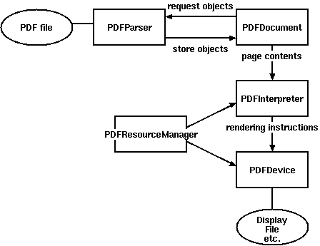
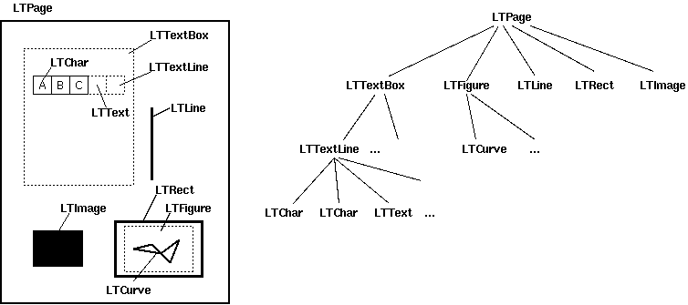

# pdfminer
pdfminer是一款分析pdf文件的库，由python写的。
主要构成：
1. PDFParser: 从一个文件中获取数据
2. PDFDocument: 保存获取的数据，与PDFParser相互关联
3. PDFPageInterpreter：处理页面内容
4. PDFDevice: 翻译成需要的格式
5. PDFResourceManger： 存储共享资源，如字体图像

布局layout（主要）

LTPage 表示整个页。
LTTextBox: 表示一组文本块可能包含在一个矩形区域
LTTextLine: 表示单个文本行LTChar对象的列表，字符可能会垂直或者水平。使用get_text()获取这一行的内容。
LTChar

步骤：
1. PDFPageInterpreter.process_page() 解析页的内容，其中会判断书写方向是水平还是垂直。之后获取获取坐标，左下右上，加载资源，初始化状态之后进行加载。
2. 在PDFLayoutAnalyzer.end_page()方法中分析布局，这里会把所有Object分为文本和其他格式（LTChar的实例属于文本对象)，将文本对象分组，放入PDFTextLine

    这里的分组算法分两种，水平和竖直，这里讲一下水平的。水平方向上判断是否属于一个group从两个方向上判断：
    1. 竖直方向重合。 obj2.y0 <= obj1.y1 and obj1.y0 <= obj2.y1 即中间有重合部分。没有重合部分就不属于一个组，有重合部分继续判断重合部分应该大于两个字较小高度乘一个符合度比例。即只有重合部分高于一定程度（0.5 * min(obj1.y1-obj1.y0, obj2.y1 - obj2.y0) 满足条件
    2. 距离  如果 `obj1.x0 < obj2.x1 and obj2.x0 < obj1.x1`表示重叠了，满足条件，如果不重叠比较最短距离和两者较小宽度乘比例（2.0）
    
    满足两个条件可以分在一个组里，即在一个LTTextLine,也就是横向上的一句话。

3. 分组之后返回textlines, LTTextLine的列表，每个里面都有左下和右上的坐标，以及文字。之后继续细分，分为不同的LTTextBox, 这里使用LTTextLine.find_neighbors(), 在所有的textLine中按照下面方法查找：
   计算 y0, y1之间的值（先用值除以50) `range(y0//50, y1//50)` 在计算x0, x1,组合所的情况，每个（x, y)保存当前的textLine, 计算所有的，（x, y)相等时表示属于一个textBox,等于放小之后再一定范围内，即属于一个box

4. 获取所有的tb之后, 按照y从小到大的顺序分到不同的行， 生成多行textBox的列表，在进行倒序，表示从上到下。 对行里的textBox按照x从小到大排序。整体循环就是从上到下，从左到右。
   
上面就是利用pdfminer获取出文字和文字顺序。之后根据pdf结构的特点进行提取数据。

 首先设立一个标志位，表示当前行表示的内容，一般为 个人信息、综述、指标、无用信息。每个来源的pdf格式一致，不同来源的进行调整。之后根据关键字进入不同的状态，利用不同的解析方式进行解析。