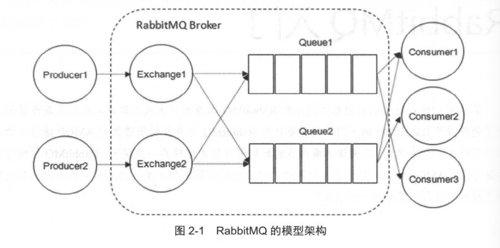
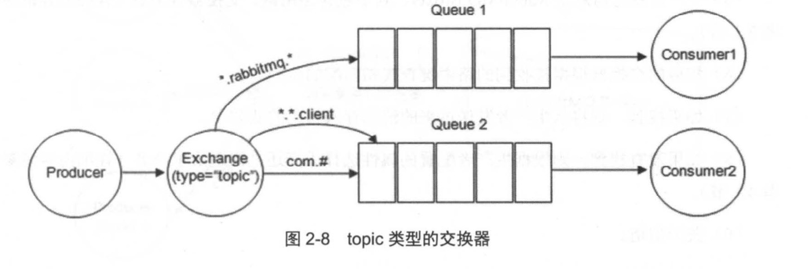
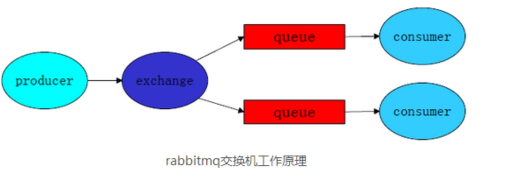
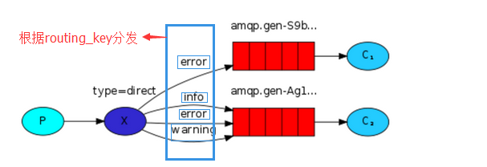

# RabbitMQ简介

RabbitMQ是消息中间件，高可靠、易扩展、高可用以及丰富的功能特性。

## 什么是消息队列中间件

MQ消息队列中间件是指利用高可靠的消息传递机制进行与平台无关的数据交流，基于数据通信进行分布式系统的集成。

MQ一般有两种传递模式： 点对点（P2P), 发布/订阅模式（Pub/Sub)。点对点是基于队列的，消息生产者发送信息到队列，消费者从队列取出消息，可以实现异步传输。发布订阅模式定了如何向一个内容节点发布和订阅消息，这个内容节点就是主题（topic),主题可以认为是消息传递的中介，消息发布者将消息发布到某个主题，而消息订阅者则从主题中订阅消息，在一对多广播时采用。

## 消息中间件的作用
1. 解耦： 通过消息队列可以在两端各自实现接口，通过数据通信，实现自己的业务逻辑。
2. 冗余： 处理数据过程失败时，消息中间件可以把数据进行持久化直到他们已经被完全处理，规避了数据丢失的风险。在把一个消息从消息中间件中删除之前，需要处理系统明确的支出该消息已经被处理完成，从而确保数据被安全的保存知道使用完毕。
3. 扩展性： 因为消息中间件解耦了应用的处理过程，所以提高消息入队和处理的效率是很容易的，只要另外增加处理过程即可。
4. 削峰：在访问量剧增的情况下， 应用仍需要继续发挥作用，但是这样的突发流量并不常见。如果以能处理这类峰值作为标准投入资源，无疑是巨大的浪费。使用消息中间件能使关键组件支撑突发访问压力，不会因为突发的超负荷请求而完全崩溃。
5. 可恢复性： 如果消息处理的进程挂掉了，加入消息队列的消息不会丢失，在系统恢复后进行处理。
6. 顺序保证：大多数场景下，支持一定程度上数据的顺序。
7. 缓冲：在任何重要的系统中，都会存在需要不同处理时间的元素，消息中间件通过一个缓冲层来帮助任务最高效率的执行，写入消息中间件的处理会尽可能快速，该缓冲层有助于控制和优化数据流经系统的速度。
8. 异步通信：在很多时候应用不想也不需要立即处理消息。消息中间件提供了异步处理机制，允许应用把一些消息放入消息中间件，但不立即处理它，在之后需要的时候再慢慢处理。
   
## 起源
rabbitmq基于AMQP协议

# RabbitMQ入门



整体就是一个生产者和消费者模型。

1. 生产者：Producer,投递消息的一方。

    生产者创建消息，然后发布到RabbitMQ,消息一般包含两个部分：消息体（payload)和标签（Label). 标签来表述这条消息，比如一个交换器的名称或者一个路由键。生产者把消息交给RabbitMQ,RabbitMQ根据标签把消息发送给对应的消费者。

2. 消费者：Consumer,接收消息的一方。
   
   消费者连接到Rabbitmq,订阅到队列上。消费一条消息时，只是消费消息的消息体。在路由过程中，消息的标签被丢弃。

3. Broker: 消息中间件的服务节点，RabbitMQ服务实例。大多数情况下，RabbitMQ Broker看做一台RabbitMQ服务器。
4. Queue: 队列，用于存储消息。当多个消费者订阅同一个队列时，队列中的消息会被平均分摊（轮询）给多个消费者进行处理，而不是每个消费者都收到所有的消息并处理。
5. Exchange 交换器。生产者将消息发送到Exchange,由交换器将消息路由到一个或多个队列中。如果路由不到，可能会返回给生产者或者直接丢弃。

6. RoutingKey 路由键，生产者将消息发送到交换器时，一般会指定一个RoutingKey,用来指定消息的路由规则，而这个RoutingKey需要与交换器类型和绑定键（BindingKey)联合使用才能最终生效。
7. Binding: 绑定。RabbitMq通过绑定将交换器和队列关联起来，在绑定的时候一般会指定一个绑定键。

## 交换器类型
1. fanout: 会把所有发送到该交换器的消息路由到所有与该交换器绑定的队列中。
2. direct: 他会把消息路由到那些bindingkey和routingkey完全匹配的队列中。
3. topic: 规则如下：
    - RoutingKey为一个点号 “."分割的字符串，如“com.rabbitmq.client", "java.util.concurrent".
    - RoutingKey和Routingkey一样也是点号”.“分割的字符串。
    - Bindingkey中可以存在两种特殊字符串"*"和”*“，用于模糊匹配，其中"*"匹配一个单词， "#"用于匹配0个或者多个单词。

    示例：

    

    - "com.rabbitmq.client"将同时路由到queue1和queue2
    - "com.hidden.client"只会路由到queue2
    - "com.hidden.demo"只会路由到queue2
    - "java.rabbitmq.demo"会路由到queue1中
    - ”java.util.concurrent" 将被丢弃或者返回给生产者。

## python 操作
1. 基础操作
   
```python
# 生产者
import pika
credentials = pika.PlainCredentials("admin", "admin")
# 创建连接
connection = pika.BlockingConnection(pika.ConnectiongParameters('192.168.1.103', 5672, '/', credentials))
# 创建频道
channel = connection.channel()
# 声明消息队列，消息将在这个队列中传递。没有就创建了。如果没有声明队列直接发送，没有这个队列时可能找不到就会丢弃。
channel.queue_declare(queue='hello')

# exchange, 指定路由到哪个队列去。
# exchange为空时，routing_key就是queue
channel.basic_publish(exchange="", routing_key='hello', body="hello world")
connection.close()
```

生产者发送步骤：
 - 生产者连接到RabbitMQ broker, 建立一个connection连接，开启一个信道（channel)
 - 生产者声明一个交换器，并设置相关属性，如交换器类型、是否持久化
 - 生产者声明一个队列，设置相关属性，是否持久化，是否自动删除等。
 - 生产者通过通过路由键将交换器和队列绑定起来。
 - 生产者发送消息到RabbitMQ broker，其中包含路由键，交换器等信息。
 - 响应的交换器根据接收到的路由键查找相匹配的队列
 - 如果找到，则将从生产者发送过来的消息存入响应的队列中
 - 如果没有找到，则根据生产者配置的属性选择丢弃或者退回给生产者
 - 关闭信道
 - 关闭连接

```python
# 消费者
import pika
credentials = pika.PlainCredentials('admin','admin')
# 连接到rabbitmq服务器
connection = pika.BlockingConnection(pika.ConnectionParameters('192.168.1.103', 5672, '/', credentials))
channel = connection.channel()

# 声明消息队列，如果消息队列不存在，则创建
channel.queue_declare(queue='hello')

# 定义一个回调函数。
def callback(ch, method, properties, body):
    print(" [x] Received %r" % body)

# 告诉rabbitmq使用callback来接收信息
channel.basic_consume(callback, queue='hello', no_ack=True)
# no_ack=True表示回调函数中不需要发送确认标识。
channel.start_consuming()
```

消费者接受消息的过程：
  - 连接到RabbitMQ broker,建立一个连接，开启一个信道。
  - 消费者向RabbitMQ broker请求消费响应队列中的消息，设置相应的回调函数等。
  - 等待RabbitMQ broker回应并投递响应队列中的消息，消费者接受消息。
  - 消费者确认ack接受到的消息
  - RabbitMq从队列中删除相应已经被确认的消息
  - 关闭信道
  - 关闭连接

2. connection channel
   
   无论生产者还是消费者都需要与RabbitMQ建立连接，一条TCP连接，也就是connection。一旦TCP连接建立，客户端紧接着传建一个AMQP信道，每个信道都会被指派一个唯一的ID。信道是建立在connection上的虚拟连接。rabbitmq处理每条AMQP指令都是通过信道完成的。

   为什么需要信道，因为如果一个应用程序有很多个线程都需要从RabbitMq中消费，或者生产，那么就会建立很多Connecion，也就是TCP连接。TCP连接是昂贵的。rabbitmq采用了NIO的做法，选择TCP连接复用。每个线程把持一个信道，信道复用了TCP连接。同时保证了每个线程的私密性，就像独立的连接一样。

3. 消息持久化：
   1. acknowledgment，消息确认机制，在回调函数consumer_callback中进行确认，如果为发送确认标识，Rabbitmq会重新将该消息添加到队列中。

    ```python
    # 生产者
    import pika
    credentials = pika.PlainCredentials('admin', 'admin')
    connection = pika.BlockingConnection(pika.ConneciontParameters('192.168.0.1', 5672, '/', credentials))
    channel = connection.channel()
    channel.queue_declare(queue='hello')

    channel.basic_publish(exchange='', routing_key='hello', body='Hellom world')
    connection.close()
    ```

    ```python
    # 消费者
    import pika
    credentials = pika.PlainCredentials('admin', 'admin')

    connection = pika.BlockingConnection(pika.ConnectionParameters('192.168.0.1', 5672, '/', credentials))

    channel = connection.channel()
    channel.queue_declare(queue='hello')

    def callback(ch, method, properties, body):
        print("[x] received %r" % body)
        import time
        time.sleep(10)
        ch.basic_ack(delivery_tag=method.delivery_tag)
    channel.basic_consume(casllback, queue='hello', no_ack=False)

    channel.start_consuming()
    ```
    
    2. 虽然有了消息反馈机制，但是如果rabbitmq自己挂掉，任务还是会丢失，所以需要将任务持久化存储起来，声明持久化存储：
        `channel.queue_declare(queue='hello', durable=True)`

        持久化包括三个部分：
        - exchange持久化，声明时候durable>=1
        - queue持久化，声明时durable>=1
        - 消息持久化，在投递消息时指定delivery_mode>=2

        ```python
        channel.queue_declare(queue='hello', durable=True)
        channel.exchange_declare(exchange='logs', exchange_type='fanout', durable=True)
        channel.basic_publish(exchange='',
                      routing_key="test_queue",
                      body=message,
                      properties=pika.BasicProperties(
                         delivery_mode = 2, # 使消息或任务也持久化存储
                      ))
        ```

        这里的持久化只保证了在rabbitmq服务器内部的持久化，如果发送给消费者，但是消费者使用了AutoAck，接收到消息就发送了确认，没来得及处理就丢失了。所以要手动确认。

        还有一种情况是持久化消息时，rabbitmq需要将消息从内存保存到磁盘，这个过程如果宕机可能会丢失数据。可以使用镜像队列。配置副本，主节点挂掉使用子节点恢复。

4. 发布与订阅



三种工作模式： Fanout, Direct, Topic

   1. fanout  任何发送到fanout exchange的消息都会被转发到与该Exchange绑定的所有queue上

    ```python
    # 生产者
    import pika
    credentials = pika.PlainCredentials('admin', 'admin')
    connection  = pika.BlockingConnection(pika.ConnectionParameters('192.168.0.1', 5672, '/', credentials))
    channel = connecion.channel()
    # 声明交换器类型
    channel.exchange_declare(exchange='log_fanout', type='fanout')
    message='hello world'
    channel.basic_publish(exchange='log_fangout', routing_key='', body=message)  # routing_key不用配置，配置了也不会生效
    connection.close()
    ```
    ```python
    # 消费者
    import pika
    credentials = pika.PlainCredentials('admin', 'admin')
    connection = pika.BlockingConnection(pika.ConnectionParameters('192.168.0.1', 5672, '/', credentials))
    channel = connecion.channel()

    channel.exchange_declare(exchange='log_fanout', type='fanout')
    # 创建随机队列
    result = channel.queue_declare(exclusive=True) # exclusive=True表示建立临时队列，当cunsumer关闭后，该队列会被删除。
    queue_name = result.method.queue

    # 将队列与exchange进行绑定
    channel.queue_bind(exchange='log_fanout', queue=queue_name)

    def callback(ch, method, properties, body):
        print(" [x] %r" % body)
    
    channel.basic_consume(callback, queue=queue_name, no_ack=True)
    channel.start_consuming()
    ```

    2. direct
    
    根据routing_key进行分发
    

    ```python
    # 生产者
    import pika
    credentials = pika.PlainCredentials('admin', 'admin')
    connection = pika.BlockingConnection(pika.ConnectionParameters('192.168.0.1', 5672, '/', credentials))
    channel = connecion.channel()

    # 定义交换机名称及类型
    channel.exchange_declare(exchange="direct_test", type='direct')
    severity = 'info'
    message = '123'

    # 发布消息至交换机direct_test,且发布的消息携带的关键字routing_key是info

    channel.basic_publish(exchange='direct_test', routing_key=severity, body=message)
    connection.close()
    ```
    ```python
    # 消费者
    import pika
    credentials = pika.PlainCredentials('admin', 'admin')
    connection = pika.BlockingConnection(pika.ConnectionParameters('192.168.0.1', 5672, '/', credentials))
    channel = connecion.channel()

    # 定义exchange和类型
    channel.exchange_declare(exchange='direct_test', type='direct')

    # 生成随机队列
    result = channel.queue_declare(exclusive=True)
    queue_name = result.method.queue
    severities = ['error', ]
    for severity in severities:
        channel.queue_bind(exchange='direct_test', queue=queue_name, routing_key=severity)

    def callback(ch, method, properties, body):
        print("[x] %r:%r"%(method.routing_key, body))
    channel.basic_consume(callback, queue=queue_name, no_ask=True)
    channel.start_consuming()
    ```

    3. topic
    ```python
    channel.exchange_declare(exchange_name, exchange_type="topic")
    channel.queue_declare(queue_name, durable=True)
    topics = ['user.add.test', 'user.update.test',]
    for topic in topics:
        channel.queue_bind(queue_name, exchange_name, routing_key=topic)
    channel.basic_qos(prefetch_count=1) # 如果没有确认信息时，将不再向这里投递信息
    channel.basic_consume(queue_name, callback)
    channel.start_consume()
    ```

## AMQP协议介绍

AMQP通信协议本身包含三层。
 - Module layer：定义了供客户端调用的命令。比如queue_declare()
 - session layer:位于中间层，负责将客户端的命令传给服务器，再将服务器的应答返回给客户端，主要为客户端和服务器之间的通信提供可靠性同步机制和错误处理
 - transport layer 传输二进制数据流，提供帧的处理、信道复用、错误检测和数据表示等。

使用了tcp协议

## rabbitmq进阶

消息如果未能路由到队列中，如何处理：
  1. 设置参数mandatory，并添加ReturnListener,当路由失败的时候RabbitMQ会通过调用return,生产者客户端通过ReturnListener来获取消息。
  2. immediate，如果exchange在路由过程中发现不存在消费者，就直接返回给生产者，这个参数已经去掉。
  3. 如果不设置mandatory，就可以使用备份交换器， AE。声明一个交换器时指定一个备份交换器，当主交换器路由失败，将消息路由到备份交换器。


1. 死信队列 Dead-Letter-Exchange。当消息在一个队列中变成死信，他能被重新被发送到死信队列。变成死信一般有几种情况

    1. 消息被拒绝，并且设置requeue参数为false.
    2. 消息过期
    3. 队列达到最大长度。

    当消息不能正确被消费时，置于死信队列，后续可以通过消费这个死信队列中的内容来分析当时所遇到的异常情况，进而可以改善和优化系统。
    也需要进行绑定队列，当一个队列的消息超时会发送到dlx交换器，之后发送到dlx绑定的死信队列

    ```python
    # 声明死信交换器
    channel.exchange_declare("dlx_exchange", "direct")
    # 声明业务交换器
    channel.exchange_declare("normal_exchange", "fanout")

    # 声明业务队列，设置死信交换器和路由键
    channel.queue_declare("normal_queue", durable=True, arguments={"x-dead-letter-exchange": "dlx_exchange", "x-dead-letter-routing-key": 'routingkey'})
    # 业务队列绑定业务交换器
    channel.queue_bind('normal_queue', "normal_exchange", "")

    # 死信队列，绑定死信路由器，路由键
    channel.queue_declare("dlx_queue", durable=True)
    channel.queue_bind("dlx_queue", "dlx_exchange", "routingkey")
    ```
    

2. 过期时间。 TTL time to live

   设置消息的过期时间，可以对队列设置统一的过期时间，或者对消息设置过期时间，取较小的为准。如果消息超过了TTL，会变成死信。
   
   arguments = {x-message-ttl: 1000}  1秒

3. 延迟队列

    表示消息延时多久之后发送给消费者，因为rabbitmq没有这个功能，但是可以通过dlx, ttl来实现。先把消息发送到一个普通队列，设置TTL,绑定死信队列，然后不进行消费，等待消息发送到死信队列，消费者绑定死信队列即可。

3. 优先级队列，优先级高的会被先消费，优先级低的后消费。

    arguments = {x-max-priority: 5}

4. 生产者确认

    * 通过事务机制实现
    * 通过发送方确认（publisher confirm）实现

    1. 事务机制 使用下面三个方法实现：
        - `channel.txSelect` 开启事务
        - `channel.txCommit` 提交事务
        - `channel.txRollback` 事务回滚

    效果好但是性能差，每个请求都开启事务的话服务器性能会严重下降

    2. 发送方确认

        1. 基础方法： 将channel声明为confirm信道 `channle.confirmSelect()`,之后每次发送消息都会带一个唯一的ID，rabbitmq处理之后会发送确认消息返回给生产者。生产者进行等待确认。这样可以保证消息不会丢失，但是性能会下降。相当于同步，每次发一个请求也需要等待。

            ```java
            try{
                channel.confirmSelect();
                channel.basicPublish("exchange", "routingkey", null, "publisher confirm test".getBytes());
                if (!channel.waitForConfirms()){
                    System.out.println("send message failed");
                }
            } catch (InterruptedException e){
                e.printStackTrace();
            }
                

            ```
        2. 进阶1： 批量confirm，发送一批方法，调用channel.waitForConfirms()
            优点：提升confirm性能
            缺点：如果出现超时或者丢失，需要重新发送。这样会重复的消息数量。如果丢失消息，性能会下降。

        3. 进阶2： 异步confirm。使用`channel.addConfirmListener()`添加回调接口`ConfirmListener`,使用两个方法`handleAck`和`handleNack`来处理basic.ack和basic.nack. 这里会保存一个唯一ID，通过维护一个未确认的消息ID集合来实现异步确认。

            优点：性能高，稳定性好
            确认：编码复杂
5. 消费者接受消息，通过轮训把消息分发到所有的消费者中，可以使用qos来指定这个channel上的消费者可以使接受多少个消息同时。

    在一些特殊情况下无法保证消息的顺序性，比如事务出错，消息重发，进入死信等等。

**小结**

    这章主要讲了消息的的可靠性传输。消息的大概步骤就是生产者产生消息，发送到rabbitmq, rabbitmq把消息发个消费者。这个过程中可能会因为网络或者断电等情况丢失数据，需要上述策略来保证数据的完整性。

 1. 生产者到rabbitmq,可以使用事务，生产者确认来保证消息传输到了rabbitmq。
 2. 通过使用durable来持久化交换器、队列和消息，这里可能会路由失败，可以使用mandatory或者备份交换机来保存。
 3. 消息从rabbitmq到消费者，可以通过推（订阅发送）和拉（get一条消息）模式。过程中可能会被拒绝或者超时，使用死信队列。 消费者接收到需要手动确认。


## rabbitmq管理