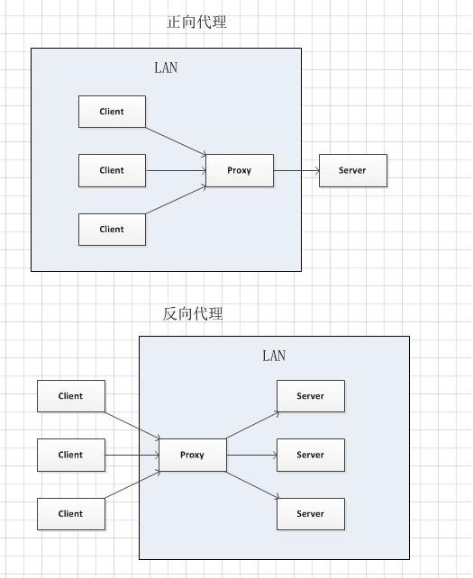
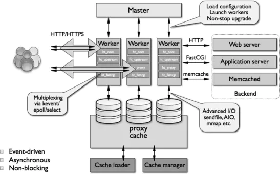

# nginx
支持http和反向代理的高性能的web服务器。

1. 反向代理

正向代理中，proxy和client同属一个LAN，对server透明；
反向代理中，proxy和server同属一个LAN，对client透明。
实际上proxy在两种代理中做的事都是代为收发请求和响应，不过从结构上来看正好左右互换了下，所以把后出现的那种代理方式叫成了反向代理

2. web服务器

指长期驻留与因特网的某种类型的计算机程序，可以处理客户端的请求，并返回响应。可以防止网站，让其他人浏览。可以防止数据，让其他人下载。

## 架构

1. 进程模型

    主进程和多个工作进程，master、worker进程。主进程负责工作调度，负责加载配置、启动worker进程和热更新。所以说最少两个nginx进程。worker负责处理网络请求，每个worker可以处理数以千计的网络请求。

    为什么一个worker可以支持上万的并发量呢？
    异步非阻塞 + epoll事件驱动

    **同步、异步、阻塞、非阻塞**

    [同步、异步、阻塞、非阻塞](https://www.jianshu.com/p/aed6067eeac9)

    同步: 一个任务A依赖任务B，只有任务B完成，任务A才算完成。
    异步：任务A执行过程中，调用任务B，结束任务A，等待通知

    阻塞：在任务B执行过程中，A不能做别的，一直等待。
    非阻塞：在任务B完成过程中，可以做别的

    同步阻塞：小明在银行排队等叫号。等待过程中一直看着叫号器。
       
       这里的同步体现在，小明在等待叫号
       这里的阻塞体现在，小明在等待的过程中什么都不做
    
    同步非阻塞：小明在等待过程中，可以一边玩手机，一边看叫号器。

        同步体现在， 小明在等待叫号
        非阻塞体现， 一边玩手机，一边等待。等待过程中做其他的。
    
    异步阻塞：小明告诉大堂经理，到了给我打电话，然后小明去外面等着电话。

        异步体现在：小明不等待叫号，等着通知（回掉函数）
        阻塞体现在：结束了当前的等叫号任务，但是还是没做其他的。
    
    异步非阻塞：小明告诉大堂经理，到了给我打电话，小明去外面吸烟玩手机。

        异步体现在：小明不等待叫号，等着通知（回掉函数）
        非阻塞体现在：可以做别的事情

    select vs epoll
    select 线程持有很多fd，遍历所有找到完成的进行通信。
    epoll 注册任务，等待完成之后在进行处理。

2. 模块化

    worker包含核心模块和功能模块。核心模块肤色一个运行循环，run-loop。执行网络请求处理的不同阶段的模块功能，网络读写，存储读写，内容传输，以及将请求发送到上游服务器。

3. 常用配置
   
   nginx.conf

   