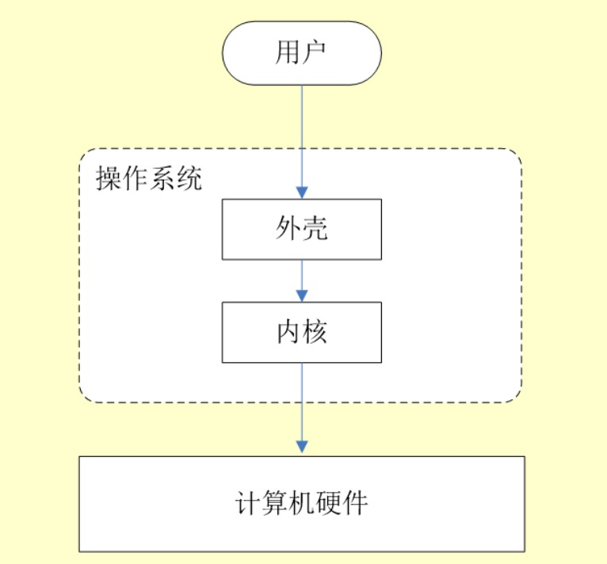
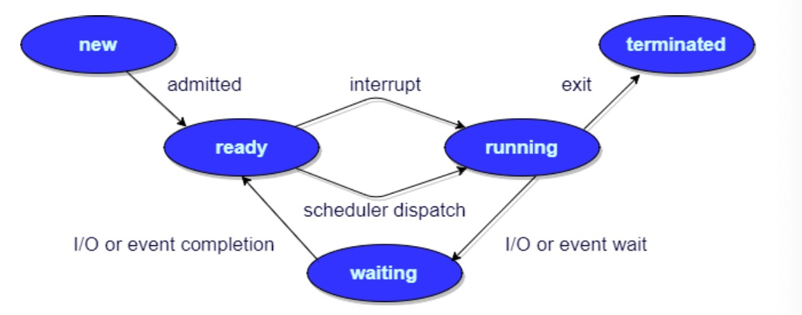
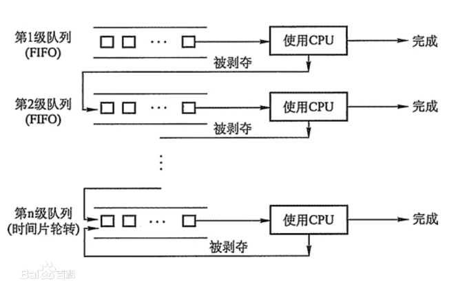
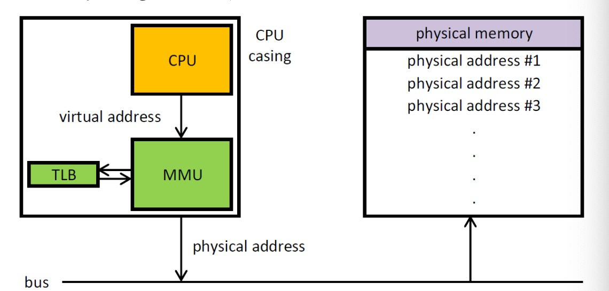

### 什么是操作系统
1. 操作系统（operating system, OS)是管理计算机硬件和软件资源的程序，是计算机系统的核心与基石
2. 操作系统本质上是运行在计算机上的软件交互
3. 操作系统为用户提供了一个与系统交互的操作界面
4. 操作系统分为内核和外壳，外壳就是围绕着内核的应用程序，内核就是能操作硬件的程序。内核负责管理系统的进程，内存、设备驱动程序、文件和网络系统等等，决定着系统的性能和稳定性。是连接应用程序和硬件的桥梁

### 系统调用
根据进程访问资源的特点，可以把进程在系统上的运行分为两个级别：
 1. 用户态(user mode):用户态运行的进行或可以直接读取用户程序的数据
 2. 系统态(kernel mode):可以简单的理解系统态运行的进程或程序几乎可以访问计算机的任何资源，不受限制。

我们运行的程序基本上都是运行在用户态，如果我们调用操作系统提供的系统态级别的子功能时，就需要进行系统调用。也就是说我们运行的程序中，凡是与系统态级别的资源有关的操作，如文件管理，进程控制，内存管理等，都必须通过系统调用的方式向操作系统提出服务请求，并由操作系统代为完成。

系统调用按功能可以分类：
 * 设备管理：完成设备的请求与释放，以及设备启动等功能。
 * 文件管理：完成文件的读写创建以及删除等功能
 * 进程控制：完成进程的创建，撤销，阻塞以及唤醒等功能。
 * 进程通信：完成进程之间的消息传递或信号传递等功能
 * 内存管理：完成内存的分配，回收以及获取作业占用内存区大小以及地址的功能。

### 进程和线程的区别
线程是进程划分成的更小的运行单位，一个进程在执行过程中可以产生多个线程。线程和进程最大的区别在于各进程是独立的，而线程则不一样，因为同一进程的线程极有可能相互影响。
1. 进程有自己的堆栈，调用的指令和本地变量
2. 线程独享栈，共享堆

### 进程有几种状态：
进程有5个状态，这个和线程很像
1. 创建状态： 正在创建进程，尚未到就绪状态
2. 就绪状态： 进程已处于准备运行状态，即进程获得了除了处理器之外的一切所需的资源，一旦得到处理器资源即可运行
3. 运行状态： 进程正在处理器上运行，单核的cpu任意时刻只有一个进程处于运行状态
4. 阻塞状态： 等待状态，进程因为等待某一事件而暂停运行，如等待某资源可用或者等待I/O操作。
5. 结束状态： 进程正在从系统中消失，可能是进程正常结束或者其他原因中断退出运行。

### 进程间的通信方式（IPC)
7种常见的进程间通信方式：
1. 管道、匿名管道 pipes 用于具有亲缘关系的父子进程或者兄弟进程之间的通信。只存在内存中的文件。
2. 有名管道 names pipes 有名管道严格遵循先进先出。以磁盘文件方式存在，可以实现本机任意两个进程通信。
3. 信号 信号是一种比较复杂的通信方式，用于接收某个进程某个事件已经发生。
4. 消息队列 MQ 消息队列是消息的链表，具有特定的格式，存放在内存中由消息队列标识符号标识。管道和消息队列的通信数据都是先进先出的原则。与管道的区别是消息队列存放在内核中，只有内核重启（计算机重启）或者显式的删除一个消息队列时，该消息队列才会被真正删除。消息队列可以实现消息的随机查询，不一定非要先进先出，也可以按消息的类型读取。消息队列克服了信号承载信息量少，管道只能承载无格式字节流以及缓冲区大小受限等缺陷。
5. 信号量 信号量是一个计数器，用于多进程对共享数据的访问，信号量的意图在于进程间同步。这种通信方式主要用于解决与同步相关的问题避免竞争条件。
6. 共享内存 是的多个进程可以访问同一块内存空间，不同进程可以及时看到对方进程中对共享内存中数据的更新，这种方式需要依靠某种同步操作，如互斥锁或者信号量等，可以说这是最有用的进程间通信方式。
7. 套接字 此方法主要用户客户端和服务端进行网络通信。套接字是支持TCP/IP的网路通信的基本操作单元，可以看做是不同主机之间的进程进行双向通信的端点，简单的说就是通信的双方的一种约定，用套接字中的相关函数来完成通信过程。

### 线程间同步的方式
线程同步是两个或者多个共享关键资源的线程的并发执行，应该同步线程避免关键的资源使用冲突。操作系统一般有下面三种线程同步的方式：
1. 互斥量（mutex)： 采用互斥对象机制，只有拥有互斥对象的资源才有访问公共资源的权限，因为互斥对象只有一个，所以可以保证公共资源不会被多个线程同时访问。
2. 信号量(semphares)： 它允许同一时刻多个线程访问同一资源，但需要控制同一时刻访问此资源的最大线程数量。
3. 事件 wait/notify: 通过通知操作的方式来保持多线程同步，可以方便的实现多线程优先级的比较操作。

### 进程的调度算法
为了确定首先执行哪个进程以及最后执行哪个进程以实现最大cpu利用率，有下面几种算法：
1. 先到先服务 fcfs: 从就绪队列中选择一个最先进入该队列的进程为之分配资源，使他立即执行并一直执行到完成或发生某事件而被阻塞放弃占用CPU时再重新调度。
2. 短作业优先 sjf : 从就绪队列中选出一个估计运行时间最短的进程为之分配资源，使他立即执行并一直执行完成或者发生某事件而被阻塞放弃占用CPU时再重新调度。
3. 多级反馈队列： 前面两个调度方式都有问题，比如短作业优先，仅照顾了短进程而忽略了长进程。多级反馈队列调度算法既能使高优先的作业得到响应又能使短作业迅速完成。是较好的进程调度算法。
4. 优先级调度： 为每个流程分配优先级，首先执行具有最高优先级的进程，依次类推。具有相同优先级的进程以FSFS方式执行，可以根据内存要求，时间要求或任何其他资源要求来确定优先级。

多级反馈队列算法：
1. 设有N的队列（Q1,Q2, ...QN), 其中各个队列的优先级不同，位于各个队列中的作业的优先级也不一样。一般来说Priority(Q1) > Priority(Q2) > ...> Priority(QN), 位于Q1中的所有优先级都高于Q2，依次类推
2. 对于最低优先级的队列，里面遵循了时间片轮转发。位于QN的M个作业，运行时间是通过QN设置的时间片来确定的。对于其他队列，遵循了先到先服务，每一进程分配一定的时间片，如果时间片内作业未完成，则进入下一优先级队列的末尾。
3. 各个队列的时间片是不一样的，各个队列的时间片随着优先级的增加而减少。QN时间片最长。

### 内存管理
1. 操作系统的内存管理主要做什么

    操作系统的内存管理主要负责内存的分配与回收，另外地址转换，也就是将逻辑地址转换成相应的物理地址等功能也是操作系统内存管理做的事。

2. 操作系统的内存管理机制了解吗？ 有几种方式？

    简单分为**连续分配管理方式**和**非连续分配管理方式**两种。连续分配管理是指一个用户程序分配了一个连续的内存空间， 如块式管理。同样的，非连续分配管理方式允许一个程序使用的内存分布在离散或者说不相邻的内存中，如页式管理和段式管理。

    1. 块式管理： 很早的计算机操作系统的内存管理方式。将内存分为几个固定大小的块，每个块中只包含一个进程。如果程序运行需要内存的话，操作系统就会分配给它一块，如果程序运行只需要很小的内存空间，分配的这块内存中很大一部分被浪费了，这些每个块中没有被使用的内存，称为碎片。
    2. 页式管理： 把主存分为大小相等且固定的一页一页的形式，页较小，对比于块式管理的划分粒度更大，提高了内存利用率，减少了碎片，页式管理通过页表对应逻辑地址和物理地址。
    3. 段式管理： 页式管理虽然提高了内存利用率，但是页式管理其中的页实际上并无任何实际意义。段式管理把主存分为一段一段的，每一段的空间又比一页的空间小很多。但是段的划分是有实际意义的，每个段定义了一组逻辑信息。例如，有主程序段MAIN，子程序段X，数据段D以及栈段S等，段式管理通过段表对应逻辑地址和物理地址。
    4. 段页式管理机制：结合了段式管理和也是管理的优点，简单来说就是把主存分为若干段，每个段又分为若干页，也就是说段页式管理机制中段与段之间以及段的内部都是离散的。

3. 页管理机制中有两个重要的概念： 快表和多级页表，这两个东西分别解决了页表管理中很重要的问题，请简单介绍下

   分页式内存管理中，很重要的两点就是：
   1. 虚拟地址到物理地址的转换要快
   2. 解决虚拟地址空间大，页表也会很大的问题。

    **快表**

    为了解决虚拟地址到物理地址的转换速度，操作系统在页表方案基础上引入了快表来加速虚拟地址到物理地址的转换。可以把快表理解为一种特殊的高速缓冲存储器cache,其中内容是页表的一部分或者全部内容。作为页表的cache，作用和页表相似，但是提高了访问速率， 由于采用页表做地址转换，读写内存数据时CPU要访问两次主存，有了快表，有时只要访问一次告诉缓冲存储器，一次主存，这样可以加速查找并提高执行执行速度。

    虚拟地址：
    程序、数据和堆栈的总大小可能超过了可用的实际物理内存大小。由操作系统把程序当前使用的部分保存在主存中，其他保存在磁盘上。比如对于一个16MB的程序，每个时刻只用4MB的内存，需要使用其他时在内存和磁盘间交换程序片段，这样就可以在一个内存为4MB的机器上运行。这里有一个交换片段，就是虚拟地址转换为物理地址。程序产生的就是虚拟地址。

    使用快表之后的地址转换流程：
     1. 根据虚拟地址中的页号找到快表，
     2. 如果该页在快表中，直接从快表中读取响应的物理地址
     3. 如果该页不在快表中，就访问内存中的页表，再从页表得到物理地址，同时将页表中的该映射表项添加到快表中。
     4. 当快表快填满后，又要登记新页时，按照一定的淘汰策略淘汰掉快表的一个页。

    快表和平常使用的缓存如Redis很像。操作系统中很多思想、经典算法，都可以在日常开发中使用的各种工具和框架汇中找到他们的影子。

    **多级页表**
    引入多级页表的主要目的就是为了避免把全部页表一直放在内存中占用过多的空间，特别是那些根本就不需要的页表就不用保留在内存中。就是页目录中的每一项对应一个页表，页表中有具体的映射。
    去电就是每次查询需要查询多次。不过可以节约内存。

    **总结**
    为了提供内存的空间功能，提出了多级页表的概念，但是提到空间性能是以浪费时间性能为基础的。因此为了补充损失的时间性能，提出了快表的概念。无论是快表还是多级页表都使用了程序的局部性原理。

4. 分页机制和分段机制的共同点和区别

    共同点：
    1. 分页机制和分段机制都是为了提供内存利用率，较少内存碎片
    2. 页和段都是离散存储的，所以这两者都是离散分配内存的方式。但是每个页和段的内存时连续的。
    区别：
    1. 页的大小是固定的，由操作系统决定，而段的大小不固定，取决于当前运行的程序
    2. 分页仅仅为了满足操作系统内存管理的需求，而段式逻辑信息的单位，在程序中可以体现为代码段，数据段可以更好的满足用户的需求

5. 逻辑（虚拟）内存和物理地址

    编程时只和逻辑地址打交道，指针里存储的就是内存中的一个地址，这个地址就是逻辑地址，逻辑地址由操作系统决定。物理地址指的是真实物理内存中的地址，更具体一点来说就是内存地址寄存器的地址，物理地址是内存单元真正的地址。

6. CPU寻址，为什么要虚拟地址空间。
   
   1. cpu寻址，现代处理器使用一种称为虚拟寻址的寻址方式。使用虚拟寻址，CPU需要将虚拟地址翻译成物理地址，才能访问到真实的物理内存。实际上完成虚拟地址转换为物理地址的硬件是CPU中的内存管理单元（MMU）。

    

    CPU： central process unit
    MMU: memory management unit
    tlb: translation lookaside buffer 页表缓冲

    2. 为什么需要虚拟地址空间？
    
    如果没有虚拟地址空间，程序可以直接访问和操作物理内存，可能导致：
     * 用户程序可以访问任意内存，寻址内存中的每个字节，容易破坏操作系统，造成系统崩溃
     * 很难同时运行多个程序，多个程序对同一物理地址进行操作，导致程序崩溃
    使用虚拟地址的优势：
       1. 程序可以使用一系列相邻的虚拟地址来访问物理内存中不相邻的大内存婚宠去。
       2. 程序可以使用一些列虚拟地址来访问大于可用物理地址内存的内存缓冲区，。当物理内存的供应量变小时，内存管理器会将物理内存也保存到磁盘文件。数据或者代码页会根据需要在物理内存和磁盘之间移动。
       3. 不同进程间使用的虚拟地址彼此隔离。一个进程的代码无法改变另一个进程中正在使用的物理地址。