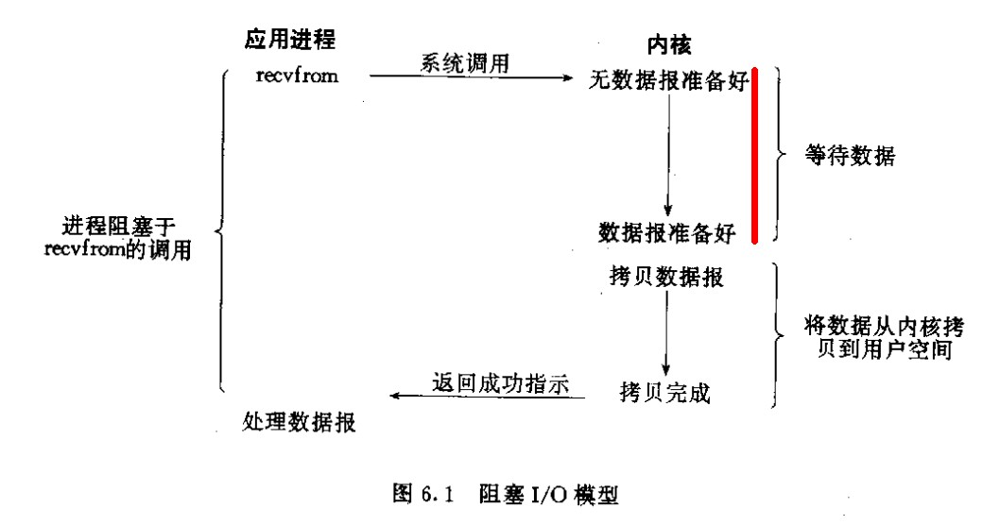
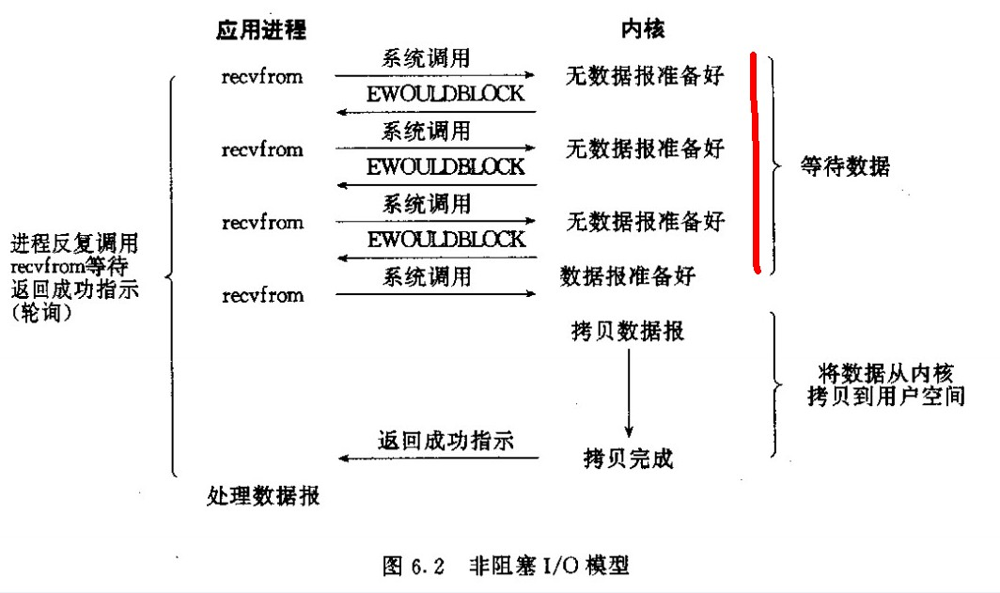
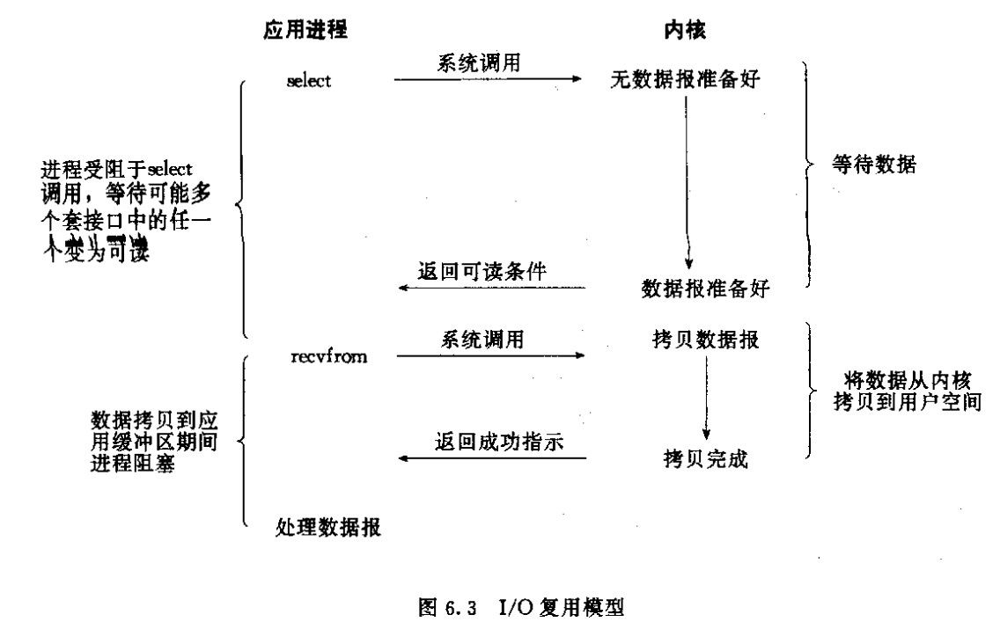
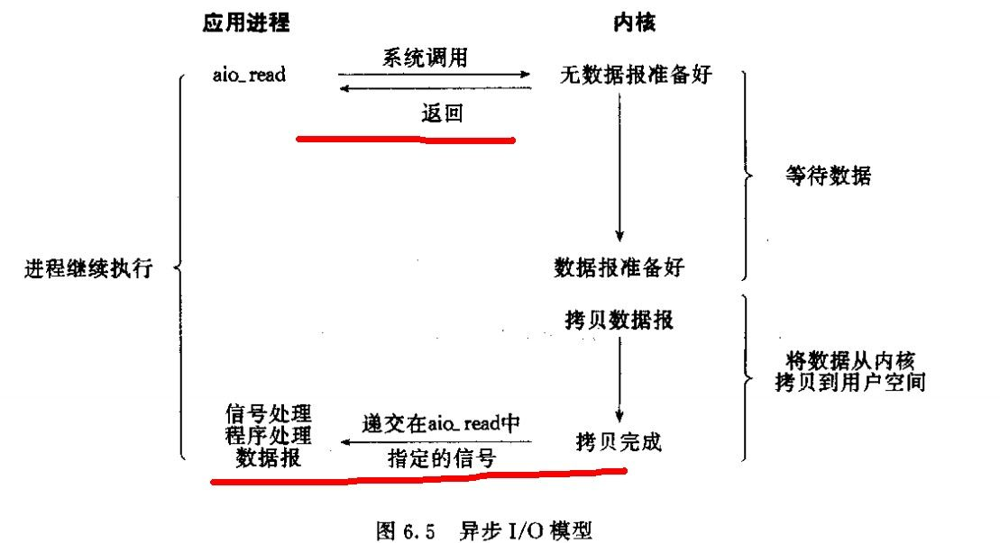

1. 进程

每个应用程序就是一个进程，每个进程有一块独立的内存空间。是操作系统进行资源分配的基本单位。有独立的代码和数据空间。程序间的切换需要系统进行调度。

2. 线程


每个进程至少有一个线程，即主线程。是cpu进行任务调度和执行的单位。线程共享进程的代码和数据空间，有独立的运行栈和程序计数器。

3. cpu多核多线程


i5 4核4线程表示有4个物理核心，每个核心在同一时间内只处理一个线程调度。
   4核8线程表示使用了超线程技术，有4个物理核心，但是每个物理核心模拟为两个逻辑核心。cpu同一时间可以调度8个线程。

4. 多线程

就像是同时开两个QQ，每个登录不同的账户，互不影响，虽然代码段相同，但是可以理解为不同的应用。
优点： 可以提高多核cpu利用率， 数据独立安全。
缺点： 占用资源多。创建和消耗都需要耗费资源

4. 多线程

如杀毒软件，可以同时清理垃圾，查杀病毒。实现不同的功能。比如一个进程有4个线程，这4个线程去CPU申请执行。
每个线程都是独立申请cpu调度和执行的基本单位。也就是说，正常情况下，多线程会实现并发的，如果几个线程同时申请到了cpu的几个核，就是并行了。

既然说了正常情况下，就有不正常情况，像python的多线程。首先说一下GIL,全局解释器锁。这个是是进程内的，谁申请到了这个锁谁就可以运行。也就是说无论单核还是多核，每个时刻都是只有一个在运行。
对于IO密集型没什么影响，例如WEB应用，每个线程执行到了可以去申请io拿到磁盘上的资源在返回、爬虫等待web响应，影响不大。对于计算密集型的影响很大，如进行数字计算，每次抢到cpu全程进行计算，和单线程效率差不多了，比其他语言的多线程差的多。


**并发** 只有一个cpu资源，线程之间要竞争的到执行机会。是通过排队，唤醒执行等步骤来执行的。在宏观角度来看就是多个线程像在同时处理，但从微观角度看，每个时刻只在执行一个线程。
**并行** 两个或者两个以上的事件（或者线程）在同一时刻发生。即同一时刻cpu多核运行不同的线程，这几个线程就是并行的。

5. 阻塞、非阻塞、同步、异步

   1. 阻塞/非阻塞： 进程/线程访问的数据在就绪之前，是否需要等待。如果等待就是阻塞，不等待去做别的就是非阻塞。
   2. 同步/异步：   访问数据的方式。在请求资源时，同步需要主动读写数据，读写过程中会阻塞。异步只用等待操作系统完成的通知，也不需要主动读写数据，由操作系统内核完成。

   **阻塞式IO模型**：
   1. 等待数据准备好
   2. 从内核向进程复制数据

   

   红色部分为阻塞

   **非阻塞式IO模型**
   请求数据之后cpu可以执行别的，这个进程每次执行都会查询是否完成。

   

   **I/O多路复用**
   I/O多路复用阻塞在select、epoll这种系统调用之上，在真正的I/O系统调用recvfrom上非阻塞。

   

   **异步I/O**
   告知内核启动某个操作，并让内核在整个操作（包括将数据从内核拷贝到用户空间）完成后通知。

   

   阻塞、非阻塞、多路复用都用了同步I/O操作。

6. 协程

   在执行函数A时，可以随时中断，执行B，然后中断继续执行A（自由切换）。但是不属于函数调用，在一个线程内完成。

   因为不需要切换线程，所以执行效率高，适用于IO密集型任务，对于计算密集型推荐使用多进程+协程。

   1. yield
   ```python
   def consumer():
      r = start
      while True:
         n = yield r
         if not n:
            print("n is empty")
            continue
         print("consumer is consuming: %s" % n)
         r = "200 ok"
   
   def producer(c):
      start_value = c.send(None)
      print(start_value)
      n = 0
      while n < 3:
         n += 1
         print("producer is producing %s" %n)
         r = c.send(n)
         print("consumer return %s" % r)
      c.close()
   
   c = consumer()
   producer(c)
   ```

   2. coroutine 协程
   ```python
   import asyncio
   @asyncio.coroutine
   def compute(x, y):
      print("Compute %s + %s ... "%(x, y))
      yield from asyncio.sleep(1)
      return x+y
   
   @asyncio.coroutine
   def print_sum(x, y):
      result = yield from compute(x, y)
      print("%s + %s = %s"%(x, y, result))
   
   asyncio.iscoroutinefunction(compute) # 判断是否是协程函数
   asyncio.iscoroutine(compute(1, 1)) # 判断是不是协程对象

   loop = asyncio.get_event_loop()
   print("start")
   loop.run_until_complete(print_sum(1, 2))
   print("end")
   loop.close()
   ```

   async await 简化版的@asyncio.coroutine 和yield from
   @asyncio.coroutine = async
   yield from = await
   可以使用asyncio.Future传值
   ```python
   import asyncio
   future = asyncio.Future()

   async def coro1():
      await aysncio.sleep(1)
      future.set_result("data")

   async def coro2():
      await future
      print(result)
   
   loop = asyncio.get_event_loop()
   loop.run_until_complete(asyncio.wait(
      coro1(),
      coro2()
   ))
   loop.close()
   ```