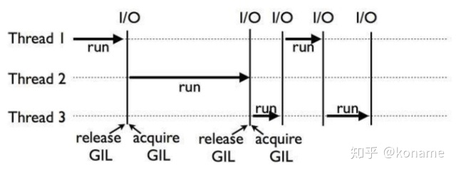

1. 进程

每个应用程序就是一个进程，每个进程有一块独立的内存空间。是操作系统进行资源分配的基本单位。有独立的代码和数据空间。程序间的切换需要系统进行调度。

2. 线程

每个进程至少有一个线程，即主线程。是cpu进行任务调度和执行的单位。线程共享进程的代码和数据空间，有独立的运行栈和程序计数器。

3. cpu多核多线程

i5 4核4线程表示有4个物理核心，每个核心在同一时间内只处理一个线程调度。
   4核8线程表示使用了超线程技术，有4个物理核心，但是每个物理核心模拟为两个逻辑核心。cpu同一时间可以调度8个线程。

4. 多线程

就像是同时开两个QQ，每个登录不同的账户，互不影响，虽然代码段相同，但是可以理解为不同的应用。
优点： 可以提高多核cpu利用率， 数据独立安全。
缺点： 占用资源多。创建和消耗都需要耗费资源

4. 多线程

如杀毒软件，可以同时清理垃圾，查杀病毒。实现不同的功能。比如一个进程有4个线程，这4个线程去CPU申请执行。
每个线程都是独立申请cpu调度和执行的基本单位。也就是说，正常情况下，多线程会实现并发的，如果几个线程同时申请到了cpu的几个核，就是并行了。

既然说了正常情况下，就有不正常情况，像python的多线程。首先说一下GIL,全局解释器锁。这个是是进程内的，谁申请到了这个锁谁就可以运行。也就是说无论单核还是多核，每个时刻都是只有一个在运行。
对于IO密集型没什么影响，例如WEB应用，每个线程执行到了可以去申请io拿到磁盘上的资源在返回、爬虫等待web响应，影响不大。对于计算密集型的影响很大，如进行数字计算，每次抢到cpu全程进行计算，和单线程效率差不多了，比其他语言的多线程差的多。

**并发** 只有一个cpu资源，线程之间要竞争的到执行机会。是通过排队，唤醒执行等步骤来执行的。在宏观角度来看就是多个线程像在同时处理，但从微观角度看，每个时刻只在执行一个线程。
**并行** 两个或者两个以上的事件（或者线程）在同一时刻发生。即同一时刻cpu多核运行不同的线程，这几个线程就是并行的。

