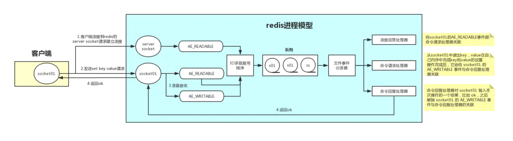

## 基础
1. 数据类型

String
格式 set key value

Hash
格式 hmset name key1 value1 key2 value2

List  粉丝列表，评论列表，使用lrange做分页
格式 lpush name value
     rpush name value
     lrem name index
     llen name 查看长度

Set
    sadd name value

zset 有序集合  可以用来做排行榜
    zadd name score value

2. 持久化

两种方式RDB AOF。
RDB就是快照，通过保存和读取文件来实现持久化，在一定的时间将数据保存到硬盘上

AOF是是追加日志的方式，保存每个命令
存储结构： redis通信协议（RESP）格式的文件命令文本存储。
RESP协议：客户端发送命令的格式，5种类型
- 简单字符串 以"+"开头
- 错误 以"-"开头
- 整数 以":"开头
- 大字符串类型 以"$"开头
- 数组 以"*"开头

3. 架构模式
    1.  单机模式 内存容量有限，无法高可用
   
    2. 主从复制 
       一个主几点，多个从节点，从节点就是主节点的复制，可以作为备份，或者从节点只读减轻压力。如何保证消息时同步的？
       1. 增量同步，主节点会将自己存储的操作指令发给每个从节点。从节点接收到之后会进行同步数据。
       2. 快照同步。 主节点会fork一个子进程对主节点做一次内存快照备份发给从节点。从节点接收后会加载快照。
    3. 哨兵模式 
       哨兵会不断检查主服务器和从服务器是否正常，当某个服务器出问题，哨兵会向管理员通知。当主服务器不能正常运行，哨兵会自动故障迁移操作，会在从节点中选出一个节点作为主节点，客户端访问以前的主节点地址会失败，哨兵返回新的地址。以前的主节点恢复之后作为从节点加入进来。

        应该有多个哨兵，最经典的是一个master,两个slave，三个哨兵，当主节点发生故障，选一个slave做主备复制，切换为master，需要2个哨兵投票通过才行。
        **数据丢失**
        主从复制，过程中master挂掉了，可能会丢掉部分数据。

        脑裂问题，哨兵和slave在一个网络中，与master断开，这时候会选出一个新的master，但是原来的master没有挂掉，只是网络原因。这时候会丢失数据，客户端写入的时候会写到随机的master，写到原来master的数据会丢失。
        解决办法：通过配置，min-slaves-to-write=1, min-slaves-max-lag=10.至少有一个slave,数据复制和同步的延迟不能超过10秒。 如果一旦所有的slave的复制和同步延迟都超过了10秒，那么master就停止写操作。
       
    4. 集群
        有多个主节点，每个主节点有多个从节点，多个哨兵进行守卫。客户端访问时先访问代理，代理选择主节点进行应答。通过数据冗余来增强可用性。

        为什么要集群，主从的话所有节点的数据都一样，能容纳的数据只有内存大小。多余内存的就会使用lru进行淘汰。

        **哈希算法**，多个master, 一个key过来，计算hash值，对master数量取模，放到对应的master.但是如果一个master挂掉，一个请求基于剩下的master数量取数据，这时候会发现找到的master上的数据找不到，大量的请求都会找不到，不止挂掉的master, 别的取模也不对。几乎100%失效

        **一致性哈希算法**
        将所有接master连成一个环，计算hash值，保存在对应的节点中。当一个节点挂掉后，会继续向下寻找与自己距离近的节点，继续取数据。这样只会有挂掉的那个节点上的key找不到。
        缓存热点问题。如果某个热点的数据的hash集中在某个节点。可以给每个master都做均匀分布的虚拟节点。然后每个区间内，大量的数据都会均匀的分不到不同的节点，不是按照顺时针的顺序全部涌入一个master内。

        **hash slot算法**
        redis cluster有固定的16384个hash slot，对每个key计算CRC16值，然后对16384取模，可以获取key对应的hash slot
        redis cluster中每个master都会持有部分slot，比如有3个master，那么可能每个master持有5000多个hash slot
        hash slot让node的增加和移除很简单，增加一个master，就将其他master的hash slot移动部分过去，减少一个master，就将它的hash slot移动到其他master上去。移动hash slot的成本是非常低的

        
4. 线程模型
   **与memcacehd的区别**
   1. redis比memcached有更多的数据结构，redis有string，list，hash,set,有序的set.
   2. redis有原生的集群模式。
   
   **redis的的线程模型**
   redis内部使用了文件事件处理器 file event handler。这个处理器是单线程的，所以redis是单线程模型。使用io多路复用来监听多个socket,根据socket上的事件选择对应的事件处理器进行处理。

   

   **为什么redis是单线程还可以支持高并发**
   纯内存操作，基于非阻塞的IO多路复用，单线程避免了多线程的上下文切换。

5. 缓存
作用： 高性能 高并发。 高性能就是每个请求不用都去查数据库，把不会经常变的数据保存在redis中，每次查询缓存就可以了。 高并发就是请求高峰期时候，如果每个请求都去查数据库，数据库也只支持不了，把一部分数据放在缓存里，一部分放在数据库，减少数据库的压力。

缓存穿透：key对应的数据再数据库中不存在，每次针对此key的请求再缓存中都找不到，会请求数据库，这样会压垮数据库。黑客可能会利用这个漏洞来攻击。
解决方案：
 - 布隆过滤器。 将所有可能存在的数据哈希保存到一个足够大的bitmap中，一个一定不存再的key会直接被这个bitmap拦截下来。
 - 就算查询是空的，也将结果进行缓存，但是过期时间很短。

缓存击穿：key对应的数据存在，但是过期了，此时有大量并发请求过来，这些请求发现缓存过期了会从数据库查询并设置回缓存。这时候可能回压垮db.
解决方案：使用锁机制，setnx，就算查数据库，相同的查询只要一个就行了，获取不到锁的就等着查缓存。

缓存雪崩：当缓存服务器挂掉或大量缓存集中再一个时间段失效。这样也会带来很大压力。
缓存失效解决方案：
  - 设置缓存过期时间是一个随机值，不要设置成一样的，就不会同一时间失效。
  - 或者设置二级缓存，第二季过期时间比较久。
缓存挂掉的解决方案：
  - 事前： redis是高可用的，主从+哨兵，集群，避免全面崩溃
  - 事中： 使用hystrix组件，来进行限流和降级。限制每秒多少个请求可以通过，多余的走降级，可以返回一些默认的值或者友情提示。这样可以保证数据还是可以提供服务的。
  - 事后： redis做持久化，快速回复缓存数据

缓存一致性
如果同时写数据库和写缓存，那么如何保证数据一致性。
使用Cache aside pattern:
 - 读的时候先读缓存，缓存没有就读数据库，然后读取出来放到缓存里，返回数据
 - 更新的时候删除缓存，然后再更新数据库。

6. 过期策略

    内存容量有限，当内存存放的东西太多，就会淘汰一些。
    `set key value 过期时间`，当过期时间到了，删除的策略是**定期删除**和**惰性删除**。
    比如有10万个key设置了过期时间，每隔一段时间cpu检查所有的key，就会很浪费cpu.定期删除是值每隔一段时间来抽取一些key来检查和删除。惰性删除就是指下次查询的时候，如果已经过期了就删除。如果定期删除和惰性删除都没什么用，还是有大量过期的key在内存中，或者长期在内存中的key,这时候需要内**存淘汰机制**。

    1. noeviction 如果内存不够，就不允许写入了，写入报错，不过不会用这个。
    2. allkeys-lru 使用最近最少使用来删除key.最常用
    3. allkeys-random 随机删除
    4. volatile-lru 只是在设置了过期时间的key中使用lru算法来淘汰
    5. volatile-random 设置了过期的key中随机删除
    6. volatile-ttl 在设置了过期时间的key中，更早过期的key优先删除。

7. redis并发竞争，cas方案
    cas乐观锁
    多个客户端同时写一个key,可能应该先到的数据后到了，导致数据版本错了。或者同客户端同时获取一个key,修改之后再写回去，顺序错了，数据就错了。
    使用分布式锁，写之前先获取锁，获取之后再修改，解锁。