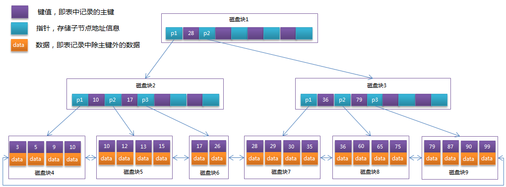
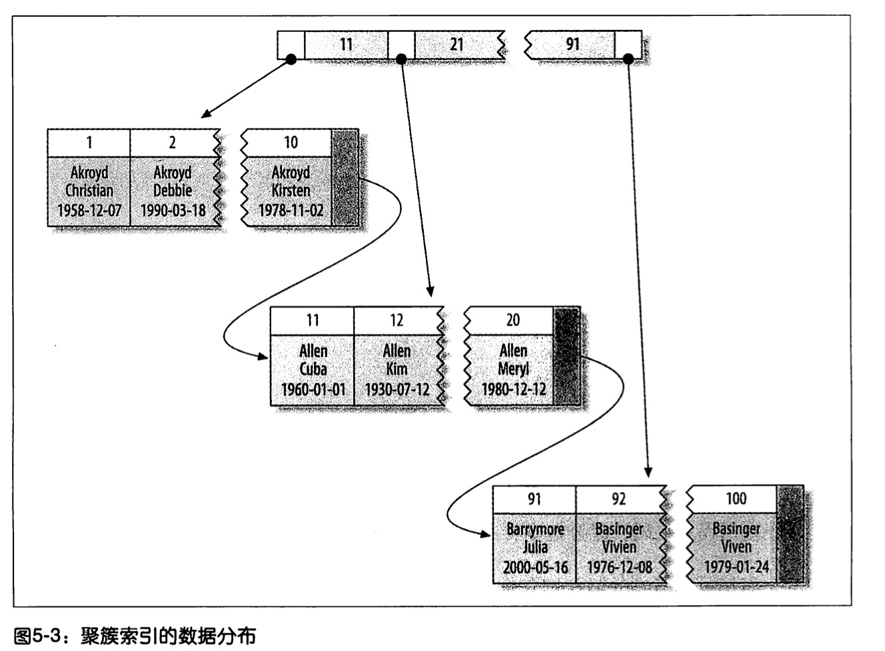
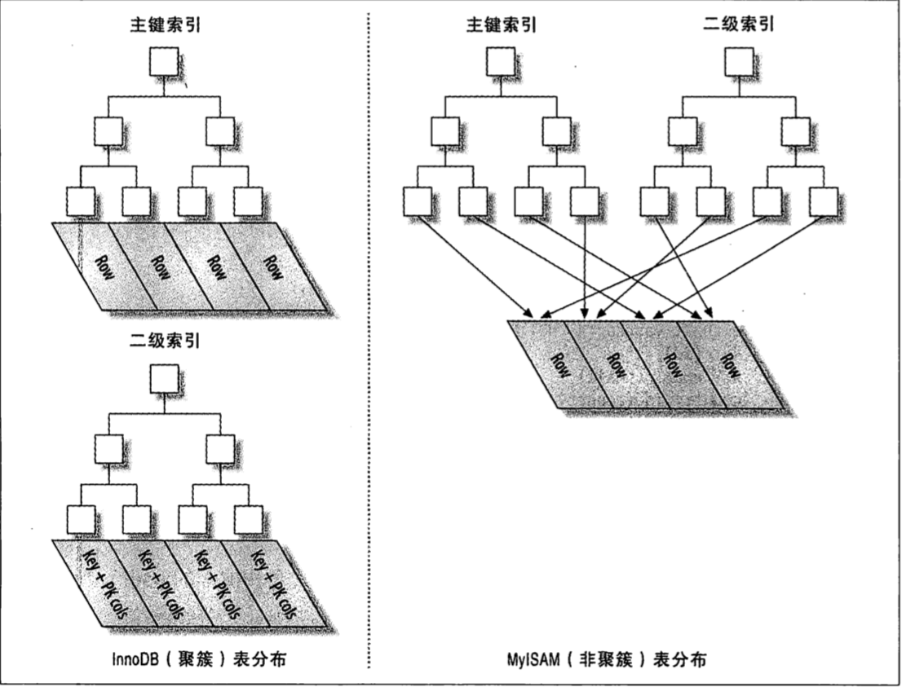

# 高性能的索引
## 索引的类型
索引也叫key,是存储引擎用于快速找到记录的一种数据结构。

索引对性能非常关键，尤其是当表中的数据量越来越大时，索引对性能的影响愈发重要。**索引是优化查询性能的最有效的手段**。索引能轻易将查询性能提高几个数量级。

索引可以包含一个或者多个列，如果包含多个列，列的顺序也非常重要，因为Mysql只能高效的使用索引的最左前缀列。

包含多个列就是组合索引，组合索引就是把几个列放到一个索引里，然后按照定义索引的顺序进行最左前缀匹配（b+Tree)。符合索引的结构与电话薄类似，名字由姓和名构成，首先按照姓氏排序。**如果知道姓，可以找到；如果直到姓和名，可以找到；如果只知道名，就找不到，也就是索引用不到，进行全表扫描**。

所以创建复合索引时，应该仔细考虑列的顺序。对索引中的所有列执行搜索或者只对前几列搜索时，复合索引非常有用。

***联合索引本质：***

当创建**(a,b,c)联合索引**时，相当于创建了**(a)单列索引**，**(a,b)联合索引**以及**(a,b,c)联合索引**
想要索引完全生效的话,只能使用 a和(a,b)和(a,b,c)这仅有的三种组合；当然，我们上面测试过，**a,c组合也可以，但实际上只用到了a的索引，c并没有用到！**


```mysql
CREATE TABLE People(
    last_name varchar(50) not null;
    first_name varchar(50) not null;
    dob date not null;
    gender enum('m', 'f') not null,
    key(last_name, first_name, dob)
);
```
**`B-Tree`索引适用于全键值、键值范围或键前缀查找，其中键前缀查找只适用于根据最左前缀的查找。**


- 全值匹配。全值匹配指的是和索引中的所有列进行匹配，例如，前述示例中的索引可用于查找姓为Cuba、名为Allen、出生于1960-01-01的人

- 匹配最左前缀。示例索引可用于查找所有姓为Allen的人，即只使用索引的第一列。

- 匹配列前缀。也可以只匹配某一列的值的开头部分，例如，示例索引可用于查找所有以J开头的姓的人，这里也只使用了索引的第一列。

- 匹配范围值。例如，示例索引可用于查找姓在Allen和Barrymore之间的人，这里也只使用了索引的第一列。

- 精确匹配某一列并范围匹配另外一列。示例索引也可用于查找所有姓为Allen，并且名字是字母K开头的人，即第一列last_name全匹配，第二列first_name范围匹配。

- 只访问索引的查询。`B-Tree`通常可以支持“只访问索引的查询”，即查询只需要访问索引，而无须访问数据行。

**`B-Tree`的一些限制：**

- 如果不是按照索引的最左列开始查找，则无法使用索引。例如，示例索引中无法用于查找名字为Bill的人，也无法查找某个特定生日的人，因为这两列都不是最左数据列。类似的，也无法查找姓氏以某个字母结尾的人。
- 不能跳过索引中的列。例如，示例索引无法用于查找姓为Smith并且在某个特定日期出生的人。如果不指定first_name，则mysql只能使用索引的第一列。
- 如果索引中有某个列的范围查询，则其右边所有列都无法使用索引优化查找。例如，示例索引中有如下查询语句`WHERE last_name = 'Smith' AND first_name LIKE 'J%' AND dob = '1976-12-23'`，此查询只能使用索引的前两列，因为这里`LIKE`是一个范围条件。如果范围查询列值的数量有限，那么可以通过使用多个等于条件来代替范围条件。


### 哈希索引

`哈希索引（hash index）`基于哈希表实现，只有精确匹配索引所有列的查询才有效。对于每一行数据，存储引擎都会对所有的索引列计算一个`哈希码（hash code）`，`哈希码`是一个较小的值，并且不同键值的行计算出来的`哈希码`也不一样。`哈希索引`将所有的`哈希码`存储在索引中，同时在`哈希表`中保存指向每个数据行的指针。 

在mysql中，只有`Memory`引擎显式支持`哈希索引`。


#### 创建自定义哈希索引

如果存储引擎不支持哈希索引，则可以模拟像 InnoDB 一样创建哈希索引，这可以享受一些哈希索引的便利，例如只需要很小的索引就可以为超长的键创建索引。

思路很简单：在 B-TREE 基础上创建一个伪哈希索引，你需要做的就是在查询的 WHERE 子句中手动指定使用哈希函数。

一个例子：

加入你需要存储大量的 URL，并且需要根据 URL 进行搜索查找，如果使用 B-Tree 来存储 URL，储存的内容就会很大，因为 URL 本身都很长。正常情况下有如下查询：

`mysql> SELECT id FROM url WHERE url="xxx"`

若删除原来 URL 列上的索引，而新增一个被索引的 url_crc 列，使用 CRC32做哈希，就可以使用下面的方式查询：

`mysql> SELECT id FROM url WHERE url_crc=CRC32("XXX") AND url="xxx";`

这样性能会非常高，因为 MySQL 优化器会使用这个选择性很高而体积很小的基于 url_crc 列的索引来完成查找。

不过这也有缺点，那就是需要维护哈希值。可以手动维护，也可以使用触发器实现。下面的案例演示了触发器如何在插入和更新时维护 url_crc 列。首先创建如下表：

```sql
CREATE TABLE pseudohash (
  id int unsigned NOT NULL auto_increment,
  url varchar(256) NOT NULL,
  url_crc int unsigned NOT NULL DEFAULT 0,
  PRIMARY KEY(id)
 );
```

然后创建触发器，在`MySQL`中默认的结束符`DELIMITER`是`;`，它用于标识一段命令是否结束。在默认情况下，在命令行客户端中，如果有一行命令以`;`结束，那么回车后，`MySQL`将会执行该命令。在此先修改一下语句分隔符：

```sql
DELIMITER //
CREATE TRIGGER pseudohash_crc_ins BEFORE INSERT ON pseudohash
	FOR EACH ROW BEGIN SET NEW.url_crc=crc32(NEW.url);
END;
//

CREATE TRIGGER pseudohash_crc_upd BEFORE UPDATE ON pseudohash
	FOR EACH ROW BEGIN SET NEW.url_crc=crc32(NEW.url);
END;
//
```

完成。

注意：使用上述方式，不要使用 SHA1() 和 MD5() 作为哈希函数。因为这俩返回非常长的字符串，会浪费大量空间，比较时也更慢。

当然，如果数据表非常大，CRC32()会出现大量的哈希冲突，则可以考虑自己实现一个简单的64位哈希函数。这个自定义函数要返回整数，而不是字符串。一个最简单的办法可以使用 MD5()返回值的一部分来作为自定义哈希函数。这可能比自己写一个哈希算法的性能要差，但这样最简单。


**处理哈希冲突**

当使用哈希索引进行查询的时候，必须在 WHERE 子句中包含常量值(像上文那样)，而不能：

`mysql> SELECT id FROM url WHERE url_crc=CRC32("XXX");`

假如 CRC32("XXX") 和另一个 CRC32("xxxxx") 发生哈希冲突，这样就会返回多个记录。


### 索引的优点

索引可以让服务器快速的定位到表的指定位置，但这并不是索引的唯一作用，根据创建索引的数据结构不同，索引也有一些其它的附加作用。 

最常见的`B-Tree`索引，按照顺序存储数据，所以mysql可以用来做`ORDER BY`和`GROUP BY`操作。因为数据是有序的，所以`B-Tree`也就会将相关的列值都存储在一起。最后，因为索引中存储了实际的列值，所以某些查询只使用索引就能够完成全部查询，总结如下：

- 索引大大减少了服务器需要扫描的数据量
- 索引可以帮助服务器避免排序和临时表
- 索引可以将随机I/O变为顺序I/O


### BTree B+Tree
#### BTree
B-Tree是为磁盘等外部存储设备设计的一种平衡查找树。
系统从磁盘读取数据到内存时是以磁盘块（block)为基本单位的，位于同一磁盘块中的数据会被一次性读取出来，而不是需要什么取出什么。（mysql服务器）

InnoDB存储引擎中有页（PAGE）的概念，页是其磁盘管理的最小单位。InnoDB默认每个页是16KB，可以通过参数设置。

而系统一个磁盘块的存储空间往往没有那么大，因此Innodb每次申请磁盘空间时都会是若干地址连续磁盘块来达到页的大小16KB。InnoDB会把磁盘数据读入内存时会以页为基本单位，在查询数据时如果一个页中的每条数据都能有助于定位数据记录的位置，这样将减少磁盘I/O次数，提高效率。

既然是平衡树，就包含了一些特性，这里不详细介绍了，只记录下查找过程。

B-Tree中的每个节点根据实际情况可以包含大量的关键字信息和分支，如下图所示为一个3阶的B-Tree（3个孩子）： 


每个节点占用了一个盘块的磁盘空间，一个节点上有两个升序的关键字，和三个指向子树根节点的指针，指针存储的是子节点所在磁盘块的地址。两个关键字划分成的三个范围域对应三个指针指向的子树的数据范围域。

模拟查找关键字29的过程：
   1. 比较根节点找到磁盘块1，读入内存。【磁盘I/O操作第一次】
   2. 比较关键字29在区间(17, 35),找到磁盘块1的指针p2
   3. 根据p2指针找到磁盘块3，读入内存。【磁盘I/O操作第二次】
   4. 比较关键字29在区间(26, 30),找到磁盘块3的指针P2.
   5. 根据P2指针找到磁盘块8，读入内存。 【磁盘I/O操作第三次】
   6. 在磁盘块8中的关键字列表中找到关键字29.

#### B+Tree
B+Tree是在BTree基础上的一种优化，使其更适应实现外存储的索引结构，InnoDB存储引擎就是使用了B+Tree实现的。

从上一节中的BTree结构图中可以看到每个节点中不仅包含数据key,还有data值。而每一个页得存储空间有限，如果data数据较大时会导致每个节点存储的KEY数量减少，当存储的数据量很大时同样会导致B-Tree的深度较大，增大查询时的磁盘I/O次数，进而影响查询效率。在B+Tree中，所有的数据记录节点都是按照键值大小顺序放在同一层的叶子节点上，而非叶子节点上只存储key，这样可以大大增加每个节点Key的数量，降低B+Tree的高度。

B+Tree相对于B-Tree有几点不同：
  1. 非叶子节点只存储键值信息。
  2. 所有叶子节点之间都有一个链指针。
  3. 数据记录都存放在叶子节点中。


将上一节中的B-Tree优化，由于B+Tree的非叶子节点只存储键值信息，假设每个磁盘块能存储4个键值及指针信息，则变成B+Tree后其结构如下图所示： 



通常在B+Tree上有两个头指针，一个指向根节点，一个指向关键字最小的叶子节点。而所有的叶子节点之间是一种链式环结构。因此可以对B+Tree进行两种查找运算：一种是对于主键的范围查找和分页查找，另一种是从根节点开始，进行随机查找。

### 高性能的索引策略
#### 独立的列
如果查询中的列不是独立的，就mysql就不会使用索引。 "独立的列"是指索引列不能是表达式的一部分， 或者函数的参数。
* 示例1： 索引列不能是表达式的一部分：
  `SELECT item_code FROM cc_item where item_code+1 = 5;`
* 示例2： 索引列不能是函数的参数：
  `SELECT ...  WHERE TO_DAYS(CURRENT_DATE()) - TO_DAYS(date_col) <= 10;`

#### 前缀索引和索引选择器
有时候需要索引很长的字符列，这会让索引变得大且慢，一个策略是模拟哈希索引（前面讲过的），另一个是用部分前缀作为索引。

索引开始的部分字符，这样可以大大节约索引空间，从而提高索引效率，但这样会降低**索引的选择性**。索引的选择性是指，不重复的索引值（基数）和数据表的记录总数（T）的比值，范围从1/T到1之间。**索引的选择性**越高则查询效率越高，因为选择性高的索引可以让mysql在查找时过滤更多的行。唯一索引的选择性是1，这是最好的索引选择性，性能也是最好的。

诀窍在于要选择足够长的前缀以保证较高的选择性，但是不能太长。前缀的基数应该接近于完整列的基数。

* 计算合适的前缀长度的一个办法就是计算完整列的选择性，并是前缀的选择性接近于完整列的选择性：
  `SELECT COUNT(DISTINCT LEFT(last_name, 2)) / COUNT(*) FROM people;`


不过只看平均选择性是不够的，也有例外的情况，需要考虑最坏情况下的选择性。如果数据分布不均匀，可能有陷阱。
前缀索引是一种能使索引更小、更快的有效办法，但另一方面也有其缺点：mysql无法使用前缀索引做`GROUP BY`和`ORDER BY`，也无法使用前缀索引做覆盖扫描。

创建：
```mysql
ALTER TABLE city_demo ADD KEY(city(7))  
// 选择前7个字符作为索引。
```

#### 多列索引
在多个列上建立独立的索引大部分情况下并不能提高mysql的查询性能。mysql 5.0和更新版本引入了一种叫`索引合并（index merge）`的策略，一定程度上可以使用表上的多个单列索引来定位指定的行，查询能够同时使用这两个单列索引进行扫描，并将结果进行合并，这种算法有三个变种：

- `OR`条件的联合（union）
- `AND`条件的相交（intersection）
- 组合前两种情况的联合及相交

or查询可以使用 UNION ALL

例如，字段last_name、first_name上各有一个单列索引：

```sql
mysql> EXPLAIN SELECT last_name,first_name FROM people WHERE last_name = 'xx' OR first_name = 'xxx'
```

索引合并策略有时候是一种优化的结果，但实际上更多时候说明了表上的索引建的很糟糕：

- 当出现服务器对多个索引做相交操作时（通常有多个AND条件），通常意味着需要一个包含所有xx相关列的多列索引，而不是多个独立的单列索引。
- 当服务器需要对多个索引做联合操作时（通常有多个OR条件），通常需要耗费大量CPU和内存资源在算法的缓存、排序和合并操作上。
- 更重要的是，优化器不会把这些计算到查询成本中，优化器只关心随机页面读取。这会使得查询的成本被低估，导致该执行计划还不如直接走全表扫描。

#### 选择合适的索引顺序

在一个多列的B-Tree索引中，索引列的顺序意味着索引首先按照从最左列进行排序，其次是第二列。所以索引可以按照升序或者降序进行扫描，以满足精确符合列顺序的ORDER BY、GROUP BY、DISTINCT等子句的查询。

治愈如何选择索引的列顺序有一个经验法则： **将选择性最高的列放到索引的最前列**。当不需要进行排序和分组时，将选择性最高的列放在前面通常是很好地。这样索引的作用仅用于优化WHERE条件查找。然而性能不只依赖于所有索引列的选择性，余额和查询条件的具体值有关，就是和值得分布有关。

#### 聚簇索引
聚簇索引的叶子节点就是数据节点，而非聚簇索引的叶子节点仍然是索引节点，只不过有指向对应数据块的指针。

聚簇索引是一种数据存储的方式。InnoDB的聚簇索引实际上是在同一个结构中保存了B+Tree索引和行。`“聚簇”表示数据行和相邻的键值紧凑的存储在一起`。

聚簇索引的数据保存在索引的叶子节点中。因为数据不能存放在不同的两个地方，所以一个表只有一个聚簇索引。这里指的是InnoDB默认的就是聚簇索引，其他的索引就是二级索引了，也是一个B-tree,不过叶子节点保存的是主键，因为聚簇索引就是按照主键来保存的。当通过自定义的索引找到主键时，想取出数据，需要用主键去聚簇索引里查找，找到叶子节点并返回。这个过程就是回表。



聚簇索引的优点：
  * 可以把相关数据保存在一起
  * 数据访问更快。因为找到聚簇索引时就拿到了数据。
  * 使用覆盖索引扫描的查询可以直接使用叶节点的主键值。

聚簇主键可能对性能有帮助，但也可能导致性能变差。要仔细的考虑聚簇索引，尤其是将表的存储引擎改变时。

聚簇索引的缺点：
  * **聚簇数据最大限度的提高了I/O密集型应用的性能**，但如果数据全部放到内存中，则访问的顺序也没那么重要了，聚簇索引的也就没有优势了。
  * 插入速度严重依赖于插入的顺序。如果插入的是非自增长主键的数据，每次插入都会改变B-Tree之前的数据状态，从而导致也分裂。
  * 更新聚簇索引的代价高，会强制将每个被更新的行移动到新的位置。
  * 基于聚簇索引的表在插入新行，或者主键被更新导致需要移动时，可能面临页分裂的问题。
  * 聚簇索引可能会导致全表的扫描变慢。
  * 二级索引（非聚簇索引）可能比想象中大，因为在二级索引中包含了引用行的主键列
  * 二级索引访问需要两次索引查找，回表。


页分裂：页1，页2都满了，但是要在页1末尾加一个值，页1已经满了无法插入，页2也满了，这时候需要新增一个页。把值放进去，并且修改页1的指针指向页3， 页3指向页2。在树的角度来看没有问题，但实际上新增的页可能并不在原来的同一个区中，他的顺序是乱的，可能会导致占用更多的磁盘空间。

在InnoDB中，聚簇索引就是表。MyISAM则不同，需要一个独立的行存储。聚簇索引的每个叶子节点都包含了主键值，事务ID，用于事务和多版本控制（mvvc)的回滚指针以及剩余列。



#### 覆盖索引

如果一个索引包含或者覆盖所需要查询的字段的值，称之为覆盖索引。因为在二级索引时可以获取到要查询的值，不用再回表。

覆盖索引的优点：
  * 索引条目通常远小于数据行大小，所以如果只需要读取索引，mysql会极大的减少数据访问量。
  * 因为索引时按照列值得顺序存储的（单页内），对于I/O密集型的范围查询比随机从磁盘读取每一行的I/O要少的多。
  * 一些存储引擎如MyISAM在内存中只缓存索引，数据则依赖操作系统来缓存，每次访问数据都要系统调用。因此不调用的话更节省I/O和时间
  * 对于聚簇索引，覆盖索引可以避免回表。

只有BTree可以做覆盖索引，因为覆盖索引必须存储索引列的值。

当发起一个被索引覆盖的查询时，在EXPLAIN的Extra列可以看到Using index信息。

#### 使用索引扫描做排序
mysql有两种方式生成有序的结果：排序操作，索引顺序扫描。
如果在EXPLAIN的type列的值是index，则表明mysql使用了索引扫描来做排序。

mysql可以使用同一个索引既满足排序，又用于查找行，设计索引时应该尽可能的同时满足两种任务。

**只有当索引的列顺序和ORDER BY子句的顺序完全一致，并且所有列的排序方向都一样时，mysql才能使用索引来对结果做排序**。如果查询需要关联多张表，则只有当ORDER BY子句引用的字段全部为第一个表时，才能使用索引做排序。ORDER by子句和查找型查询的限制是一样的：需要满足索引的最左前缀的要求。

有一种情况ORDER BY子句可以不满足索引的最左前缀的要求，就是前导列为常量的时候。示例：key name(first_name, last_name)
`select first_name, last_name from people where first_name = "m" order by last_name;`
#### 重复索引和冗余索引
mysql允许在相同的列上创建多个索引。重复索引是指在相同的列上按照相同的顺序创建相同类型的索引，应该避免。冗余索引和重复索引不同，如果创建了索引（A, B),在创建索引（A）就是冗余索引，因为这只是前一个索引的前缀索引。

大多数情况下都不需要重复索引（除非是在同一列上创建不同类型的索引来满足不同的查询需求，另外，如果索引类型不同，也不算重复索引）

有时会无意间创建重复索引，比如给加了唯一的列再加索引：
mysql的unique(唯一限制)和Index(主键限制)都是通过索引实现的。

而冗余索引通常发生在为表添加新索引的时候，比如先创建了 (A), 再创建（A, B)

大多数情况下都不需要冗余索引，应该尽量扩展已有的索引而不是创建新索引。但也有时候处于性能方面的考虑需要冗余索引，因为扩展已有的索引 会导致其变化太大，从而影响其他使用该索引的查询的性能。

例如，如果在整数列上有一个索引，现在需要额外增加一个很长的VARCHAR列来扩展该索引，那性能可能会急剧下降。特别是有查询把这个索引当做覆盖索引的时候。

一般来说，增加新索引会导致INSERT, UPDATE, DELETE等操作速度变慢，特别是当新增索引后导致达到了内存瓶颈的时候。

#### 索引与锁
**索引可以让查询锁定更少的行**。如果查询从不访问那些不需要的行，那么就能锁定更少的行。必要性：
  * Innodb的行锁效率虽然高，内存使用也少，但是锁定行的时候还是会带来额外的开销。所以没必要锁定不需要的行。
  * 锁定过多的行会增加锁争用，减少并发性。

例子：
```SQL
SET AUTOCOMMIT = 0;
BEGIN;
SELECT actor_id from actor where actor_id < 5 and actor_id <>1 for update;
end;
```
这里的查询只需要 2-4的行，但是会锁定 1-4.这里的底层的存储引擎的操作是：“从索引的开头开始获取满足条件 actor_id < 5的记录”，服务器并没有告诉InnoDB可以过滤掉第一行。所以会锁定第一行。

关于InnoDB、索引和锁有一些很少人注意到的细节。**InnoDB在二级索引上使用共享锁（读锁），但是访问主键索引需要排它锁（写锁）。这消除了使用覆盖索引的可能，并且使SELECT...FOR UPDATE比 lock in share mode或非锁定查询要慢的多。还有就是，"select for update,lock in share mode这两个提示会导致某些优化器无法使用，比如覆盖索引，这些锁定经常会被滥用，很容易造成服务器的锁争用问题，实际上应该尽量避免使用这两个提示，通常都有更好的方式可以实现同样的目的。

#### 使用索引注意事项
* 支持多种过滤条件
* 避免多个范围条件
* 优化排序
* 维护索引和表
* 找到并修复损坏的表（check table,repair table)
* 跟新索引统计信息
* 减少索引和数据的碎片


通过本章可以看到， 索引是一个非常复杂的话题! MySQL和存储引擎访问数据的方式，加上索引的特性， 使得索引成为一个影响数据访问的有力而灵活的工作（无论数据是在磁盘中还是在内存中）。

在选择索引和编写利用这些索引的查询时， 有如下三个原则始终需要记住：

* 单行访问是很慢的。特别是在机械硬盘存储中(SSD的随机I/O 要快很多， 不过这一点仍然成立）。如果服务器从存储中读取一个数据块只是为了获取其中一行， 那么就浪费了很多工作。最好读取的块中能包含尽可能多所需要的行。使用索引可以创建位置引用以提升效率。

* 按顺序访问范围数据是很快的，这有两个原因。第一，顺序I/O不需要多次磁盘寻道，所以比随机I/O要快很多（特别是对机械硬盘）。第二， 如果服务器能够按需要顺序读取数据， 那么就不再需要额外的排序操作， 井且GROUP BY查询也无须再做排序和将行按组进行聚合计算了。

* 索引覆盖查询是很快的。如果一个索引包含了查询需要的所有列， 那么存储引擎就不需要再回表查找行。这避免了大最的单行访问， 而上面的第1点已经写明单行访问是很慢的。

总的来说， 编写查询语句时应该尽可能选择合适的索引以避免单行查找、尽可能地使用数据原生顺序从而避免额外的排序操作， 井尽可能使用索引覆盖查询。
