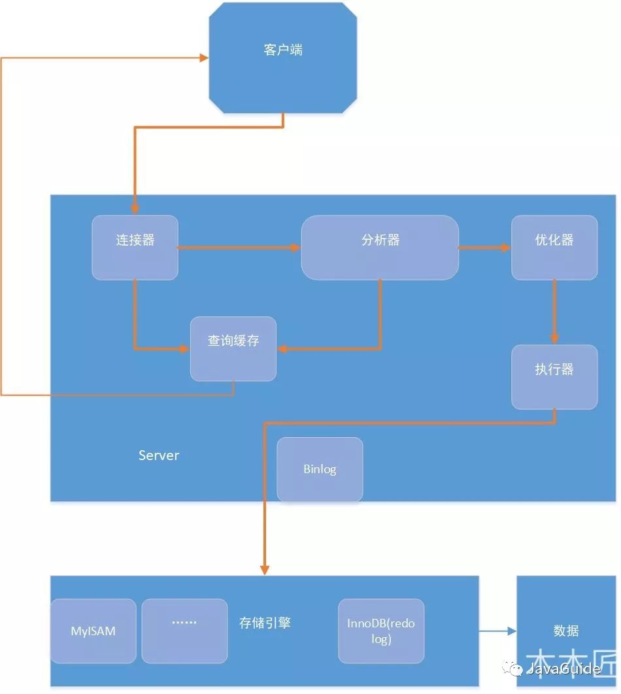

这里没有，使用看书的这章了。直接看的网页，这里写下博客上的总结。

# 一条SQL语句在MYSQL中五河执行
## MYSQL基本架构


图里面优点问题，分析器之后不会再访问缓存了


分层为： Server层和存储引擎层。
* Server: 包括连接器，查询缓存，分析器，优化器和执行器。所有跨存储引擎的功能都在这里实现，比如存储引擎、触发器、视图、函数。还有一个通用的日志模块binglog
* 存储引擎：主要负责数据的存储和读取。默认是InnoDB

### Server
1. 连接器， 负责身份认证和权限相关。
2. 查询缓存， 缓存以kEY-value的形式存储在内存汇总，key是预计查询，value是结果集。 8.0直接删除了。
3. 分析器，两步： 词法分析，提取关键字，表，字段名，查询条件等。 然后语法分析。查询sql对不对，查询会不会出错
4. 优化器：按照Mysql认为最优的方案去执行。比如多个索引的时候如何选择，多表查询时候的顺序。
5. 执行器：执行前检查权限，如果有权限，调用引擎的接口返回结果，保存到缓存（配置）。

## 分析sql语句
1. 查询 `select * from tb_student A where A.age = '18' and A.name='张三';`
   1. 检查权限，没有就报错，有的话检查缓存。缓存有就返回，没有就下一步
   2. 分析器进行词法分析，提取关键词，SELECT tb_student, age=18等。然后判断语法对不对。
   3. 优化器， 两种方案：
      * 先查询学生表中姓名为“张三”的学生，然后判断是否年龄是 18。
      * 先找出学生中年龄 18 岁的学生，然后再查询姓名为“张三”的学生。
      然后选择比较好的执行。
2. 更新 `update tb_student A set A.age = '19' where A.name = '张三'`
   
   和上面一样，之后进入日志模块，使用binlog(归档日志), InnoDB有一个redolog（重做日志）
   1. 先查询到张三这条数据，如果有缓存也会用缓存。
   2. 拿到查询的语句的记录，age改为19，调用引擎的接口，写入数据。InnoDB把数据保存在内存中，同时记录redolog, 此时redo log进入prepare状态，告诉执行器，执行完成了，随时可以提交。
   3. 执行器接收到通知后记录binlog,然后调用接口，提交redo log为提交状态。
   4. 更新完成

    这里为什么用两个日志模块，这是因为Innodb的事务就是依靠redo log。
    为了保持一致性。防止机器停机导致的数据不一致。
    Mysql恢复的过程就是：1. 判断redo log是否完整，如果完整就提交，2. 如果redo log只是预提交，不是commit，就检查binlog是否完整，如果完整就提交redo log, 不完整就回滚，事务是一致的。

**总结**
SQL 等执行过程分为两类，一类对于查询等过程如下：权限校验---》查询缓存---》分析器---》优化器---》权限校验---》执行器---》引擎
对于更新等语句执行流程如下：分析器----》权限校验----》执行器---》引擎---redo log prepare---》binlog---》redo log commit

# sql执行的慢
分两种情况，偶尔慢， 一直慢
## 偶尔慢
1. 数据库在flush数据，可能是redo log写满了，或者内存不够了，系统空闲时候
2. 数据被锁了， 查看`show processlist` 查看当前的状态
## 一直慢
1. 没用到索引。
    * 没创建索引
    * 有索引但是没用到， 不是函数的一部分或者运算。
    * 范围搜索的时候可能不会使用索引，扫描表的话N条记录，但是用索引还要回表，最坏可能是2N.不过可以强制使用索引 `select * from t force index(a) where c < 10 and c < 10000;

# 书写高质量sql
1. select 具体字段
   ```sql
   select * from employee; # 不好
   select id, name from employee; 好
   ```
2. 如果只查询一条记录或者最大最小，使用Limit 1
   
   ```sql
   select id, name from employee where name = 'jay'; # bad
   select id, name from employee where name = 'jay' limit 1; # good
   ```
   找到之后就不会继续扫描了。如果是唯一索引可以不用加。

3. 避免在where子句里面使用or来连接条件
   
   ```sql
   select * from user where user_id = 1 or age = 18; # user_id是索引 bad

   select * from user where user_id = 1
   union
   select * from user where age = 18;
   ```
   union 和 union all，union会去掉重复的，union all不会
   防止扫描全表

4. 优化limit分页
   
   ```sql
   select id, name, age from employee limit 1000， 10 # bad
   
   # 方案1：利用where做偏移
   select id, name, age from employee where id > 1000 limit 10; # good
   # 方案2：order by + 索引
   select id, name, age from employee order by id limit 1000, 10; # good
   ```
   limit会先取出 偏移量+要取的条数。然后去掉前面的。
   方案一可以跳过偏移量
   方案二也可以提高查询效率

5. 优化like

    ```sql
    select userId, name from user where userId like '%123'; # bad

    select userId, name from user where userId like '123%'; # good
    ```
    最左前缀匹配

6. 使用where条件限定要查询的数据，避免返回多余的行
   查询某个用户是不是会员

   ```sql
   select userId from user where isVip = 1; # bad

   select userId from user where userId=123 and isVip=1; # good
   ```
7. 避免在索引列使用mysql的内置函数
    查询7天内登陆过的用户， loginTime加了索引
    ```sql
    select userId, loginTime from loginuser where Data_ADD(loginTime, Interval 7 DAy) >= now(); # bad

    select userId, loginTime from loginuser where loginTime >= Data_ADD(now(), INTERVAL -7 DAY);
    ```
8. 避免在where子句上对字段进行表达式操作，这样会直接全表扫描
    ```sql
    select * from user where age - 1 = 10; # bad

    select * from user where age = 11; # good
    ```

9. Inner join, left join, right join,优先使用inner join, 如果是left join,左表尽量小
    * Inner join 内连接，在两张表进行连接查询时，只保留两张表中完全匹配的结果集
    * left join 在两张表进行连接查询时，会返回左表所有的行，即使在右表中没有匹配的记录。
    * right join 在两张表进行连接查询时，会返回右表所有的行，即使在左表中没有匹配的记录。

    ```sql
    select * from t1 left join t2 on t1.size = t2.size where t1.id > 2; # bad

    select * from (select * from t1 where id > 2) tb1 left join t2 on t1.size = t2.size;
    ```

10. 避免在where中使用！= 或者<>, 否则进行全表扫描

    ```sql
    select age, name from user where age <> 18; # bad

    select age, name from user where age < 18
    union all
    select age, name from user where age > 18; # good
    ```
11. 联合索引要注意索引的顺序，遵循最左匹配

    ```sql
    alter table user add index idx_user_id_age (userId, age);

    select * from user where age =10; #bad

    select * from user where userId= 10 and age = 10; # good
    ```

12. 对查询进行优化，应考虑在where以及Order by涉及的列上建立索引，避免全表扫描

    ```sql
    select * from user where address = 'a' order by age; # bad

    alter table user add index idx_address_age (address, age);  # 添加索引
    select * from user where add = 'a' order by age; # good
    ```

13. 插入数据过多，可以使用批量插入。
    django 有bluck_create
14. 适当时候可以使用覆盖索引
    覆盖索引可以不用回表

    ```sql
    select * from user where userId like '%123%'; # BAD， explain type=all，扫描全表了。

    //id为主键，那么为普通索引，即覆盖索引登场了。
    select id,name from user where userid like '%123%'; # 这里有select索引就不会全表扫描了。
    ```

15. 慎用distinct

    ```sql
    select distinct * from user; # bad
    select distinct name from user; # good
    ```
16. 删除冗余和重复的索引

    ```sql
    KEY `idx_userId` (userId)
    key `idx_userId_age` (userId, age)
    # 这里重复了，可以删掉第一个
    ```

17. 如果数据量大，优化修改和删除
    ```sql
    delete from user where id < 10000; # 会锁超时可能
    delete from user where id < 500; # 分批次删除
    ```

18. 使用默认值代替null

    ```sql
    select * from user where age is not null; # bad 
    select * from user where age > 0; # 会使用索引，看着也清楚
    ```

19. 不要连接超过5个以上的表。
20. 使用exist in
    
    表A表示某企业的员工表，表B表示部门表，查询所有部门的所有员工，很容易有以下SQL:
    `select * from A where deptId in (select deptId from B);`
    或者
    `select * from A exists(select 1 from B where A.deptId = B.deptId);`
    如果B的数据量小，适合用in，如果B的数据量大，用exist

21. union all 代替 union

    如果没有重复记录的话，union会合并排序。

22. 索引不宜超过5个

    因为insert, update可能会重建索引。
23. 尽量使用数字类型。

    字符型会降低查询和连接的性能，增加存储开销

24. 不在选择性低的字段建立索引

    选择性，不重复的个数 / 总数

25. 避免向客户端返回过多的数据量

    进行分页

26. 连接时候使用表的别名，并把别名前缀放到每一列上。
27. 尽量使用varchar/nvarchar 代替char/nchar

    变长字段存储空间小，节省空间。

28. 在group by 之前过滤不需要的记录

    ```sql
    select job, avg(salary) from employee group by job having job = 'president' or job = 'managent'; # bad

    select job, avg(salary) from employee where job = 'president' or job = 'president' group by job;
    ```

29. 如果字段类型是字符串，where时一定要用引号，否则索引无效
30. 使用explain分析sql计划