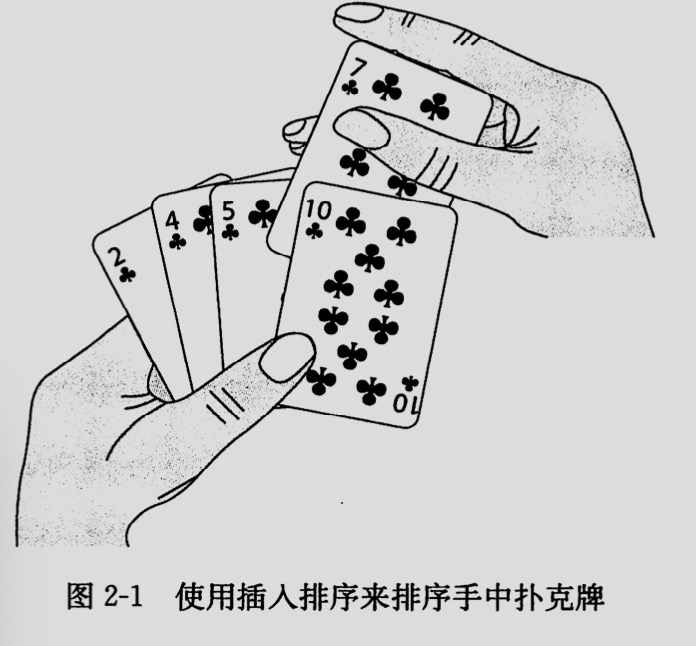

## 第一章 算法在计算中的作用
### 冒泡排序
1. 比较相邻元素。如果第一个大于第二个，则交换
2. 对每一对相邻的元素做相同的工作，从开始的第一队到结尾的最后一对。结束之后则最大的元素已经出现。
3. 对除了最后一个元素重复以上
4. 重复执行直到没有一对数据需要比较

```python
def bubble_sort(array):
    for i in range(len(array)-1):
        for j in range(0, len(array) - 1 - i):
            if array[j] > array[j+1]:
                array[j], array[j+1] = array[j+1], array[i]
```
```java
public static void bubble_sort(int[] array){
    for (int i = 0; i < (array.length - 1); i++) {
        for (int j = 0; j < (array.length - i - 1); j++) {
            if (array[j] > array[j+1]){
                int tmp = array[j+1];
                array[j+1] = array[j];
                array[j] = tmp;
            }
        }
    }
}
```
优化： 如果一轮都不需要交换，则返回
```python
def bubble_sort_2(array):
    for i in range(0, len(array) - 1):
        is_change = False
        for j in range(0, len(array) - 1 - i):
            if array[j] > array[j + 1]:
                array[j], array[j + 1] = array[j + 1], array[j]
                is_change = True
        if not is_change:
            return
```
- 最优时间复杂度 O(n)
- 最坏时间复杂度 O(n**2)
- 平均时间复杂度 O(n**2)

### 选择排序
1. 首先在未排序的序列中找到最小元素，放到排序序列的起始位置
2. 从剩余未排序的元素中寻找最小元素，放到已排序队列的末尾
3. 重复执行，直到所有元素均已排序
```python
def select_sort(array):
    for i in range(0, len(array) - 1):
        min_index = i
        for j in range(i+1, len(array)):
            if array[min_index] > array[j]:
                min_index = j
        array[i], array[min_index] = array[min_index], array[i]
```
```java
public static void select_sort(int[] array){
    for (int i = 0; i < (array.length - 1); i++) {
        int min_index = i;
        for (int j = i+1; j < array.length; j++) {
            if (array[min_index] > array[j]){
                min_index = j;
            }
        }
        int tmp = array[min_index];
        array[min_index] = array[i];
        array[i] = tmp;
    }
}
```
- 时间复杂度O(n**2)

## 第二章 算法基础
### 插入排序
对于少量元素的排序，是一个有效的算法。工作方式像排序一手扑克。开始时候左手为空且桌子上的牌面乡下。每次从桌子上拿走一张并插入到左手中的正确位置。为了找到正确的位置，需要它从左到右比较手中的牌。因此左手中的牌总是排序好的，拿的牌是桌子顶部的牌。



伪代码:
```
INSERTION-SORT(A)
for j = 2 to A.length
    key = A[j]
    i = j - 1
    while i > 0 and A[i] > key  // 所有大于j位置上值都向右移动，直到找到合适的位置，将这个值插入就进入
        A[i+1] = A[i]
        i = i - 1
    A[i+1] = key // 插入进去
```
```python
def insert_sort(array):
    for i in range(1, len(array)):
        key = array[i]
        j = i - 1
        while j >= 0 and array[j] > key:
            array[j+1] = array[j]
            j-=1
        array[j+1] = key
```
```java
public static void insert_sort(int[] array){
    for (int i = 1; i < array.length; i++) {
        int key = array[i];
        int j = i - 1;
        while (j>=0 && array[j]>key){
            array[j+1] = array[j];
            j--;
        }
        array[j+1] = key;
    }
}
```
- 最坏时间复杂度(O**2)

### 希尔排序
希尔排序，也称递减增量排序算法，是插入排序的一种更高效的改进版本。但希尔排序是非稳定排序算法。
- 对要排序的列表根据一定间隔（初始间隔一般设为列表长度的一半）进行分组
- 对各列表之间相同位置（下标）的元素进行插入排序
- 间隔减半，再次分组并对各列表之间相同位置（下标）的元素进行插入排序
- 如此循环，最终间隔为1，即为正常的插入排序
```python
def shell_sort(array):
    gap = len(array) // 2
    while gap > 0:
        for i in range(gap, len(array)):
            j = i
            while j >= gap and array[j-gap] > array[j]:
                array[j-gap], array[j] = array[j], array[j-gap]
                j -= gap
        gap //= 2
```
- 时间复杂度 O(nlgn)

### 归并排序
主要利用了归并的思想实现的排序方法。采用了经典的分治算法，既
    - 分(divide) 将问题分成小的问题来递归求解。
    - 治(conquer) 将分的阶段的答案合并到一起。
```python
  def merge(left, right):
    result = []
    while left and right:
        if left[0] > right[0]:
            result.append(right.pop(0))
        else:
            result.append(left.pop(0))
    result += left
    result += right
    return result

def merge_sort(array):
    if len(array) <= 1:
        return array
    mid = len(array) // 2
    left = merge_sort(array[:mid])
    right = merge_sort(array[mid:])
    return merge(left, right)
```

- 时间复杂度 nlgn