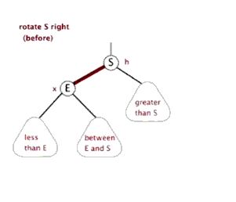
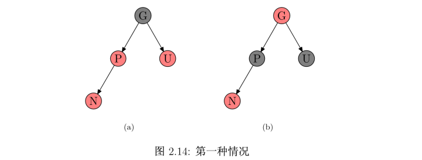
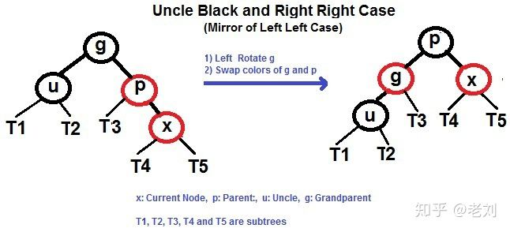

### 第10章 基本数据结构
#### 栈和队列
**栈是先进后出**, **队列是先进先出**
#### 链表
1. `链表linked list`是一种线性顺序排列。数组的线性顺序是由数组的下标决定的，链表是由各个对象的指针决定的。
2. 链表有多种形式，可以分为单链接和双链接（next, prev），已排序和未排序，循环和非循环（尾部的next指向头部）
   
#### 二叉树
`二叉树Binary tree`只有左右子节点的树结构.

### 第11章 散列表
散列表hash table是实现字典操作的有效数据结构。散列表是普通数组概念的推广，由于普通数组可以直接寻址，能在O（1）时间内访问任意位置。散列表中是对关键字进行计算，得出相应的下表进行寻址。
#### 直接寻址表
直接把value放到数组对应Key的位置上。


#### 散列表
利用散列函数（hash函数），由关键字Key计算出槽的位置，并保存value。
这里可能存在一个问题：散列冲突，两个关键字映射到同一个槽中。


解决方法：**链接法** 和 **开放寻址法**
1. 链接法， 把散列到同一槽中的所有元素放入一个链表中。
   

2. 开放寻址法 ：每个关键字都有自己的探查序列，`<h(k, 0), h(k, 1)...h(k, m-1)>`, 按照序列进行检查，如果槽位是空的没有值就直接保存在对应的槽位上。
   > 简单地讲，也就是说，一间厕所，来了一个顾客就蹲其对应的位置，如果又来一个顾客，把厕所单间门拉开，一看里面有位童鞋正在用劲，那么怎么办？很自然的，拉另一个单间的门，看看有人不，有的话就继续找坑。当然了，一般来说，这个顾客不会按顺序一个一个地拉厕所门，而是会去拉他认为有可能没有被占用的单间的门，这可以通过闻味道，听声音来辨别，这就是寻址查找算法。如果找遍了所有厕所单间，看尽了所有人的光屁股，还是找不到坑，那么这座厕所就该扩容了。当然了，厕所扩容不会就只单单增加一个坑位，而是综合考虑成本和保证不让太多顾客拉到裤子里，会多增加几个坑位，比如增加现有坑位的0.72倍。为什么是0.72呢，这是所长多年经营所得到的经验值，为了让自己的经验发扬光大，需要出去演讲，又不能太俗，总不能说“厕所坑位因子”吧，那就把把0.72叫做“装填因子”或者“扩容因子”吧。目前很多产品使用0.72这个常数。

#### 散列函数
将每个关键字尽可能的散列到M个槽位上

### 第12章 二叉搜索树
1. 属性：左子孙节点小于父节点，右子孙节点大于父节点
2. 遍历：对于父节点来看，采用递归来输出
   - 前序遍历 先输出父节点，再输出左子树，最后输出右子树
   - 中序遍历 先输出左子树，再输出父节点，最后输出右子树
   - 后续遍历 先输出左子树，再输出右子树，最后输出父节点
3. 后继： 找一个节点的后继节点，就是找该节点的中序遍历的下一个节点。分两种情况：
   - 如果该节点有右子树，则返回右子树中的最小值，就是大于该节点值得最小值。
   - 如果没有，当前节点x，需要向上寻找，直到找到父节点a,不是a的父节点b的右子树，这时候b节点是x的后继
  ```python
  def successor(node):
      if node.right != None:
          return minimim(node.right)
      y = node.parent
      while y != None and node == y.right:
         x = y
         y = y.parent
      return y
  ```
4. 遍历
   - 深度遍历：前序中序后序
   - 广度优先：利用栈来操作
   ```python
   def bfs(root):
      stack = [root]
      while stack:
         curr = stack.pop(0)
         print(curr.value)
         if curr.left:
            queue.append(curr.left)
         if curr.right:
            queue.append(curr.right)
   ```
5. 新增和删除
   1. 新增， 与查找一样，直到找到叶子节点把值插进入
   2. 删除：
      - 如果没有孩子节点，直接删除，修改父节点。
      - 只有一个孩子节点，将这个孩子提升到该节点位置上，并删除这个节点
      - 当前节点z有两个孩子，需要找到后继节点（因为有右子树，一定在右子树中）x，这里的后继节点x分两种情况：
         1. x有右子树（一定没有左子树，否则就不是后继节点了），用x的右子树替换x，用x替换z，删除z
         2. x没有右子树：直接用x替换z，然后修改子树和父节点，删掉z


```python
class Node:
    # 节点 有值，指针分别指向父节点，左右子节点
    def __init__(self, value):
        self.value = value
        self.left = None
        self.right = None
        self.parent = None

class Tree:
    def __init__(self):
        self.root = None

    def inorder_walk(self, node):
        # 中序遍历
        if node != None:
            self.inorder_walk(node.left)
            print(node.value)
            self.inorder_walk(node.right)


    def preinorder_walk(self, node):
        # 前序遍历
        if node != None:
            print(node.value)
            self.preinorder_walk(node.left)
            self.preinorder_walk(node.right)

    def postorder_walk(self, node):
        # 后续遍历
        if node != None:
            self.postorder_walk(node.left)
            self.postorder_walk(node.right)
            print(node.value)
    
    def breadth_first_search(self):
        # 广度优先
        if self.root is None:
            return
        stack = [self.root]
        while stack:
            curr = stack.pop(0)
            print(curr.value)
            if curr.left:
                stack.append(curr.left)
            if curr.right:
                stack.append(curr.right)

    def search(self, node, k):
        # 查找关键字为K的节点指针
        if node == None or k == node.value:
            return node
        if k < node.value:
            return self.search(node.left, k)
        else:
            return self.search(node.right, k)
    
    def iterative_search(self, k):
        node = self.root
        while node != None and k != node.value:
            if k < node.value:
                node = node.left
            else:
                node = node.right
        return node

    def minimum(self, node):
        # 最小值
        while node.left != None:
            node = node.left
        return node

    def maximum(self, node):
        # 最大值
        while node.right != None:
            node = node.right
        return node
    
    def successor(self, node):
        # 计算一个后继节点，中序遍历的下一个
        # 1. 有右子树，则是右子树中最小的值
        # 2. 没有右子树，就向上找到一个节点不是该父节点的右子树时候，这个父节点就是后继节点。
        if node.right:
            return self.minimum(node.right)
        y = node.parent
        while y!=None and node == y.right:
            node = y
            y = node.parent
        return y

    def insert(self, value):
        # 插入一个新值
        new_node = Node(value)
        y = None
        curr = self.root
        while curr != None:
            y = curr
            if value < curr.value:
                curr = curr.left
            else:
                curr = curr.right
        new_node.parent = y
        if y == None:
            self.root = new_node
        elif new_node.value < y.value:
            y.left = new_node
        else:
            y.right = new_node

    def transplant(self, target, source):
        # 用source节点替换掉target节点
        if target.parent == None:
            self.root = source
        elif target == target.parent.left:
            target.parent.left = source
        else:
            target.parent.right = source
        if source != None:
            source.parent = target.parent

    def delete(self, node):
        if node.left == None:
            self.transplant(node, node.right)
        elif node.right == None:
            self.transplant(node, node.left)
        
        else:
            y = self.minimum(node.right)
            if y.parent != node:
                self.transplant(y, y.right)
                y.right = node.right
                y.right.parent = y
            self.transplant(node, y)
            y.left = node.left
            y.left.parent = y
```

### AVL树
AVL树是一种特殊的二叉搜索树，有如下性质：

- 具有二叉查找树的全部特性
- 任意节点的左子树和右子树的高度差 <= 1
AVL是最先发明的一种自平衡二叉查找树，像普通二叉树一样组织数据。所不同的是，AVL的每一个节点都附带了一个`平衡因子`，其值代表了左子树和右子树的高度之差。对于每一次改变其平衡性的操作，AVL树都通过执行一次`旋转`操作来使其重新平衡。每一次插入和删除操作最多可能有`log n`个节点被旋转。

因此，平衡树基于这种特点就可以保证其不会出现大量节点偏向于一边的情况了，于是，通过平衡树，我们解决了二叉查找树递增(减)插入情况的缺陷。对于有 n 个节点的平衡树，查找、插入和删除在平均和最坏情况下的时间复杂度都是O(logn)。插入和删除元素的操作则可能需要借由一次或多次树旋转，以实现树的重新平衡。
**查找**
可以像普通二叉查找树一样的进行，所以耗费O(logn)时间。

**插入**

AVL树的插入操作和普通二叉树类似。只不过**在每一次插入后，需要重新计算子树高度**。如果这次插入操作改变了树的平衡性，就需要旋转节点以使树重新平衡，**所谓的左旋和右旋都是以子树为原点的**。

**左左型-右旋**


顺时针旋转两个节点，使得父节点被自己的左孩子取代，而自己成为自己的右孩子


动态过程：



**右右型-左旋**


**右左型-先右旋在左旋**


**左右型-先左旋后右旋**
同上 图省略

**规则**
- 左-左型：做右旋。

- 右-右型：做左旋转。

- 左-右型：先做左旋，后做右旋。

- 右-左型：先做右旋，再做左旋。

### 红黑树
**性质**
1. 节点是红色或者黑色
2. 根是黑色
3. 所有叶子节点都是黑色
4. 每个红色节点必须有两个黑色的子节点（不能有两个连续的红色节点）
5. 从任一节点到其每个叶子的所有简单路径都包含相同数目的黑色节点（黑高）


`红黑树(red-black tree)`是许多“平衡”搜索树中的一种，可以保证在最坏情况下基本动态集合操作的时间复杂度为 O(logn)。

一棵右n个内部节点的红黑树的高度至多为 2lg(n+1)

红黑树首先是一棵二叉搜索树，它在每个结点上增加了一个储存位来表示结点的颜色，通过对任何一条从根到叶子的简单路径上各个结点的颜色进行约束，红黑树确保没有一条路径会比其它路径长出2倍，因而是**近似平衡的, **不会像平衡树那样，频繁着破坏红黑树的规则，所以不需要频繁地调整**。其牺牲了部分平衡性以换取插入/删除操作时少量的旋转操作。**

树中的每个结点有5个属性：color、key、left、right 和 p，如果一个结点没有子结点或父结点，则该结点相应指针属性的值为 NIL。


#### 1. 旋转

**旋转不会改变树的中序遍历结果**

左旋


```python
def left_rotate(T, x):
    y = x.right
    x.right = y.left
    if y.left != T.nil:
        y.left.p = x
    y.p = x.p
    if x.p == T.nil:
        T.root = y
    elif x == x.p.left:
        x.p.left = y
    else:
        x.p.right = y
    y.left = x
    x.p = y
```


右旋：


```python
def right_rotate(T, m):
    e = m.left
    m.left = e.right
    if e.right != T.nil:
        e.right.p = m
    e.p = m.p
    if m.p == T.nil:
        T.root = e
    elif m == m.p.left:
        m.p.left = e
    else:
        m.p.right = e
    e.right = m
    m.p = e
```
#### 2. 插入

向红黑树中插入新的节点。将新节点的颜色染色为红色，用二叉搜索树的插入方式进行插入。**这里染色成红色，因为如果为黑色，会导致根节点到这个叶子的路径多出一个黑节点，这样很难调整了。但是设置为红色，黑高不变，但是可能会导致连续红色节点，需要进行调整颜色和旋转。**
设要插入的结点为N，其父结点为P，其祖父结点为G，其父亲的兄弟结点为U（即P和U 是同一个结点的两个子结点）。下面介绍五种情况：
1. 情况1：
新插入的节点N是红黑树的根节点，这个时候只需要把红色变为黑色，就满足了性质2（根是黑色），同时所有路径的黑色节点都增加1，满足性质5（所有路径黑高相同)

    

2. 情况2:
N的父节点P是黑色，这种情况下，性质4（每个红色节点必须有两个黑色的子节点）和性质5不受影响，不用调整

    

3. 情况3:
N 的父节点是红色（节点 P 为红色，其父节点必然为黑色）。由于 P 和 N 均为红色，所以性质4被打破，此时需要进行调整。这时候又分为2种情况：
   - 第一、N的叔叔U是红色的。
     - 将P和U重绘为黑色并重绘结点G为红色
     - 现在新结点N有 了一个黑色的父结点P，因为通过父结点P或叔父结点U的任何路径都必定通过祖父结点G， 在这些路径上的黑结点数目没有改变。**但是，红色的祖父结点G的父结点也有可能是红色的**，这就违反了性质3。为了解决这个问题，我们在祖父结点G递归向上调整颜色(当然，如果G是跟节点，最后则把G调整为黑色)。

       
     
   - 第二、N的叔叔U是黑色的，有4种情况：
     - 左-左情况
       这种情况很简单，想象这是一根绳子，手提起 P 节点，然后变色即可(实际上是对新插入节点的父节点(p)进行右旋)：

       

     - 左-右情况
       先对p进行选左旋，在应用左-左情况

       

     - 右-右情况

       

     - 右-左情况

       


#### 3. 删除
相较于插入操作，红黑树的删除操作则要更为复杂一些。删除操作首先要确定待删除节点有几个孩子，如果有两个孩子，不能直接删除该节点。而是要先找到该节点的前驱（该节点左子树中最大的节点）或者后继（该节点右子树中最小的节点），然后将前驱或者后继的值复制到要删除的节点中，最后再将前驱或后继删除。
由于前驱和后继至多只有一个孩子节点，这样我们就把原来要删除的节点有两个孩子的问题转化为只有一个孩子节点的问题，问题被简化了一些。我们并不关心最终被删除的节点是否是我们开始想要删除的那个节点，只要节点里的值最终被删除就行了，至于树结构如何变化，这个并不重要。

红黑树删除操作的复杂度在于删除节点的颜色，当删除的节点是红色时，直接拿其孩子节点补空位即可。因为删除红色节点，性质5（从任一节点到其每个叶子的所有简单路径都包含相同数目的黑色节点）仍能够被满足。

当删除的节点是黑色时，那么所有经过该节点的路径上的黑节点数量少了一个，破坏了性质5。如果该节点的孩子为红色，直接拿孩子节点替换被删除的节点，并将孩子节点染成黑色，即可恢复性质5。但如果孩子节点为黑色，处理起来就要复杂的多。分为6种情况，下面会展开说明。

在展开说明之前，我们先做一些假设，方便说明。这里假设最终被删除的节点为X（至多只有一个孩子节点），其孩子节点为N，X的兄弟节点为S，S的左节点为 SL，右节点为 SR。接下来讨论是建立在节点 X 被删除，节点 N 替换X的基础上进行的。


[参考](https://zhuanlan.zhihu.com/p/91960960)

