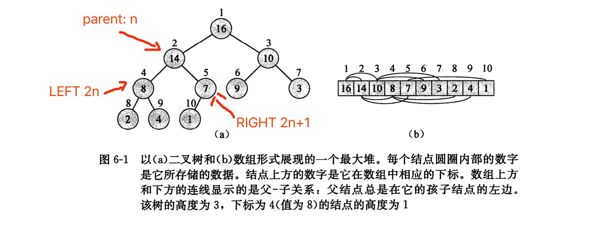
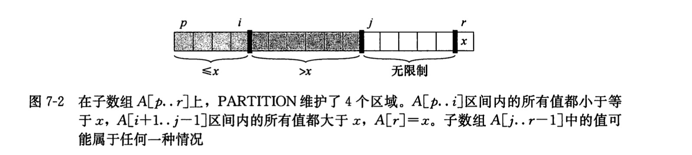

### 第六章 堆排序
#### 堆和堆排序
（二叉）堆是一个数组，被看成一个近似的完全二叉树。


1. 最大堆和最小堆： 父节点大于/小于子节点
    -  A[PARENT(i)] >= A[i] 最大堆，用于排序(堆排序)
    -  A[PARENT(i)] <= A[i] 最小堆，用于构造优先队列

2. 堆排序 主要步骤
   1. 构建最大堆 A[0...n]
   2. 把第一个元素与最后一个交换 A[0], A[n]
   3. 构建最大堆 A[0...（n-1)] (平衡)
   
```python
class Heap:
    def __init__(self, array):
        self.array = array
        self.size = len(array)
        self.build()

    @staticmethod
    def get_child(parent):
        # parent 是数组索引值 从0开始算，每次计算都要加1
        return parent * 2 + 1
    

    def heapify(self, parent):
        '''
        堆化： 传入一个父节点，由此向下的进行比较交换--堆化
        每次比较父节点和左右子节点，把最大的和父节点进行交换，如果进行了交换则向下继续执行
        这样做不能保证子孙节点都小于这个父节点，因此要从第向下进行堆化
        '''
        left_child, right_child = self.get_child(parent), self.get_child(parent) + 1

        largest = parent
        if left_child < self.size and self.array[left_child] > self.array[largest]:
            largest = left_child
        if right_child < self.size and self.array[right_child] > self.array[largest]:
            largest = right_child
        
        if largest != parent:
            self.array[parent], self.array[largest] = self.array[largest], self.array[parent]
            self.heapify(largest)
        
    def build(self):
        '''
        # 从底向上的建堆
        # 因为根节点在第一个，顺序向下的，所以array[n/2+1....n]都是叶子节点，不需要进行平衡
        # 从最底下的父节点进行建堆即可
        # 一直到第一个 array[0]
        # '''
        for i in range(len(self.array)//2-1, -1, -1):
            self.heapify(i)

    def sort(self):
        '''
        # 堆排序
        # 1. 构建最大堆
        # 2. 每次将第一个数放到堆得最后，并且堆得长度-1 （每次取出最大的放到后面，顺序就出来了）
        # 3. 取出之后的可能不是最大堆，需要重新平衡一下即可
        '''
        for i in range(len(self.array)-1, 0, -1):
            self.array[0], self.array[i] = self.array[i], self.array[0]
            self.size -= 1
            self.heapify(0)
```
- 复杂度：nlgn

#### 优先队列
1. 堆排序是一个优秀的算法，但在实际应用中，快速排序的性能一般会优于堆排序。尽管如此，堆这一数据结构仍然有很多应用。如：作为高效的优先队列，和堆一样，优先队列也有两种形式: 最大优先队列和最小优先队列。
`优先队列(priority queue)`是一种用来维护由一组元素构成的集合 S 的数据结构，其中的每一个元素都有一个相关的值，称为`关键字(key)`。一个`最大优先队列`支持以下操作:
   - INSERT(S,x): 把元素 x 插入集合 S 中。
   - MAXIMUM(S): 返回其最大键值的元素。
   - EXTRACT-MAX(S): 去掉并返回 S 中的具有最大键值的元素。
   - INCREASE-KEY(S,x,k): 将元素 x 的关键字值增加到 k(k 不小于 x的原来值)

```python
class PriorityQueue(Heap):
    def __init__(self, array):
        super().__init__(array)

    def insert(self, x):
        """
        堆中新增一个值
        先在数组最后加一个负无穷，防止上浮报错
        然后提升末尾位置的优先级，即赋值
        然后堆得长度增加
        """
        self.array.append(-float("inf"))
        self.increase(self.size, x)
        self.size += 1

    def maximum(self):
        """
        返回最大值
        """
        return self.array[0]
    
    def extract_max(self):
        """
        返回并从堆中删除最大值
        """
        max_value = self.array.pop(0)
        self.size -= 1
        self.heapify(0)
        return max_value
    
    def increase(self, index, key):
        """
        提升一个索引位置的值
        """
        if key <= self.array[index]:
            raise ValueError("new key is smailler than current key")
        self.array[index] = key
        while index > 0 and self.array[self.get_parent(index)] < self.array[index]:
            self.array[index], self.array[self.get_parent(index)] = self.array[self.get_parent(index)], self.array[index]
            index = self.get_parent(index)
```
### 第七章 快速排序
快速排序的最坏的时间复杂度是 n^2, 但实际排序应用中最好的选择还是快速排序，因为他的平均性能好，他的期望时间复杂度是 nlgn

对数组A[p...r]进行快速排序，采用分治法：
  - 分解：数组A被划分为两个子数组A[p...q-1]和A[q+1...r],还有A[q], 使得前面的都小于A[q],后面的都大于A[q]。
  - 解决：然后递归调用快速排序，对两个子数组进行排序，一直递归到左右子数组都只有一个值时。
  - 合并：子数组都是原址排序的，不需要进行合并
  
  

```python
def partition(array, left, right):
    pivot = array[right]
    i = left
    for j in range(left, right):
        if array[j] < array[right]:
            array[i], array[j] = array[j], array[i]
            i += 1
    array[i], array[right] = array[right], array[i]
    return i

def quick_sort(array, left, right):
    if left < right:
        pivot = partition(array, left, right)
        quick_sort(array, left, pivot-1)
        quick_sort(array, pivot+1, right)
```

#### 线性时间排序
目前为止，我们已经介绍了几种能在 Ω(nlgn)时间内排序 n 个数的算法。

* 归并排序和堆排序达到了最坏情况下的上界
* 快速排序在平均情况下达到该上界
  这些算法都有一个共同点：`在排序的最终结果中，各元素的次序依赖于它们之间的比较`。我们把这类排序算法称为`比较排序`。本章将证明对包含 n 个元素的输入序列来说，任何比较排序在最坏情况下都要经过 Ω(nlgn) 次比较。因此，归并排序和堆排序是渐进最优的，并且任何已知的比较排序最多就是在常数因子上优于它们。
  本章将介绍3种线性时间复杂度的排序算法：计数排序、基数排序和桶排序。当然，这3种算法是用运算而不是比较来确定排序顺序的，因此，下界 Ω(nlgn) 对它们是不适用的。

#### 计数排序
`计数排序`假设n个输入元素都是在0-k区间内的一个整数，对每个输入的元素x,确定小于x的元素个数，可以把它放入输出数组的位置上。
```python
def count_sort(array, k):
    out = [0] * len(array)
    tmp = [0] * (k+1)
    
    for j in array:
        tmp[j] += 1
    
    for x in range(1, k+1):
        tmp[x] += tmp[x-1]
    
    for i in array:
        out[tmp[i]-1] = i
        tmp[i] -= 1
    return out
```
- 复杂度 O（n)
#### 基数排序 radix sort
`radix sort` 从最低位到最高位进行排序，每次只比较对应位置的数
```python
def radix_sort(array, num, base=10):
    for x in range(num):
        bucket = [[] for d in range(base)] # 10进制
        for el in array:
            radix = el // (10**x) % 10 # 取某位上的数
            bucket[radix].append(el)
        array = [el for els in bucket for el in els]
    return array

a = [123, 43, 12, 4432, 5, 9]
print(radix_sort(a, 4))
```
- 复杂度 O（n)
#### 桶排序 bucket sort
桶排序假设输入的数据服从正太分布，平均情况下的复杂度是O（n)， **计数排序假设输入数据都属于一个小区间内的整数，而桶排序则假设输入是由一个随机过程产生，该过程将元素均匀、独立地分布在[0,1)区间上。**

```python
def insert_sort(array):
    for i in range(1, len(array)):
        num = array[i]
        j = i - 1
        while j >= 0 and array[j] > num:
            array[j+1] = array[j]
            j -= 1
        array[j+1] = num

def bucket_sort(array):
    result = []
    bucket = [[] for x in range(10)]
    for el in array:
        bucket[int(el*10)].append(el)
    for bck in bucket:
        insert_sort(bck)
        result += bck
    return result
```

| 排序方法 | 类别 | 平均复杂度 | 最差 | 最好 | 稳定性 | 空间复杂度 |
| -------- | ---- | ------ | ---- | ---- | ------ | ---- |
| 冒泡排序 | 交换类 | O(n^2) | O(n^2) | O(n) | 稳定 | O(1)(即原址) |
| 选择排序 | 选择类 | O(n^2) | O(n^2) | O(n) | 不稳定 | O(1) |
| 插入排序 | 插入类 | O(n^2) | O(n^2) | O(n) | 稳定 | O(1) |
| 希尔排序 | 插入类 | O(nlogn) | O(nlog^2n) | O(nlog^2n) | 不稳定 | O(1) |
| 归并排序 |  | O(nlogn) | O(nlogn) | O(nlogn) | 稳定 | O(n) |
| 快速排序 | 交换类 | O(nlogn) | O(n^2) | O(nlogn) | 不稳定 | O(1) |
| 堆排序   | 选择类 | O(nlogn) | O(nlogn) | O(nlogn) | 不稳定 | O(1) |
| 计数排序 |      | O(n+k) | O(n+k) | O(n+k) | 稳定 | O(n+k) |
| 基数排序 |      | O(n*base) | O(n*base) | O(n*base) | 稳定 | O(n*base) |
| 桶排序 |      | O(n+k) | O(n+k) | O(n+k) | 稳定 | O(n+k) |


### 中位数和顺序统计量
#### 最大值和最小值
```python
def minnum(array):
    min = A[0]
    for el in array:
        if min > el:
            el = min
    return min
```

**同时找到最大值和最小值**
按上面代码的思路：只需要分别独立地找出最大值和最小值，这各需要 n-1次比较，共需2n-2次比较。

实际上，我们只需要最多`3n/2`次比较就可以同时找出最大值和最小值，具体方法是记录已知的最小值和最大值。但我们并不是将每一个输入元素与当前的最小值和最大值进行比较——这样做的代价是每个元素需要2次比较，而是对输入元素成对地进行处理。首先，我们将一对输入元素相互进行比较，然后把较小的与当前最小值进行比较，把较大的与当前最大值进行比较。这样，对每两个元素共需3次比较。

```python
def min_max(array):
    min, max = array[0], array[0]
    for i in range(len(array) % 2, len(array), 2):
        if array[i] > array[i+1]:
            tmp_min, tmp_max = array[i+1], array[i]
        else:
            tmp_min, tmp_max = array[i], array[i+1]
        
        if tmp_max > max:
            max = tmp_max
        if tmp_min < min:
            min = tmp_min
    return max, min
```
- 复杂度 3n/2
#### 期望为线性时间的选择算法
在无序数组中找到第K小的数，使用分治算法，以快速排序为基础进行改良，与快速排序一样，我们仍然将输入数组进行递归划分，但与快速排序不同的是：快速排序会递归处理划分的两边，而 Ramdomized-select只处理划分的一边。这一差异会在性能分析中体现出来：快速排序的期望运行时间是O(nlgn)，而Ramdomized-select的期望运行时间为 O(n)。这里，假设输入数据都是互异的。

```python
def partition(array, left, right):
    pivot, i = array[right], left
    for j in range(left, right):
        if array[j] < pivot:
            array[i], array[j] = array[j], array[i]
            i += 1
    array[i], array[right] = array[right], array[i]
    return i

def randomized_select(array, left, right, k):
    if left == right:
        return array[left]
    
    q = partition(array, left, right)
    i = q - left + 1
    if i == k:
        return array[q]
    elif i > k:
        return randomized_select(array, left, q-1, i)
    elif i < k:
        return randomized_select(array, q+1, right, i - k)
```