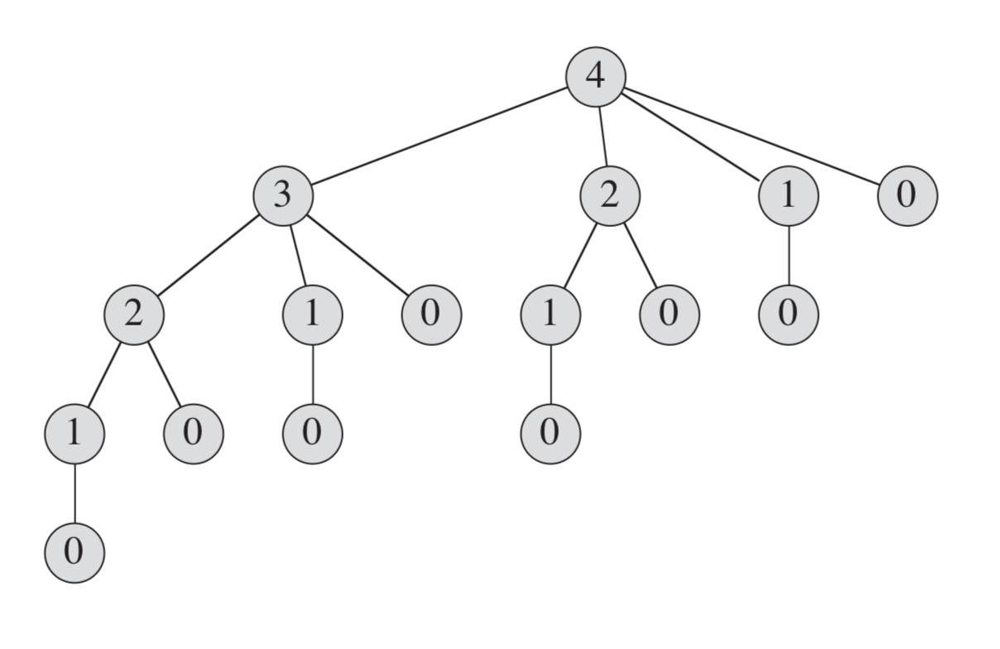
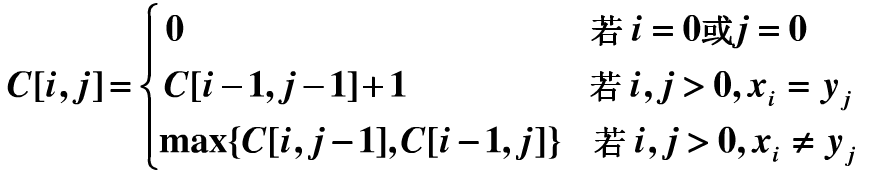

# 高级设计和分析技术
这一部分介绍了设计和分析高校算法的三种中少技术：动态规划、贪心算法和摊还分析。

动态规划通常同来解决最优化问题，在这类问题中，我们通过做出一组选择来达到最优解。在做出每个选择的同时，通常会生成与原问题形式形同的子问题。当任意一个选择子集都生成相同的子问题时，动态规划技术通常就会很有效，其关键技术就是对每个这样的子问题都保存其解，当重复出现时即可避免重复求解。

贪心算法通常也用于最优化问题，我们做出一组选择来达到最优解。**贪心算法的思想是每步选择都追求局部最优**。一个简单的例子是找零问题：为了最小化找零的硬币数量，我们反复选择不大于剩余金额的最大面额的硬币。**贪心算法对很多问题都能求得最后解，而且速度比动态规划快得多。但是，我们并不能总是简单地判断出贪心算法是否有效**。

## 第15章 动态规划
**动态规划（dynamic programming)** 与分治法相似，都是通过组合子问题的解来求解原问题。分治法将问题划分为不相交的子问题，递归的求解子问题，再将它们的解组合起来，求出原问题的解。与之相反，动态规划应用于子问题重叠的情况，即不同的子问题具有公共的子子问题。在这种情况下，分治法会做许多重复的工作，会反复的求解那些公共子子问题。而动态规划算法对每个子子问题只求解一次，将其解保存在一个表格中，从而无需每次求解一个子子问题时都重新计算，避免了这种不必要的计算工作。
### 动态规划求解钢条的切割问题
给定一段长为n的钢条和一个价格表，求切割钢条的方案，使得销售收益最大。如果长度n的价格足够大，可以不进行切割。
| 长度 i  | 1    | 2    | 3    | 4    |
| ------- | ---- | ---- | ---- | ---- |
| 价格 pi | 1    | 5    | 8    | 9    |

**分析：**
长度为 n 的钢条共有 2 ^(n-1)种不同的切割方案(因为在距离钢条左端 i(i=1,2,...n-1)英寸处，我们总是可以选择切割或不切割)。于是有：
$$ 收益rn = max(pn, r1+r(n-1), r2+r(n-2),...,r(n-1)+r1) $$

第一个参数 pn 对应不切割，直接出售长度为 n 的钢条的方案，其它 n-1个参数对应另外 n-1种方案，对于每个 i=1,2,...,n-1，首先将钢条切割成长度为 i 和 n-i 的两段，接着求解这两段的最优切割收益 ri 和 r(n-1)(每种方案的最优收益为两段的最优收益之和)

注意到，为了求解规模为 n 的原问题，我们先求解形式完全一样，但规模更小的子问题。即当完成某次切割后，我们将两段钢条看成两个独立的钢条切割问题实例，我们通过组合两个相关子问题的最优解，并在所有可能的两段切割方案中选取组合收益最大者，构成原问题的最优解。我们称这样的问题满足`最优子结构(optimal substructure)`性质：问题的最优解由相关子问题的最优解组合而成，而这些子问题可以独立求解。

除了上述求解方法外，钢条切割问题还存在一种相似的但更为简单的递归求解方法：我们将钢条从左边切割下长度为 i 的一段，只对右边剩下的长度为 n-i 的一段继续进行切割(递归求解)，对左边的一段则不再进行切割。于是得到更简化的版本：
$$ rn = max(pi + r(n-i))(1<=i<=n) $$

朴素递归法:

```python
def cut_rod(p, n):
    if n == 0:
        return 0
    profit = 0
    for x in range(1, n+1):
        profit = max(profit, p[x] + cut_rod(p, n-x))
    return profit

price = {1: 1, 2: 5, 3: 8, 4: 9} # 价格表
print(cut_rod(price, 4))
```

上面几行代码即解决了此问题，但是，其效率并不高，当 n 较大的时候，所花费的时间明显增大，原因在于其反复地同相同的参数值对自身进行递归调用：




如果能做到在后面再次需要此子问题的解时直接查找保存的结果，而不必重新计算，那么就能得到一个更高效的动态规划算法。 因此，动态规划方法是付出额外的内存空间来节省计算时间。动态规划有两种等价的实现方法：

第一种方法称为**带备忘的自顶向下法(top-down with memoization)**。此方法仍按自然的递归形式编写过程，但过程中会保存每个子问题的解，当需要该解时，过程首先检查是否已经保存过此解，若是，则直接返回保存的值，从而节省了计算时间。

第二种方法称为**自底向上法(bottom-top method)**。这种方法一般需要恰当定义子问题“规模”的概念，使得任何子问题的求解都只依赖于“更小的”子问题的求解。因而我们可以将子问题按规模排序，按由小至大的顺序进行求解。当需要某个子问题时，它所依赖的那些更小的子问题都已求解完毕，结果已经保存，每个子问题只需要求解一次。

递归一般是自顶向下，依赖于子问题优化函数的结果，只有子问题完全求出，也就是子问题的递归返回结果，原问题才能求解。
自底向上一般为迭代法，就是巧妙的安排求解顺序，从最小的子问题开始，自下而上求解。每次求新的问题时，子问题的解已经计算出来了。

两种方法得到的算法具有相同的渐进运行时间，仅有的差异是在某些特殊的情况下，自顶向下方法并未真正递归地考察所有可能的子问题。由于没有频繁的递归函数调用的开销，自底向上方法的时间复杂性函数通常具有更小的系数。

```python
def top-down-cut-rod(p, n, mem):
    if mem.get(n):
        return mem[n]
    if n == 0:
        return 0
    profit = 0
    for x in range(1,  n+1):
        profit = max(profit, p[x] + top-down-cut-rod(p, n-x, mem))
    mem[n] = profit
    return profit

price = {1: 1, 2: 5, 3: 8, 4: 9} # 价格表
print(top-down-cut-rod(price, 4， dict()))

def down_top_cut_rod(p, n, mem):
    mem[0] = 0
    for bigger in range(1, n+1):
        profit = 0
        for smaller in range(1, bigger+1):
            profit = max(profit, p[smaller] + mem[bigger-smaller])
        mem[bigger] = profit
    return profit
    
price = {1: 1, 2: 5, 3: 8, 4: 9} # 价格表
print(down_top_cut_rod(price, 4， dict()))
```
### 动态规划原理

在上例中，我们关注适合用于动态规划方法求解的最优问题应该具备两个要素：最优子结构和子问题重叠。

**最优子结构：**
由前所述，注意到，长度为 n 的钢条的最优切割方案是由第一次切割后(需要切割的情况下)得到的两段钢条的最优切割方案组成的。
在动态规划的方法中，我们通常是同自底向上地使用最优子结构。也就是说，首先求得子问题的最优解，然后求得原问题的最优解。

**重叠子问题：**
适合动态规划方法求解的最优化问题应具备的第二个性质是子问题空间必须足够小，即问题的递归算法会反复地求解相同的子问题，而不是一直生成新的子问题。如果递归算法反复求解相同的子问题，我们就称最优化问题具有`重叠子问题(overlapping subproblems)`性质。与之相对，适合用分治方法求解的问题通常在递归的每一步都生成全新的子问题。动态规划算法通常这样利用重叠子问题性质：对每个子问题求解一次，将解存入一个表中，当在此需要这个子问题时直接查表，每次查表的代价为时间常量。

### 最长公共子序列
**最长公共子序列问题（longest-common-subsequence problem， LCS)给定两个序列 `X = <x1, x2...xm>`和`Y = <y1, y2...yn>`，求X和Y的最长公共子序列。（不用连续）
比如字符串1：<font color=red>B</font>D<font color=red>C</font>A<font color=red>BA</font>；字符串2：
A<font color=red>BCB</font>D<font color=red>A</font>B
则这两个字符串的最长公共子序列长度为4，最长公共子序列是：BCBA

#### 求解
对于动态规划求解的问题，一般有两个特征： 1. 最优子结构；2. 重叠子问题
1. 最优子结构
   设`X = <x1, x2..xn>`和 `Y = <y1, y2..ym>`是两个序列，将X和Y的最长公共子序列记为LCS(X, Y)
   找出LCS(X, Y)就是一个最优化问题。因为我们需要找到XY中最长的公共子序列，而要找到LCS(X, Y)，首先考虑X的最后一个元素和Y的最后一个元素。
   - 如果 xn = ym, 即X的最后一个元素和Y的最后一个元素相同，说明该元素一定位于公共子序列中。因此只要找出LCS(Xn-1, Ym-1)。LCS(Xn-1, Ym-1)就是原问题的一个子问题。为什么叫子问题？因为规模小于原问题。（少xn=ym)
   - 如果 xn != ym，会产生连个子问题: LCS(Xn-1, Ym) 和 LCS(Xn, Ym-1)。因为序列X和序列Y的最后一个元素不相等，说明最后一个元素不可能在最长公共子序列中。其中：
     - LCS(Xn-1, Ym) 表示：最长公共序列在`<x1, x2...xn-1>`和`<y1, y2...ym>`中找
     - LCS(Xn, Ym-1) 表示：最长公共序列在`<x1, x2...xn>`和`<y1, y2...yn-1>`中找
    求解上面两个子问题，其中谁的公共子序列最长，就是LCS(X, Y): 
    $$ LCS = max{LCS(Xn-1, Ym), LCS(Xn, Ym-1)} $$

    因为条件1，2包含了所有的可能，原问题转化成了三个规模更小的子问题。

2. 重叠子问题
   重叠子问题表示原问题转化为子问题后， 子问题中相同的问题。 原问题 LCS(X, Y)有三个子问题1.LCS(Xn-1，Ym-1)    2.LCS(Xn-1，Ym)   3.LCS(Xn，Ym-1)
   其中重叠部分为LCS(Xn-1, Ym-1) 因为，当Xn-1 和 Ym 的最后一个元素不相同时，我们又需要将LCS(Xn-1，Ym)进行分解：分解成：LCS(Xn-1，Ym-1) 和 LCS(Xn-2，Ym),也就是说：在子问题的继续分解中，有些问题是重叠的。

因为LCS具有重叠子问题的性质，就不能使用递归求解了，采用递归会重复求解子问题。所有子问题加起来就是指数级了。
这里最经典的例子是Fib数列（卸载后面）。

LCS的递归式：


c[i,j]表示：(x1,x2....xi) 和 (y1,y2...yj) 的最长公共子序列的长度（整数）。

```python

```