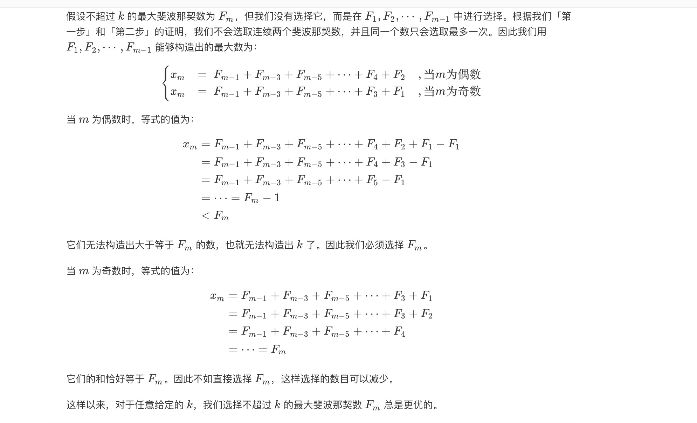

## 描述
给你数字 k ，请你返回和为 k 的斐波那契数字的最少数目，其中，每个斐波那契数字都可以被使用多次。

斐波那契数列定义：
* f1 = 1
* f2 = 1
* fn = fn-1 + fn-2     n>2

## 解题
1. 分析： 构造出所有小于或者等于k的斐波那契数，然后贪心的从大到小进行选取即可。
2. 证明：对于任意给定的 kk，存在一种最优的选择方法，其中我们选择了不超过 kk 的最大斐波那契数。
    - 不会选取连续两个斐波那契数。
        我们用Fi表示第i个斐波那契数，假设选了Fx和Fx+1, 则Fx+2 = Fx + Fx+1 可以用Fx+2来代替他
    - 不会选同一个斐波那契数超过一次：
        $$ 2Fx = Fx-2 + Fx-1 + Fx = Fx-2 + Fx+1 $$
        可以通过第一步获取更优的答案
    - 对于任意给定的K，我们需要选择不超过K的最大斐波那锲数

        

## 代码
```python
class Solution:
    def findMinFibonacciNumbers(self, k: int) -> int:
        f1 = f2 = 1
        fibs = [1, 1]
        while f1 + f2 <= k:
            fibs.append(f1+f2)
            f1, f2 = f2, f1+f2
        count = 0
        for num in fibs[::-1]:
            if k >= num:
                k -= num
                count += 1
        return count
```
```java
package basic.day2.demo2;

import java.util.ArrayList;

class Solution {
    public static int findMinFibonacciNumbers(int k) {
        ArrayList<Integer> fibs = new ArrayList<>();
        int f1 = 1;
        int f2 = 1;
        fibs.add(f1);
        fibs.add(f2);
        int fn = 0;
        while ((fn = f1+f2)<=k){
            fibs.add(fn);
            f1 = f2;
            f2 = fn;
        }

        int ans = 0;
        for (int i = fibs.size()-1;i>=0;i--){
            if(k>=fibs.get(i)){
                k -= fibs.get(i);
                ans += 1;
            }
        }
        return ans;
    }
    
    public static void main(String[] args) {
        System.out.println(findMinFibonacciNumbers(10));
    }
}

```