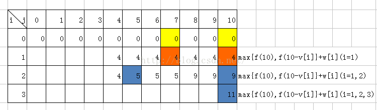

# 描述
N件物品和一个容量为V的背包。每个物品只能使用一次。
第i件物品的体积是Ci, 价值是Wi.
求解那些物品装入背包，可使这些物品的总体积不超过背包容量，且总价值最大。输出最大价值。

# 动态规划
满足动态规划需要满足两个性质
1. 最优化原理： 一个最优策略的子策略也是最优的，所有的子问题的局部最优解导致了整个问题的全局最优。如果一个问题满足最优化原理，就称其具有最优子结构性质。

    **验证**
    一般采用反证法：  比如 求A到D的最近路程d, 他的最优化策略是经过点B使得A到B最之间的点是d1, B到D之间的距离为d2。这时候如果假设另一条路径可以使得B到D之间距离更短是d3，d3 < d2. 那么 d3+d1 < d2 + d1 = d ,这就与d是最短距离相矛盾了。 

2. 无后效性
   不管以前的策略是什么，达到了当前的状态，那么对以后的选择是没影响的。

# 分析
因为每个物品只有装入或者不装入两个状态，所以叫01背包。
这里是每个状态都依赖于前一个状态。
设函数F（i, v)表示前i个物品放入一个容量为v的背包可以或者最大的价值。
所以： F(i,v) = max{ F(i-1, v), F(i-1, v-Ci)+Wi }
    这里就是对 与第i个物品，无非两种状态， 放入与不放入。如果放入了，价值就是前一个状态加上当前的价值。前一个状态就是对于第i-1个物品，他的容量是v-Ci,他的最大价值。所以状态转移公式就出来了。
base case: F（0， 0-v):对于第0件物品的最大价值就是0，也就是没有物品的时候，他的容量就是0
           F（0-i，0）：他的容量是0，放不进入，所以最大价值也是0.


[参考博客](https://www.cnblogs.com/mfrank/p/10533701.html)

# 注意初始化值
如果要求恰好装满背包时的最优解，则初始化是除了F(0)=0， 其他的值都是负无穷。如果不要求恰好装满，初始化时可以全部默认Wie0

解释： 初始化就是F数组事实上没有任何物品可以放入背包时的状态。如果要求恰好装满，只有容量为0时是满足的，价值就是0，其他容量时的背包均没有合法的解，属于未定义状态，应该被赋值为负无穷。
如果并不要求恰好装满，任何容量都有一个合法的解，就是价值为0。

# python
```python
# 01背包
n = 4
v = 10
w = [2, 4, 3, 7]
c = [2, 3, 5, 5]

def test_knapsack(n, v, c, w):
    result = ks2(n, v, c, w)
    print(result)

def ks2(n, v, c, w):
    c.insert(0, 0)
    w.insert(0, 0)
    dp_tables = [[0] * (v+1)  for _ in range(n+1)]
    for i in range(n+1):
        for j in range(v+1):
            if i == 0:
                dp_tables[i][j] = 0
            elif j == 0:
                dp_tables[i][j] = 0
            elif c[i] > j:
                dp_tables[i][j] = dp_tables[i-1][j]
            elif c[i] <= j:
                dp_tables[i][j] = max(dp_tables[i-1][j], dp_tables[i-1][j-c[i]] + w[i])
    return dp_tables[n][v]
test_knapsack(n, v, c, w)
```

# 优化空间复杂度
时间复杂度是O（V*N)  背包容量*物品个数

`f(i, j) = max(f(i-1, j), f(i-1, j-v[i]))`
这里可以去掉i,因为除了最后一行，别的都是多余的。
`f(j) = max(f(j), f(j-v[i]))`  这里的f(j)应该是上一轮的f(j)

这里有一个公式：
```text
# ci 表示第i个物品的体积  wi表示第i个物品的价格
DP[0...V] = 0
for i in range(1, N+1):
    for v in range(V, 0, -1):
        DP[v] = max(dp[v], dp[v-ci]+wi)
return DP[V]
```

关于这里为什么体积要倒序：



如当i=1时，f(10)=max{f(10),f(10-v[1])+w[1]}=max{f(10),f(7)+w[1]}=max{0,4}=4

即f(10)依赖的是f(10)和f(7)的值，需要注意的是，此时的f(10)和f(7)是i=0时的f(10)和f(7)，如果使用二维数组存储，无需担心覆盖问题，对体积的枚举逆序或正序都可，但是如果使用一维数组，若正序枚举会先计算f(7)，那么，再计算f(10)时，i=0时的f(7)已被覆盖矣！

[参考链接](https://blog.csdn.net/aidway/article/details/50726472)

其实就是每一轮计算`f[j]`和`f[j-ci]`其实是上一轮的`f[i-1, j]` 和 `f[i-1, j-ci]`，只有倒序的时候才能使用到，如果正序的话就被前面覆盖了，计算的值也就没意义了。

```python
# 01背包
n = 4
v = 10
# 价格
w = [2, 4, 3, 7]
#体积
c = [2, 3, 5, 5]

def test_knapsack(n, v, c, w):
    result = ks3(n, v, c, w)
    print(result)


def ks3(n, v, c, w):
    c.insert(0, 0)
    w.insert(0, 0)
    dp = [0] * (v+1)
    for i in range(1, n+1):
        for j in range(v, c[i]+1, -1):
            dp[j] = max(dp[j], dp[j-c[i]]+w[i])
    return dp[v]
test_knapsack(n, v, c, w)
```
