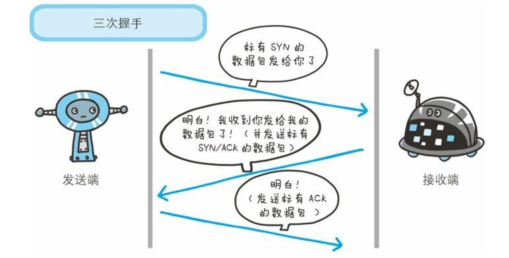
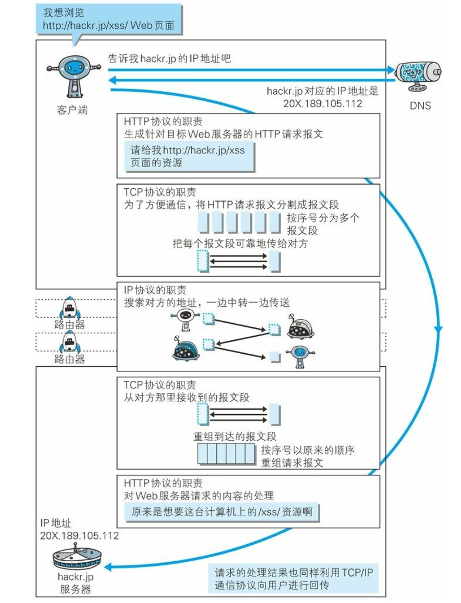
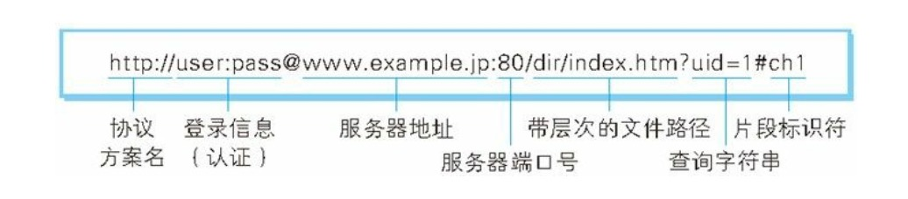
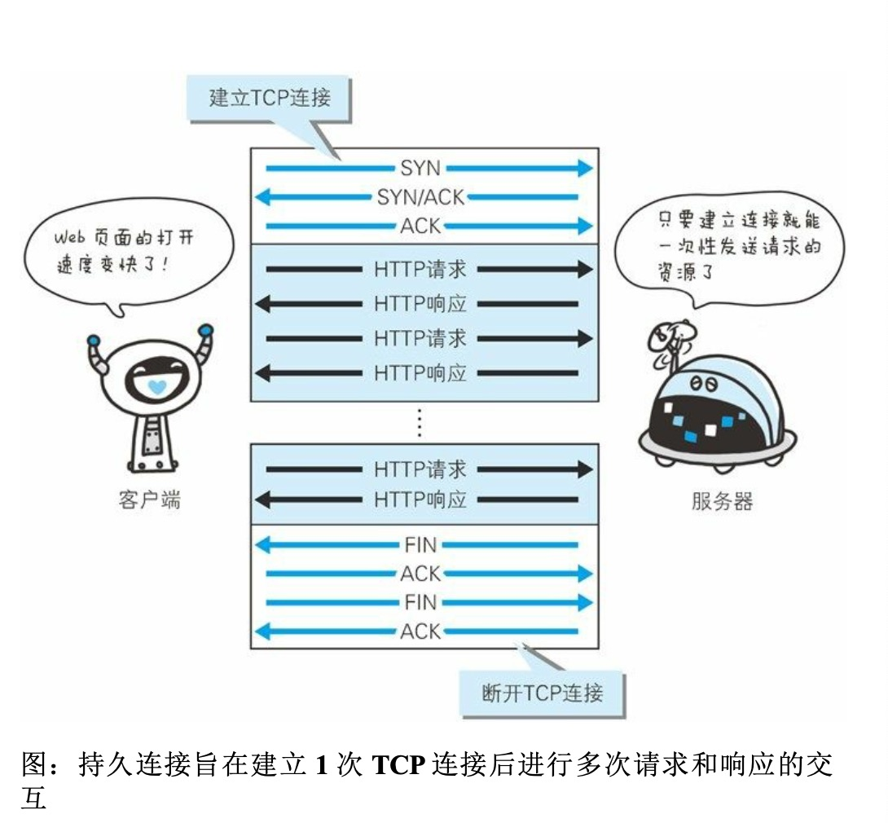
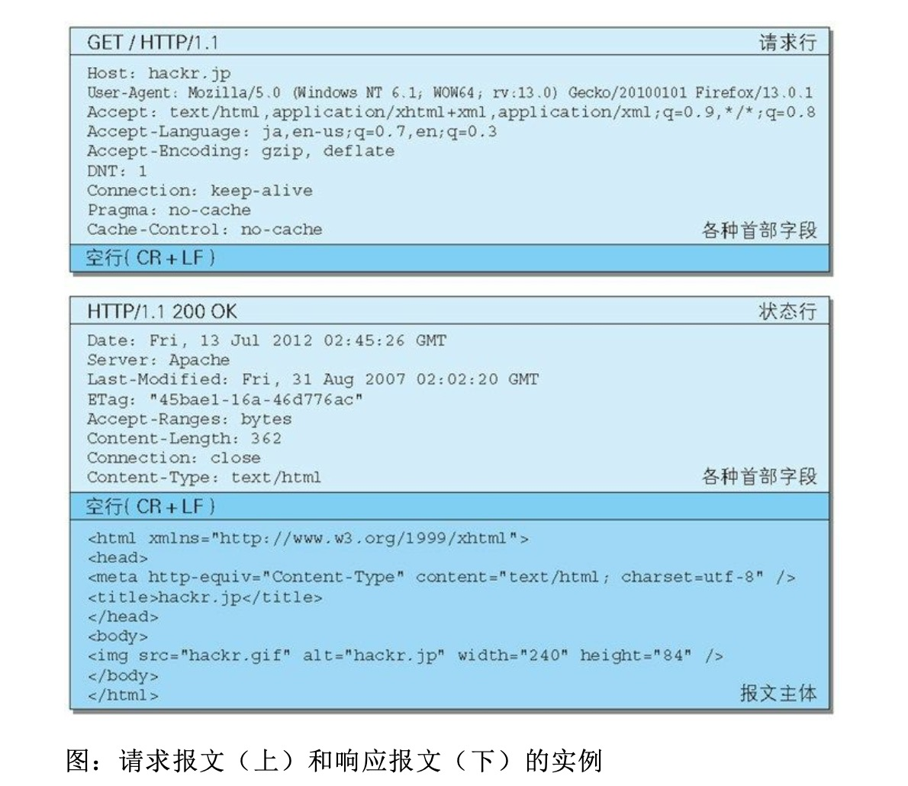

# 第一章 了解web以及网络基础
  
HTTP HyperText Transfer Protocol 超文本传输协议。用来完成客户端到服务器的一系列运作流程。

## TCP/IP
1. 网络协议： 是指计算机网络中互相通信的对等实体之间交换信息时必须遵守的规则的集合。
2. 网络协议三要素：
    * 语义： 解释控制信息每个部分的意义。规定了需要发出何种控制信息，以及完成动作与做出什么样的响应。
    * 语法：用户数据与控制信息的结果与格式，以及数据出现的顺序。
    * 时序：对事件发生顺序的说明（同步）。
    语义表示做什么，语法表示怎么做，时序表示做的顺序。

3. 网络分层：
   * 应用层： 向用户提供应用服务时通信的活动。FTP,DNS,HTTP
   * 传输层：提供处于网络连接中的两台计算机之间的数据传输。  TCP,UDP
   * 网络层：在众多的链接中选择一条线路。 IP协议
   * 数据链路层：处理网络的硬件部分。

4. 与HTTP关系密切的是：IP,TCP,DNS
   1. IP: 把各种数据包传输给对方。要确保能送到。其中IP地址指明了要送到哪里,mac地址是指网卡所属的固定地址。这里会使用ARP协议。
   2. TCP：提供可靠的字节流服务。字节流服务是指为了方便传输，将大块数据分割成以报文段为单位的数据包进行管理。这里为了可靠的传输，使用了三次握手的策略，确保对方能收到。

        **三次握手**使用了TCP的标志，SYN(synchronize 同步)和ACK(acknowledgement 收件复函).
        

        如果握手过程中某个阶段中断，TCP协议会再次以相同的顺序发送相同的数据包。

    3. DNS：域名解析，将域名解析为主机地址。

    

5. URI
   * URI 统一资源标识符 抽象定义，不管什么方法，能定位一个资源，就是URI。
   * URL 统一资源定位符 使用地址定位：`http://www.example.com:80/path/to/myfile.html?key1=value1&key2=value2#SomewhereInTheDocument`
   * URN 统一资源名称 使用名称定位 `urn:isbn:9780141036144`
   URI 包含URL和URN，但是URN不流行，现在的URI基本都是URL

    
# 第二章 简单的HTTP协议
## 请求报文和响应报文
1. 请求报文基本格式
```text
方法  URI        协议
POST /form/entry HTTP/1.1

请求体首部字段
HOST: hackr.jp
Connection: keep-alive
Content-Type: application/x-www-form-urlencoded
Content-Length: 16

内容实体
name=ueno&age=37
```
2. 响应报文的基本格式
```text
协议版本  状态码 状态码的原因短语
HTTP/1.1 200  OK

响应首部字段
Date: Tue, 10 Jul 2012 06:50:15 GMT
Content-Length: 362
Content-Type: text/html

主体
<html>
...
```
## 无状态
HTTP是无状态协议。即HTTP自身不对请求和响应之间的通信状态进行保存。
为了实现保持状态的功能，引入了Cookie技术。

## 请求URI定位资源
* 完整的请求URI：`GET http://hackr.jp/index.html HTTP/1.1`
* 在首部字段中
    ```text
    GET /index.html HTTP/1.1
    Host: hackr.jp
    ```

如果只是对服务器本身发起请求，可以使用 
```text
OPTION * HTTP/1.1
Host: hackr.jp
```
## HTTP方法

1. GET： 获取资源
2. POST：传输实体主体
3. PUT： 传输文件
4. HEAD: 获取报文头部 和GET一样，只是不返回报文主体部分，用于确认URI的有效性以及资源更新的日期等
5. DELETE：删除资源
6. OPTION: 查询支持的方法
7. TRACE: 追踪路径 通常不用
8. CONNECT: 要求用隧道协议连接代理：SSL,TLS,利用隧道协议进行TCP通信。

## 持久连接节省通信量
HTTP keep-alive  只要任意一段没有明确提出断开连接，则保持TCP连接状态。



好处是可以减少TCP连接的重复建立和断开造成的额外开销，减轻服务器的负载。

HTTP管线化：pipelining, 发送完请求后不用等待，可以并行发送多个请求。

## Cookie状态管理
Cookie技术通过在请求和响应报文中写入Cookie信息来控制客户端的状态。

Cookie会根据服务器端传来的响应报文中的Set-Cookie的字段，通知客户端保Cookie。下次客户端再向这个服务器发请求时，会自动在请求报文中加入Cookie的值。

服务端收到客户端发来的Cookie,会检查查找记录（数据库）查找出是哪个实体，返回对应的信息。

# 第三章 HTTP报文中的HTTP信息


请求报文是： 
请求行： 方法 uri 协议
首部信息
空行

响应报文是：
状态行： 协议 状态码 状态码原因短语
首部信息
空行
报文主体

## 编码提升传输速率
* 报文：是HTTP通信的基本单位，由8位组字节流组成，通过HTTP通信传输。
* 实体：作为请求或者响应的有效载荷数据被传输，其内容由实体首部和实体主体组成。

这里的报文就是请求报文或者响应报文。实体就是要传输的东西。通常只有当传输中进行编码操作时，实体主体的内容发生变化，才导致他和报文主体产生差异。

```text
HTTP/1.1 200 OK
Content-Type: text/plain
Transfer-Encoding: chunked

25
This is the data in the first chunk

1C
and this is the second one

3
con

8
sequence

0
```
这里的有效载荷主体就是This is the date in the first chunk, and this is the second one,con和sequence这几行，而报文主体为从第一个空行以后的所有内容，包含有效载荷主体和25， 1C等和几个空行。

1. 常见的编码内容有：
  * gzip GNU zip
  * compress UNIX系统的标准压缩
  * deflate zlib
  * identity 不进行编码
  
2. 分割发送的分块传输编码
    
    分块传输编码会将实体主体分成多个部分。客户端接收后负责解码，回复到编码前的主体。

3. 发送多种数据的多部分对象集合

    MIME 多用途因特网邮件扩展。
    * multipart/form-date: 表单时使用
    * multipart/byteranges: 状态码206（部分内容）响应报文包含了多个范围的内容时使用

## 获取部分内容的范围请求

使用首部字段Range 指定byte范围：
    * 获取0~5000字节 `Range: bytes=-5000`
    * 获取5001~10000字节 `Range: bytes=5001-10000`
    * 获取10000~  `Range: bytes=10000-`

针对范围请求，响应会返回状态码 206 Partial Content

## 内容协商返回最合适的内容
根据浏览器的默认语言，返回对应版本的Web页面。
通过下面的首部字段进行判断：
  * Accept
  * Accept-Charset
  * Accept-Encoding
  * Accept-Language
  * Content-Language

# 第四章 状态码
响应的状态码 有 三位数字和原因短语组成

**类别**

状态码|类别|原因短语
:-:|:-:|:-:
1XX|Informational(信息性状态码)|接收的请求正在处理
2XX|Success(成功状态码)|请求正常处理完毕
3XX|Redirection(重定向状态码)|需要进行附加操作以完成请求
4XX|Client Error(客户端错误状态码)|服务端无法处理请求
5XX|Server Error(服务器错误状态码)|服务器处理请求出错


## 2XX 成功
1. 200 OK

    表示正常处理了。

2. 204 No Content
    
    请求已经成功处理，但是返回的响应中没有主体部分。

3. 206 Partial Content

    请求进行了范围请求，返回这部分的请求响应。响应报文中由Content-Range指定范围的实体内容。

## 3XX 重定向
表示浏览器需要执行某些特殊的处理以正确的处理请求

1. 301 Moved Permanently
    
    永久重定向。表示请求的资源已经分配了新的URI，以后应该按照响应首部的Location字段重新请求。比如书签需要更新。
    如果忘记加最后的/也会产生301。

2. 302 Found

    临时性重定向。请求的资源已被分配了新的URI，希望用户本次使用新的URI访问。
    如果用户吧URI保存成了书签，这时候不需要更新。

3. 303 See Other

    该状态码表示由于请求对应的资源存在着另一个URI，应该使用GET方法定向获取请求中的资源。

4. 304 Not Modified

    表示客户端发送附带条件的请求时（If-Match之类的），服务端允许请求访问资源，但未满足条件的情况。返回的时候不包含任何响应的主体部分。这个与重定向没什么关系。

5. 307 Temporary Redirect

    临时重定向，和302一样，302会吧POST改成GET，这个不会。

## 4XX 客户端错误
1. 400 Bad Request

    表示报文中存在语法错误。

2. 401 Unauthorized

    认证失败。

3. 403 Forbidden

    对资源访问的请求被拒绝。

4. 404 Not Found 

    无法找到该资源

## 5XX服务器错误
1. 500 Internal Server Error

    服务器在执行请求时出现了错误，可能是存在的bug或者临时的故障

2. 503 Service Unavaliable
    表示服务器暂时处于超负载或者停机维护，无法进行处理请求。

# WEB服务器
1. 代理：
   
    转发功能的应用程序，接收来自客户端发送的请求转发给服务器，同时也接收服务器返回的响应并转发给客户端。
    **使用的理由**：
    1. 缓存代理：利用缓存代理来减少网络带宽的流量。代理转发响应时，缓存代理预先将资源的副本保存在代理服务器上。当代理再次接收到对相同资源的请求时，可以直接返回。
    2. 组织内部针对特定网站的控制。
    3. 可以获取访问日志。
   
2. 网关

    网关能使通信线路上的服务器提供非HTTP协议服务。 比如使用网关连接数据库，使用SQL语句查询数据。

3. 隧道

    按照要求建立起一条与其服务器的通信线路，之后可以使用ssl等加密手段进行通信，可以却把客户端与服务器进行安全的通信。

## 保存资源的缓存

