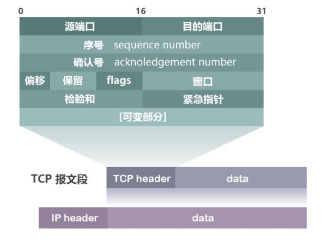

# 总结
看了几篇面经，大部分问题集中在了http, tcp。别的层协议了解就行。

## 总体概括

五层协议即简洁又清楚
1. 应用层： 通过应用进程间的交互来完成特定的网络应用。如域名系统DNS，HTTP，SMTP（邮件）。应用层交互的数据单元称为报文。
2. 传输层：负责向两台主机进程之间的通信提供数据传出服务。应用进程使用传输层来传送应用层的报文。传输层面向的不是一个特定的应用程序，这里会有复用和分用的功能。复用：多个应用层进程可以同时使用下面传出层的服务。分用：传输层把收到的信息分别交付给上面的应用层中的相应进程。主要有：tcp,udp

3. 网络层：计算机网络进行通信的两个计算机之间可能经过很多个数据链路，也可能还要经过很多通信子网。网络层的任务就是选择合适的网间路由和交换节点，确保数据能及时传送。发送数据时，网络层把传输层产生的报文段或者用户数据报封装成组或者包进行传送。分组叫做IP数据报，简称数据报。也叫网际层或者IP层。使用IP协议
4. 数据链路层：链路层。两台主机之间的数据传输，总是在一段一段的链路上传送，在两个相邻节点之间传送数据时，数据链路层将网络层交下来的IP数据报组装成帧，在相邻的节点间传送帧，每一帧包括数据和必要的控制信息（同步信息，地址信息等）ARP协议
5. 物理层：相邻计算机节点之间比特流的透明传送，尽可能屏蔽掉具体截止和物理设备的差异。

## 简单介绍的协议：
1. ARP： 为IP地址到对应的硬件地址提供动态映射。
2. IP协议
3. ICMP： 传递差错报文和其他要注意的信息

**ping命令**：

作用：1. 查看网络连接是否超时 2. 查看延迟
主要分两种：同一网段和跨网段：
1. 同一网段，A首先查看自己的mac地址表，如果有就直接发送，如果没有，就发送一个广播，交换机有学习MAC地址的功能，先自己检查，如果没有就向所有的端口发送arp广播。其他主机收到广播对比自己的地址，直到主机B收到了，就立即响应，返回自己的MAC地址，并学习到A的MAC地址。这时候A学到了B的MAC地址，就发送一个ICMP报文给B，是回显请求，这时候返回一个值给A，就完成了同一网段的ping。
2. 不同网段，A要PingC,发现主机C的IP和自己不是一个网段，就去找网关转发，找网关的过程就是arp广播，找到网关之后，再发送ICMP报文给网关路由器。这个时候如果也没有C的地址，还是发送ARP请求，找对方的MAC地址，找到之后，把数据报中的MAC头改为自己的mac地址，源IP不变，然后发送。主机C已经学到了网关路由器的MAC地址。之后响应并回复报文。

**IP地址**
三类IP地址：
 * A类： 8位网络号， 24位主机号     子网掩码： 255.0.0.0
 * B类： 16位网络号， 16位主机号    子网掩码： 255.255.0.0
 * C类： 24位网络号， 8位主机号     子网掩码： 255.255.255.0

## 重点：
### 传输层
1. UDP： 简单的面向数据报的传出层协议，进程的每个输出操作都正好产生一UDP数据报，并组装成一份待发送的IP数据报。
2. TCP 面向字节流的，应用程序产生的全体数据与真正发送的单个IP数据报可能没什么关系。

TCP与UDP的相互区别和优劣：
  * TCP面向连接，UDP无连接
  * TCP面向字节流，UDP面向数据报文段
  * TCP可靠，UDP不可靠
  * TCP传输速度慢，UDP高
  * TCP需要资源多（头部开销大），UDP要求少
  * TCP应用场景：图片传输，邮件传输， UDP： 域名转换

**tcp格式**

1. 序号 sequence number: 32位，标识TCP源端向目的端发送的字节流，发起方发送数据时对此进行标记。
2. 确认号 acknowledgement number: ACK序号， 32位，只有ACK标志位为1时，确认序列号字段才有效， Ack = Seq + 1
3. 标志位： 6个： 
   * URG: 紧急指针有效
   * ACK: 确认序号有效
   * PSH: 接收方应该尽快将这个报文上交应用层
   * SYN: 发起一个新连接
   * FIN: 释放一个连接

**三次握手**
在创建tcp 连接时候，需要发送三次数据，建立连接。

1. 客户端向服务端发送一段TCP报文，其中：
   * 标记为为SYN，表示请求建立连接
   * 序列号为Seq = x
   * 随后进入SYN-SEND状态。
2. 服务端一直处于LISTEN状态，直到接收到TCP报文，返回一段报文
   * 标志位位Seq, ACK, 表示客户端报文的seq有效，服务器可以接收数据，并同意创建新连接
   * 序号为Seq = y
   * 确认号为 ACK=x+1,表示我已经看过了，随后进入SYN-RCVD状态

3. 客户端接收到之后，明确了从客户端到服务器之间的传输是正常的，结束了SYN-SEND状态，发送tcp报文，
   * 标志位为ACK，表示确认收到服务器同意连接的信号。
   * 序号为seq = x+1表示收到了，并且看过了。
   * 确认号为  ack=y+1
   * 随后客户端进入Established阶段。
4. 服务端收到最后的确认信息后，进入建立连接的状态。

这样做是为了保证数据能正常传输。一旦其中一个报文丢失，无法继续握手。

**为什么进行第三次握手**
目的：节省资源
1. 如果不进行第三次握手就开启，第二次握手报文丢了的话，客户端就不知道，无法进行正常通信，但是服务器端口已经开了连接，这样就浪费了资源
2. 如果因为网络原因，客户端以前发送过一次连接请求，但是已经失效了，服务器收到以后，直接创建了连接，这样还是浪费。

只有第三次握手，才能保证双方都知道对方知道了。

**四次挥手**

1. 客户端想断开连接，向服务端发送一段TCP报文：
   * 标记位为FIN，表示请求释放连接
   * 序号为Seq = x
   * 随后进入FIN-WAIT-1阶段，半关闭阶段。并且停止在客户端到服务端方向上发送数据（正常传输的数据报文），此时客户端还能收到数据。
2. 服务端收到客户端发出的报文后，确认了客户端想要释放连接，随后客户端结束了ESTABLISHED阶段，进入CLOSE-WAIT阶段，半关闭状态，并返回：
   *  标记位为ACK，表示接受到了客户端发送的 请求释放连接的请求。
   *  Seq = y
   *  确认号 Ack = x + 1, 表示收到了客户端的报文。
   *  随后开始准备释放连接

前两次挥手是为了让服务端知道客户端想释放连接，也让客户端知道，服务端已经知道了。随后客户端进入到FIN-WAIT-2阶段。

3. 服务端自从发出ACK确认之后，经过一段closed-wait阶段，做好了释放的准备，就再次向客户端发出一段TCP：
   * 标记位FIN，ACK，表示我已经准备好释放连接了。
   * 序号Seq = w
   * 确认号为 ack=x+1,表示在收到客户端报文的基础上，将其序号seq值加1作为确认号
   * 随后服务端进入last-ack阶段，并停止在向客户端发消息。

4. 客户端收到服务端发的TCP报文，确认了服务器端已经做好了释放连接的准备，进入time-wait阶段，并发送报文：
   * 标记位ACK，表示接收到服务器准备好释放连接的信号
   * 序列号为Seq = x + 1
   * 确认号 Ack = w + 1
   * 随后客户端开始等待 2msl(两倍的报文最大生存时间)，之后关闭。
5. 服务端收到后进入closed阶段。正式关闭。

后两次挥手是为了让客户端知道服务器准备好关闭连接了，也让服务端知道客户端知道了。

为什么需要四次挥手
确保数据能完成传输。关闭连接时，当服务端收到客户的fin请求时，表示客户端不会发数据了，但是服务端可能还有数据要传输，这时候要完成传输，所以只发一个ACK，表示我知道了，我发完就不发了，发完之后就发送一个FIn，表示我也要关了。所以这里需要ACK和FIn分开发。

为什么要等待2msl
msl maximum segment lifetime: 一段TCP报文在传输过程中最大的生命周期。2msl,表示从服务端发出fin到服务端接收到客户端发出ACK的最大时间。
如果服务端1msl内没有收到客户端发来的ACK确认报文，就会再次向客户端发出FIN报文。
客户端在如果在等待时候收到了，就再次发送ack并重新倒计时。只有2msl内没有再次发出，证明了服务端收到了。大家都可以关闭了。

**TCP如何保证可靠性**
1. 应用数据被分割为TCP认为最合适发送的数据块
2. TCP会给每个包编号，接收方对数据报进行排序，把有序数据传给应用层。
3. 校验和，TCP将保持它首部和数据的校验和。这是一个端到端的校验和，目的是检测数据在传输过程中没有任何变化，如果接收端收到的报文的校验和有差错，tcp会弃这个报文段和不确认收到这个报文段。利用伪头部进行校验和。
4. TCP接收端会丢弃重复的数据
5. 流量控制：TCP连接的每一方都有固定大小的缓冲空间，TCP的接收端只允许发送端发送接收端缓冲区能容纳的数据，当接收方来不及处理发送方的数据，能提示对方降低发送频率，方式包丢失。TCP使用的流量控制协议是可变大小的滑动窗口协议。（TCP利用滑动窗口来流量控制）
6. 拥塞控制：当网络阻塞时，减少数据的发送。
7. ARQ协议 为了实现可靠传输，原理是发送完一个分组就停止发送，等待对方确认，确认后再发送下一个分组。
8. 超时重传，当TCP发出一个段后，他启动一个定时器，等待目的端确认收到这个报文段，如果不能及时收到一个确认，将重复这个报文段。

**ARQ协议**
自动重传请求（Automatic repeat-request, ARQ)，传输层的错误纠正协议。通过使用确认和超时这两个机制，在不可靠服务的基础上实现可靠的信息传输。如果发送方在发送一段时间之内没有收到确认帧，通常就会重新发送。ARQ包括停止等待ARQ和连续ARQ协议。

1. 停止等待ARQ
   * 基本原理就是发送完成一个分组就停止发送，等待对方回复（ack)。如果一段时间内没有收到ACK，就说明没有发送成功，需要重新发送，知道收到确认后再发下一个分组。
   * 在停止等待协议中，若接收方收到重复的分组，就丢弃，同时发送确认。

    优点： 简单
    缺点： 信道利用率低，等待时间长

    可能出现情况：
    1. 无差错情况：

        发送方发送完成之后，接收方在规定时间内收到，并且回复收到，发送方再次发送

    2. 出现差错：

        如果超出一段时间没有收到确认，就重传。因此每发送完成一个就设置一个超时计时器，其重传时间应该比数据在分组传输的平均往返时间更长一点，这种自动重传叫做**自动重传请求ARQ**。接收方收到重复的分组，要丢弃并发送ACK，防止一直发。出现差错的原因可能是：

        * 确认丢失
        * 确认迟到

2. 连续ARQ协议

    可以提高信道利用率。发送方维持一个发送窗口，凡位于发送窗口内的分组可以连续发送出去，不需要对方确认。接收方采取累积确认，对按序到达的最后一个分组发送确认，表明到这个分组为止的所有分组都收到了。

    优点： 信道利用率高，容易实现，即使确认丢失也不必重传
    缺点： 不能向发送方发反馈信息。比如发送发了5条消息，中间丢失了第三条，这时候接收方只能确认前两条发送成功了，需要重传后三个，这个叫GO-BACK-N 回退n,表示需要退回来重传已经发送过得N个消息。

**流量控制**
使用了滑动窗口来实现流量控制。流量控制就是为了控制发送方发送速率，保证接收方来得及接收。接收方发送的确认报文ACK中的窗口字段来控制发送方窗口的大小，从而影响发送发的速率。窗口字段设置为0，则发送方不能发送数据。

大概步骤如下：
假设A向B发送数据报，总长度为600字节，每个报文长度为100字节。

1. 建立连接时B告诉A，我的窗口值为rwnd=300（sliding window);
2. A向B发送一个报文段，序号为1到100，还能再发200个字节。
3. A向B发送一个报文段，序号为101到200，还能再发送100个字节。
4. A再向B发送一个报文段，序号为201到300，还能发0个字节。
5. B接收到1-100 以及 101-200，第三个报文段丢失。所以B向A发送一个报文段ack=201, rwnd=300, 这里表示把窗口移动到201，大小为300个。
6. A发送报文段301-400，
7. A发送401-500，
8. A超时重发旧的数据，201-300，以前丢失的数据
9. 这时候B确认收到了100-500（可以排序）发送确认 ack=501, rwnd=100
10. A发送501-600。窗口满了，不用发了。
11. B发送确认 ack=601, rwnd=0。都收到了就不用发了。

**拥塞控制**
在一段时间内，若对网络中某一资源的需求超过了该资源所能提供的可用部分，网络性能就会变差，这种情况就叫拥塞。拥塞控制就是为了防止过多的数据注入到网络中，这样就可以使网络中的路由器或者链路不致过载。
拥塞控制是一个全局的过程，设计所有的主机，路由器。流量控制是端对端的。流量控制是抑制发送端的发送速率，以便接收端来的及接受。

为了进行拥塞控制,TCP发送方维持了一个拥塞窗口（cwnd)。拥塞控制窗口的大小取决于网络的拥塞程度，动态变化。发送方让自己的发送窗口取为拥塞窗口(cwnd)和接受窗口（swnd）中较小的一个。

这里采用了四种算法：慢开始，拥塞避免，快重传，快恢复。

1. 慢开始： 当主机开始发送数据时，先探测一下，由小到大的逐渐增大发送窗口。cwnd初始值是1，没经过一个传播轮次，cwnd加倍。这样如果不控制的话，很快就会引起拥塞。所以设置了一个门限ssthresh:
    - cwnd < ssthresh,进行慢开始算法
    - cwnd > ssthresh,使用拥塞避免算法
    - cwnd = ssthresh,使用哪个都可以

2. 拥塞避免：
   * 让拥塞窗口cwnd缓慢增大，即每经过一个往返时间RTT就把发送方的cwnd拥塞窗口cwnd加1cwnd.而不是加倍cwnd.这样拥塞窗口cwnd按线性规律缓慢增长，比慢开始算法的拥塞窗口增长速率缓慢的多。
   * 不论是慢开始还是拥塞避免，只要网络出现拥塞（没有按时到达）时，就把ssthresh的值置为出现拥塞时的拥塞窗口的一半（但不能小于2），以及cwnd置为1，进行慢开始。目的是迅速减少主机发送到网络中的分组数，使得发生拥塞的路由器有足够的时间把队列中积压的分组处理完毕。

    这样可以降低拥塞的可能，并不能完全避免拥塞， 利用以上的措施是完全避免网络拥塞还是不可能的。

   

发送端判断拥塞发生的依据：
1.传输超时（TCP重传定时器溢出）
2.接收到重复的确认报文段

拥塞控制对这两种情况有两种不同的处理方式。对第一种情况使用慢启动和拥塞避免，对第二种情况使用快速重传和快速回复（如果真的发生拥塞的话）。注意：第二种情况如果发生在第一种情况之后，也会被拥塞控制当成第一种情况来对待。

这里接收到重复的确认报文是指，可能是接收端接受的数据中间一部分报文丢失，或者接收端收到乱序的TCP报文端并重排等。
当接收端收到报文段的顺序不符合序号，即两个报文段之间的报文段没收到，会立即发送三条重复确认报文，接收方收到三条重复的确认报文段后，立即使用快速重传和快速恢复算法来处理。

快速重传： 要求接收方在收到一个失序的报文段后立即发出重复确认，而不要等到自己发送数据时再发送确认。
如果在超时重传定时器溢出之前，收到三个连续重复的ACK（4个，第一个正常），发送端知晓了哪个报文段丢失了，于是重发该报文段。这就是快速重传机制。

快速恢复：
  1. 当发送方连续收到三个重复确认时，就执行乘法减小算法，把慢开始门限ssthresh减半。这是为了预防网络发生拥塞，然后立即重传丢失的报文段，并将cwnd设置为新的ssthresh。
  2. 发送方现在认为网络很可能没有发生拥塞，因此不执行慢开始。而是把cwnd设置为慢开始门限ssthresh减半后的数值，然后执行拥塞避免。
  当有单独的数据报丢失的时候，使用快速重传和快速恢复可以很有效的工作。

    