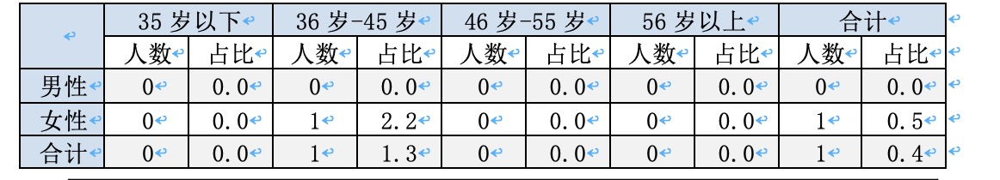
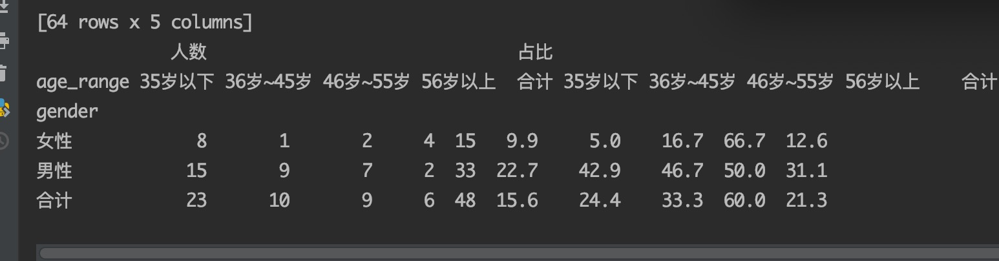

数据统计
统计分析之后的报告数据，将整体数据在年龄、性别的的基础上根据所选指标或者标签上的分组操作。

1. 遍历团体内部报告，保存最少的需要的数据到统计库。user_id, test_id, year, age, gender, samples, tags, name, group, hospital。其中samples, tags是id的列表。保存在Mongodb中，方便后续直接聚合查询。

    这里使用mongoengine创建了模型，包含字段，每次使用with switch_collection（basemodel, collection_name) as st:

2. 创建分组字段以及权限，分组字段只要包含在统计库中即可，由运营创建，创建分组之后会生成可选字段。如创建了年份，医院，点击自动生成会生成统计库中的distinct值，2018， 2019， 2020，医院包含鼓楼医院、中医院。之后由管理员对账号和字段进行关联。
3. 校验权限 每次请求统计会发送可选字段和用户名进行请求，返回数据。这里使用post方法，请求参数之间是与的关系，如：
   
   ```json
   [
       {
           "field": "year",
           "values": [2018, 2019]
       },
       {
           "field": "hospital",
           "values": ["鼓楼医院"]
       }
   ]
   ```
   根据配置的权限对字段进行筛选，如果没有2019年权限就删除2019年。这里的逻辑是先对传过来的参数根据配置进行筛选，如果筛选之后有值就直接用，如果没有值就选择为改组配置的全部选项。例如： year配置了2017， 2018，如果选了2018， 2019，则只使用2018的数据，如果选择了2019， 2020，则使用2017， 2018的数据。然后将剩余的分组字段保存为aggregate的match部分。

4. 统计数据 每次请求为某个方向上的统计数据，整体概况，风险标签，疾病标签，常见指标，每个方向在展示上是一个表格。
    1. 整体概况是全体男女有多少人，每个年龄段的男女各多少人，多个年龄段（<=35, 36~45, 46~55，56~65，66~75， 76~85， >=85)
    
    统计过程：
     1. mongo聚合
        1. 生成match语句为一个字典格式 `{"$match: {year: {$in: [2018, 2019]}}}`
        2. 对年龄进行聚合 project语句，重新组合选择结果，
            ```json
            {
                "$project": {
                    "_id": 1,
                    "year": 1,
                    "age": 1,
                    "gender": 1,
                    "userId": 1,
                    ...,
                    "age_range": {
                        "$switch": {
                            "branches": [
                                {"case": {"$lte": ["$age", 35]}, "then": 0},
                                {"case": {"$and": [{"$gt": ["$age", 35]}, {"$lte": ["$age", 45]}]}, "then": 1},
                                ...
                                {"case": {"$gt": ["$age", 85]}, "then": 6}
                            ],
                            "default": 1
                        }
                    }
                }
            }
            ```
        3. 对用户去重，两次group操作即可，第一次包含userId分组，第二次去掉userId分组。
            ```json
            [
                ...
                {"$group": {"_id": {"userId": "$userId", "gender": "$gender", "age_range": "$age_range"}}},
                {"$group": {"_id": {"gender": "$gender", "age_range": "$age_range"}, "total": {"$sum: 1}}}
                ...
            ]
            ```
            如果是对列表进行操作，需要先添加unwind, 再进行group, `{"$unwind": "$sample"}`
    2. 因为从mongo聚合出来的数据是列表格式的，数据放在每个对象的_id字段下，对数据进行整理，每个表格对数据要求格式不一样，主要分为两种，网页显示和word文档显示，网页直接传输对象列表，word传输pandas序列化的结果。
    
        mongo聚合结果是列表，每个值结构为： `{tag: 1, gender:1, age_range:4, total: 1}`

       **网页版**
       1. 整体数据体现为各个年龄段的男女分布，预先创建好容器 `[[0, 0] for _ in range(len(AGE_RANGE_STR)]`, 之后遍历保存即可，根据gender字段，gender值范围是1， 2，用gender-1作为索引放入列表中，即可表示数量，而[]的索引即使年龄段的信息。
       2. 单项数据，例如疾病标签，这里的标签不是固定的，无法预先创建容器。但是对每个标签的分布情况和整体数据是类似的。遍历mongo中的结果，在结果中以标签名作为Key,如果没有出现过就常见容器如上。然后把这行数据加上去。

       **word文档**

        网页版只显示人员数量情况，通过直方图可以比较数据，word版本用于作报告，需要详细的百分比，如 甘油三脂在 age_range=1, gender=2 时有多少人，占全体age_range=1, gender=2的人员的百分比。word版本统计比较复杂

        1. 生成dataframe, dataframe可以通过对象列表生成。需要将mongodb聚合出来的数据转化为对象列表。
            ```json
            {
                "gender": 0,
                "age_range": 1,
                "count": 900,
                "percent": 12.3
            }
            ```
            需要计算一个占比情况，这里计算占比的分母为这个年龄段性别下的全部人数（round保留一位小数)
            全部生成之后需要补全数据，因为可能存在某个标签下人员分布不均匀，缺少某些年龄段或者性别，导致后面计算出错，需要补0. 这里按照标签来分，如果长度不为8（2*4）需要补全。 tags = set([x["name" for x in data]])获取所有标签名， `[x for x in data if x["tag"] == tag]`获取某个标签下的所有数据。


        2. 对dataframe进行转换，这里使用双层column, 年龄段下面再分为人数和占比，如下图格式：
            

            现在有了每个的占比，需要计算合计即可。
            这里使用了透视表功能 pivot_table。是一种可以可以对数据动态排布并且分类汇总的表格格式。table = pd.pivot_table(index=["name", "gender"], columns=["age_range"], values=["count], file_value=0) 索引是双层，以每个指标项目为一个大的索引，里面包含男女。列以年龄段为列，值是占比或者人数，两个分开算。

            使用table.index.get_level_values(0) 来获取最外层索引。也就是指标名。之后对每个指标都生成一个对象。使用`table.loc[sample]`选中当前的指标统计信息。利用`table.loc["合计“] = table.apply(lambda x: x.sum())`新增一行（男女下面的合计）和为男女人数之和。占比计算时先取出这四个值（不同年龄段的合计） `real_age_agg = list(table.iloc[2])`,然后和对应的年龄段的总数进行计算。求出占比情况。

            计算男女合计方向上的统计人数和占比， 需要设置参数axis=1. `count_num = list(table.apply(lambda x: s.sum(), axis=1))` `table["人数", "合计”] = count_num`. 
            
            将人数表和占比表进行联合，这时候的结果为：
            

            交换columns, `df=df.swaplevel(0, 1, axis=1).sort_index(axis=1)`

            **axis=0 跨行， axis=1， 跨列**

        3. 返回结果
            ```json
            {
                "columns": [["35岁以下", "36岁-45岁", "46岁-55岁", "56岁以上", "合计"], ["人数", "占比"]],
                "index": ["男性", "女性", "合计"],
                "items": [{
                    "name": "甘油三酯",
                    "data": [
                        [0, 0, 2, 16.7, 1, 33.3, 0, 0, 3, 6.5],
                        [0, 0, 0, 0, 1, 25, 0, 0, 1, 1.5, ],
                        [0, 0, 2, 5.4, 2, 28.6, 0, 0, 4, 3.5]
                    ]
                }]
            }
            ```
        4. 加载生成pandas(word报告)
            `df = pd.DataFrame(data=data, index=index, columns=columns)`
            即可为每个标签生成

5. 数据呈现
   1. 网页版，提供结构返回json数据，前端渲染。
   2. word版本